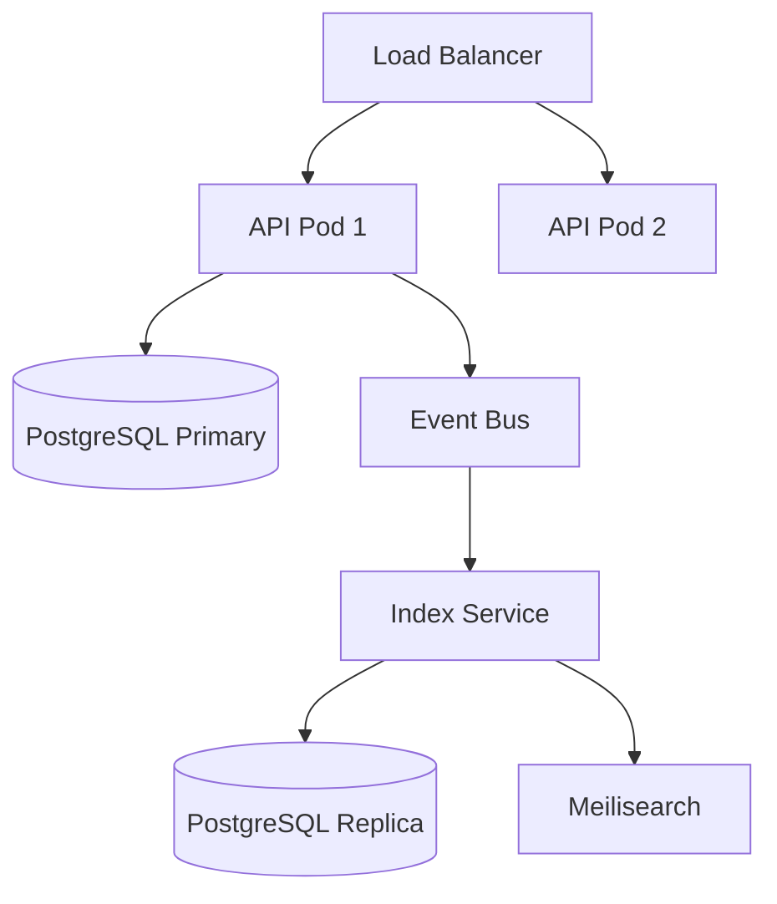

# RusToK — System Architecture Manifest

**Target:** Humans & AI Assistants (Cursor, Windsurf, Copilot, Claude)  
**Role:** Senior Rust Architect & System Designer  
**Philosophy:** "Write Optimized vs Read Optimized" / "Modular Monolith over Microservices"

## 1. PROJECT IDENTITY

| Property | Value |
|----------|-------|
| **Name** | RusToK |
| **Type** | Event-Driven Headless Platform |
| **Architecture** | Modular Monolith with CQRS & Event Sourcing elements |
| **Language** | Rust |
| **License** | MIT |
| **Repository** | <https://github.com/RustokCMS/RusToK> |

### 📚 Documentation Hub

> **Важно:** Полная живая документация находится в [`docs/`](docs/index.md).  
> Этот манифест фиксирует философию, принципы и архитектурные инварианты платформы.  
> Для навигации по всем разделам используйте **[docs/index.md](docs/index.md)**.

| Document | Description |
|----------|-------------|
| [docs/index.md](docs/index.md) | Главная карта всей документации — начинайте отсюда |
| [docs/architecture/overview.md](docs/architecture/overview.md) | Технический обзор архитектуры |
| [docs/architecture/database.md](docs/architecture/database.md) | Схема БД с таблицами и связями |
| [docs/architecture/i18n.md](docs/architecture/i18n.md) | i18n/multi-language архитектура |
| [docs/modules/registry.md](docs/modules/registry.md) | Реестр всех модулей и приложений |
| [docs/modules/manifest.md](docs/modules/manifest.md) | Манифест модулей и rebuild |
| [docs/modules/flex.md](docs/modules/flex.md) | Спецификация Flex модуля |
| [docs/architecture/rbac.md](docs/architecture/rbac.md) | RBAC система прав доступа |
| [docs/architecture/events.md](docs/architecture/events.md) | Event system и transactional publishing |
| [docs/architecture/improvement-recommendations.md](docs/architecture/improvement-recommendations.md) | Актуальные рекомендации по архитектуре |
| [CHANGELOG.md](CHANGELOG.md) | История версий и релизов |

---

### 1.1 Паспорт платформы

> Этот блок — «объяснение для человека с нулевым контекстом». Если прочитать только его, уже понятно что такое RusToK.

#### Что такое RusToK в одном абзаце

RusToK — это headless-платформа на Rust для e-commerce и контента.  
Она хранит данные по арендаторам (tenant), использует модульную архитектуру и события между модулями, а API разделяет по назначению клиентов.  
Главная идея: безопасные записи (write path) + быстрые чтения (read path/index), чтобы система держала высокую нагрузку.

#### Что платформа делает

- Управляет tenants (магазины/сайты) и изолирует их данные.
- Даёт GraphQL API для админки и storefront UI, а REST API — для интеграций и служебных сценариев.
- Позволяет включать/отключать модули через manifest + rebuild.
- Публикует доменные события, на которых строятся read-модели и интеграции.

#### Для кого это

- **Backend/Platform команды**: ядро, модули, API, миграции.
- **Frontend команды**: admin/storefront через стабильный GraphQL-контракт.
- **DevOps/SRE**: деплой, мониторинг, очереди, кэш, поиск.
- **Product/Analyst**: понимание границ модулей и бизнес-флоу.

#### Границы и ответственность

- `apps/server` — основной HTTP/API рантайм.
- `crates/rustok-core` — инфраструктурное ядро (контракты, events, cache abstractions).
- `crates/rustok-*` — доменные модули (commerce/content/blog/…); каждый владеет своими таблицами и логикой.
- Модули не ходят друг к другу напрямую по БД — только через контракты и события.

#### Как читать код (рекомендуемый порядок)

1. `apps/server/src/app.rs` — boot, routes, middleware.
2. `apps/server/src/middleware/tenant.rs` — tenant resolution и кэш.
3. `apps/server/src/controllers/*` + `apps/server/src/graphql/*` — API слой.
4. `crates/rustok-core` — инфраструктурные интерфейсы.
5. `crates/rustok-*/src/services` — бизнес-логика модулей.

#### Операционные правила (must know)

- Tenant isolation обязательна: каждый запрос и каждая сущность должны быть scoped по `tenant_id`.
- Изменение состава модулей = изменение manifest + rebuild (а не hot-plug в runtime).
- Кэш tenant resolver должен быть консистентным между инстансами (Redis + pub/sub invalidation).
- Метрики `/metrics` должны отражать реальное состояние shared cache (а не только локальный процесс).
- Транспорт событий задаётся через `settings.rustok.events.transport` или `RUSTOK_EVENT_TRANSPORT`; при неверном значении сервер должен падать на старте.

---

### 📍 Политика размещения документации

- **Общая документация платформы** хранится в корневой папке [`docs/`](docs/).
- **Документация каждого приложения/модуля/библиотеки** хранится в корневой папке соответствующего компонента (`apps/<name>/docs/` или `crates/<name>/docs/`).
- У каждого приложения/модуля/библиотеки **обязателен корневой `README.md`** с минимумом обязательных разделов:
  - назначение компонента и краткое описание того, **как он работает**;
  - зона ответственности (какие данные/процессы ведёт компонент);
  - явный список взаимодействий (с какими модулями/приложениями/библиотеками интегрируется);
  - точки входа (ключевые файлы/модули для старта чтения кода);
  - ссылка на локальную папку `docs/` и ссылку на глобальную `docs/`.

---

## 2. CORE PHILOSOPHY

### 2.1 The Tank Strategy

- **Stability First:** Мы строим "Танк", а не хрупкую экосистему плагинов.
- **Compile-Time Safety:** Если компилируется — работает.
- **Monorepo:** Backend, Admin и Storefront живут вместе.
- **Rebuild-Modules:** Состав модулей управляется манифестом и пересборкой
  (WordPress/NodeBB-style админ → rebuild → новый бинарник).

### 2.2 Core Module, Specific Modules

- **Core Module (`rustok-core`):** Содержит только универсальные возможности (Traits, Events, Module Registry). Без таблиц БД.
- **Specialized Modules:** Товары, Блог и пр. — у каждого свои таблицы и бизнес-логика.
- **Empty Tables Cost Zero:** Неиспользуемые таблицы не нагружают систему.
- **Module Boundaries:** модули не импортируют доменные таблицы/сервисы друг друга напрямую; интеграция только через Events/Interfaces.

**Module Contracts (code-aligned):**  
`rustok-core` — инфраструктурный crate, не регистрируется как `RusToKModule`. Остальные модули реализуют единый контракт (slug/name/description/version) и стандартный набор unit-тестов для метаданных и миграций.

| Crate | slug | name | description |
|-------|------|------|-------------|
| `rustok-content` | `content` | Content | Core CMS Module (Nodes, Bodies, Categories) |
| `rustok-blog` | `blog` | Blog | Posts, Pages, Comments |
| `rustok-commerce` | `commerce` | Commerce | Products, Orders, Cart, Checkout |
| `rustok-pages` | `pages` | Pages | Static pages, menus, blocks |
| `alloy-scripting` | `alloy` | Alloy Scripting | Rhai scripting engine, triggers, and script storage |
| `rustok-tenant` | `tenant` | Tenant | Multi-tenancy helpers |
| `rustok-rbac` | `rbac` | RBAC | Roles & permissions |
| `rustok-index` | `index` | Index | CQRS Read Model (Fast Search) |

### 2.3 CQRS (Write vs Read)

- **Write Model (Modules):** строгие реляционные таблицы (3NF), транзакции, валидация.
- **Read Model (Index/Catalog):** денормализованные JSONB-таблицы/индексы, GIN, быстрый поиск.
- **Event-Driven Sync:** изменения propagate через события.

### 2.4 Highload by Default

- **Event-Driven Glue:** модули не знают друг друга напрямую. Они общаются через EventBus.
- **No Heavy JOINs on Storefront:** данные "склеиваются" при записи (в Indexer), а не при чтении.
- **Multilingual by Default:** многоязычность включена сразу; платформа по умолчанию полностью многоязычная.

### 2.5 Multilingual Implementation

Многоязычность реализована в ключевых доменных модулях:

- **Content:** переводы узлов и тела (`node_translation`, `body`) с `locale`.
- **Commerce:** переводы продуктов и вариантов (`product_translation`, `variant_translation`) с `locale`.
- **Blog:** DTO и сервисы принимают `locale`.
- **Index:** индексация поддерживает `locale` и пересборку по локалям.

### 2.6 Loco RS Foundation

Используем Loco RS как базовый каркас, чтобы не дублировать инфраструктуру:

- **Config:** `apps/server/config/*.yaml`, секция `rustok` для кастомных настроек.
- **Auth:** встроенные Users + JWT access/refresh + bcrypt.
- **Cache:** shared `CacheBackend` (Redis optional, in-memory fallback).
- **Workers/Queue:** фоновые задачи и очереди Loco.
- **Mailer:** SMTP через Loco mailer.
- **Storage:** Local/S3 через Loco storage (`object_store`).

**Следствие:** отдельные crates `rustok-config`, `rustok-cache`, `rustok-auth`, `rustok-storage` **не нужны**.

**RusToK settings (Loco `settings.rustok`):**

- `tenant.enabled` / `tenant.resolution` / `tenant.header_name` / `tenant.default_id`
- `search.enabled` / `search.driver` / `search.url` / `search.api_key` / `search.index_prefix`
- `features.registration_enabled` / `features.email_verification` / `features.multi_tenant` / `features.search_indexing` / `features.oauth_enabled`
- `rate_limit.enabled` / `rate_limit.requests_per_minute` / `rate_limit.burst`

---

## 3. TECHNOLOGY STACK

| Layer | Technology | Details |
|-------|------------|---------|
| **Repository** | Cargo Workspace | Monorepo for all apps & crates |
| **Runtime** | Tokio | Async runtime |
| **Application Framework** | Loco RS (Axum-based) | Foundation for app boot, auth, workers, mailers |
| **HTTP Framework** | Axum | REST + middleware (via Loco) |
| **OpenAPI Docs** | Utoipa | `utoipa`, `utoipa-swagger-ui` |
| **Validation** | Validator | `validator` crate |
| **Database** | PostgreSQL 16+ | Partitioning, JSONB |
| **ORM** | SeaORM | Async, fully typed |
| **SQL Driver** | SQLx | For raw queries/migrations |
| **Config** | Loco YAML | `apps/server/config/*.yaml` with env overrides |
| **Events (L0)** | tokio::sync::mpsc | In-memory transport |
| **Events (L1)** | Outbox Pattern | Custom crate `rustok-outbox` |
| **Events (L2)** | Iggy | Streaming (remote/embedded via connector layer) |
| **Cache** | `rustok-core::CacheBackend` + Redis/InMemory | Shared cache backend, Redis optional |
| **Search** | PostgreSQL FTS + Tantivy/Meilisearch (optional) | Start with `tsvector`, add Tantivy or Meilisearch when needed |
| **Storage** | object_store | Unified object storage API |
| **Tracing** | tracing | `tracing` crate |
| **Metrics** | Prometheus text endpoint | `/metrics` + tenant cache hit/miss counters |
| **Auth** | Loco Auth (JWT) | Users + JWT access/refresh, bcrypt hashing |
| **Mailer** | Loco Mailer (SMTP) | Built-in mail delivery + templates |
| **Workers/Queue** | Loco Workers | Async workers + Redis/Postgres queue |
| **Serialization** | Serde | `serde`, `serde_json` |

### 3.1 Frontend/GraphQL integration stack (Leptos-first)

| Layer | Library | Role in RusToK |
|---|---|---|
| UI Runtime | `leptos`, `leptos_router` | UI components, routing, reactive state on admin/storefront |
| GraphQL Transport | `crates/leptos-graphql` (internal) | Thin wrapper for request shape, persisted-query extensions, tenant/auth headers, error mapping |
| HTTP Client | `reqwest` | HTTP transport for GraphQL/REST calls |
| Typed GraphQL (optional) | `graphql-client` | Codegen of typed operations from `.graphql` files (app-level adoption) |
| Async State | Leptos `Resource`/actions | Query/mutation lifecycle (`loading/error/data`) |

**Policy:** prefer battle-tested libraries (`reqwest`, optionally `graphql-client`) + minimal internal glue (`leptos-graphql`) instead of building monolithic custom GraphQL clients.

---

## 4. API ARCHITECTURE

### 4.1 API boundaries by client type

RusToK использует разные API-стили по типу клиента и сценарию:

- **GraphQL (UI-only):** admin/storefront фронтенды работают через единый GraphQL endpoint.
- **REST (integration/service):** внешние интеграции, webhook-коллбеки, batch/service automation и compatibility flows.
- **Alloy GraphQL:** управление scripts/triggers и ручными запусками для UI-инструментов в той же GraphQL-схеме.

### 4.2 Documentation

- **OpenAPI:** Generated via `utoipa` and served at `/swagger`.
- **API Boundary Policy:** `docs/architecture/api.md` (GraphQL for UI; REST for integrations/service flows).

---

## 5. PROJECT STRUCTURE (Workspace)

```text
rustok/
├── Cargo.toml                 # Workspace
├── crates/
│   ├── rustok-core/           # Core traits/events
│   ├── rustok-content         # CMS domain
│   ├── rustok-blog            # Blog domain
│   ├── rustok-forum           # Forum domain
│   ├── rustok-pages           # Pages domain
│   ├── rustok-commerce        # Commerce domain
│   ├── rustok-index           # CQRS read model
│   ├── rustok-tenant          # Multi-tenancy helpers
│   ├── rustok-rbac            # Roles & permissions
│   ├── rustok-outbox          # Outbox transport
│   ├── rustok-iggy            # Streaming (optional)
│   ├── rustok-iggy-connector  # Iggy connector layer (embedded/remote)
│   └── rustok-mcp             # MCP adapter (rmcp SDK)
│
└── apps/
    ├── server/                # Loco RS backend
    │   ├── config/            # Loco YAML configs
    │   ├── migration/         # SeaORM migrations
    │   └── src/
    │       ├── app.rs         # Loco hooks & routes
    │       └── main.rs
    ├── admin/                 # Admin UI (Leptos CSR)
    ├── storefront/            # Storefront UI (Leptos SSR)
    ├── next-frontend/         # Optional storefront UI (Next.js)
    └── mcp/                   # MCP server (stdio)
```

---

## 6. DATABASE SCHEMAS

### 6.1 Core & Tenancy

Каждая таблица в RusToK обязана иметь поле `tenant_id`.

```sql
CREATE TABLE tenants (
    id              UUID PRIMARY KEY,
    name            VARCHAR(255) NOT NULL,
    slug            VARCHAR(64) NOT NULL UNIQUE,
    settings        JSONB NOT NULL DEFAULT '{}',
    is_active       BOOLEAN NOT NULL DEFAULT true,
    created_at      TIMESTAMPTZ NOT NULL DEFAULT NOW(),
    updated_at      TIMESTAMPTZ NOT NULL DEFAULT NOW()
);

CREATE TABLE tenant_modules (
    id              UUID PRIMARY KEY,
    tenant_id       UUID NOT NULL REFERENCES tenants(id) ON DELETE CASCADE,
    module_slug     VARCHAR(64) NOT NULL,
    enabled         BOOLEAN NOT NULL DEFAULT true,
    settings        JSONB NOT NULL DEFAULT '{}',
    created_at      TIMESTAMPTZ NOT NULL DEFAULT NOW(),
    UNIQUE (tenant_id, module_slug)
);
```

### 6.2 Content Module (i18n & Versioning)

Гибридная схема: метаданные в главной таблице, контент в переводах.

```sql
CREATE TABLE nodes (
    id              UUID PRIMARY KEY,
    tenant_id       UUID NOT NULL REFERENCES tenants(id) ON DELETE CASCADE,
    parent_id       UUID REFERENCES nodes(id) ON DELETE CASCADE,
    kind            VARCHAR(32) NOT NULL,
    status          VARCHAR(32) NOT NULL DEFAULT 'draft',
    position        INT DEFAULT 0,
    metadata        JSONB NOT NULL DEFAULT '{}',
    created_at      TIMESTAMPTZ NOT NULL DEFAULT NOW(),
    updated_at      TIMESTAMPTZ NOT NULL DEFAULT NOW(),
    published_at    TIMESTAMPTZ
);

CREATE TABLE node_translations (
    id              UUID PRIMARY KEY,
    node_id         UUID NOT NULL REFERENCES nodes(id) ON DELETE CASCADE,
    locale          VARCHAR(10) NOT NULL,
    title           VARCHAR(512) NOT NULL,
    slug            VARCHAR(512) NOT NULL,
    excerpt         TEXT,
    content         TEXT,
    search_vector   TSVECTOR,
    UNIQUE (node_id, locale),
    UNIQUE (tenant_id, locale, slug)
);
```

### 6.3 Commerce Module (Products & Prices)

```sql
CREATE TABLE commerce_products (
    id              UUID PRIMARY KEY,
    tenant_id       UUID NOT NULL REFERENCES tenants(id) ON DELETE CASCADE,
    status          VARCHAR(32) NOT NULL DEFAULT 'draft',
    discountable    BOOLEAN NOT NULL DEFAULT true,
    metadata        JSONB NOT NULL DEFAULT '{}',
    created_at      TIMESTAMPTZ NOT NULL DEFAULT NOW()
);

CREATE TABLE commerce_product_translations (
    id              UUID PRIMARY KEY,
    product_id      UUID NOT NULL REFERENCES commerce_products(id) ON DELETE CASCADE,
    locale          VARCHAR(10) NOT NULL,
    title           VARCHAR(255) NOT NULL,
    description     TEXT,
    handle          VARCHAR(255) NOT NULL,
    UNIQUE (product_id, locale),
    UNIQUE (tenant_id, locale, handle)
);

CREATE TABLE commerce_variants (
    id              UUID PRIMARY KEY,
    product_id      UUID NOT NULL REFERENCES commerce_products(id) ON DELETE CASCADE,
    sku             VARCHAR(64) UNIQUE,
    barcode         VARCHAR(64),
    inventory_quantity INT NOT NULL DEFAULT 0,
    manage_inventory BOOLEAN NOT NULL DEFAULT true,
    weight          INT,
    metadata        JSONB NOT NULL DEFAULT '{}'
);

CREATE TABLE commerce_prices (
    id              UUID PRIMARY KEY,
    variant_id      UUID NOT NULL REFERENCES commerce_variants(id) ON DELETE CASCADE,
    amount          BIGINT NOT NULL,
    currency_code   CHAR(3) NOT NULL,
    min_quantity    INT NOT NULL DEFAULT 1,
    region_id       UUID,
    UNIQUE (variant_id, currency_code, min_quantity)
);
```

---

### 6.4 VERSIONING STRATEGY

Мы применяем версионирование на трёх уровнях:

1. **Entity Versioning (Optimistic Concurrency):**  
   При каждом обновлении записи увеличивается `version: INT`. Если при сохранении версия в БД не совпадает с версией у клиента — возвращается ошибка `Conflict`.

2. **Event Versioning:**  
   Каждое событие имеет поле `schema_version`. Обработчики поддерживают N-1 версий для плавной миграции без простоя.

3. **API Versioning:**
   - **REST:** Префикс `/api/v1/...`.
   - **GraphQL:** Эволюционный подход. Поля не удаляются, а помечаются `@deprecated`.

---

### 6.5 Partitioning Strategy (Phase-in)

Начинать с обычных таблиц + индексов на `tenant_id`, включать партиционирование по мере роста числа тенантов.

```sql
CREATE TABLE commerce_orders_partitioned (
    id              UUID NOT NULL,
    tenant_id       UUID NOT NULL,
    created_at      TIMESTAMPTZ NOT NULL,
    PRIMARY KEY (id, created_at)
) PARTITION BY RANGE (created_at);

CREATE TABLE nodes_partitioned (
    id              UUID NOT NULL,
    tenant_id       UUID NOT NULL,
    PRIMARY KEY (id, tenant_id)
) PARTITION BY HASH (tenant_id);
```

### 6.6 Architecture Scaling (CQRS-lite + Index Module)

```text
WRITE: REST/GraphQL API -> Service -> SeaORM -> PostgreSQL -> EventBus
READ:  User -> Index Tables (denormalized) -> Search Results
```

---

## 7. TRAITS & INTERFACES (Rust Code)

### 7.1 Entity Identification

Все сущности используют `Uuid` (генерируемый из `Ulid`).

### 7.2 Module Interface (`RusToKModule`)

`crates/rustok-core/src/module.rs`

```rust
#[async_trait]
pub trait RusToKModule: Send + Sync + MigrationSource {
    fn slug(&self) -> &'static str;
    fn name(&self) -> &'static str;
    fn description(&self) -> &'static str;
    fn version(&self) -> &'static str;

    fn dependencies(&self) -> &[&'static str] { &[] }

    fn event_listeners(&self) -> Vec<Box<dyn EventListener>> {
        Vec::new()
    }

    async fn on_enable(&self, ctx: ModuleContext<'_>) -> Result<()> { Ok(()) }
    async fn on_disable(&self, ctx: ModuleContext<'_>) -> Result<()> { Ok(()) }
}
```

### 7.3 Service Pattern

Использование `NodeService` как эталона для бизнес-логики (CRUD + Event Publishing).

### 7.4 Integration Tests as Documentation

Интеграционные тесты считаются **исполняемой документацией**:

- фиксируют кросс-модульные сценарии (write → event → read/index);
- подтверждают совместимость версий событий и схем;
- служат регрессионным контрактом при изменениях архитектуры.

---

## 8. EVENT SYSTEM

### 8.1 Domain Events

```rust
// crates/rustok-core/src/events/types.rs
#[derive(Clone, Debug, Serialize, Deserialize, PartialEq)]
#[serde(tag = "type", content = "data")]
pub enum DomainEvent {
    // CONTENT
    NodeCreated { node_id: Uuid, kind: String, author_id: Option<Uuid> },
    NodeUpdated { node_id: Uuid, kind: String },
    NodePublished { node_id: Uuid, kind: String },
    NodeDeleted { node_id: Uuid, kind: String },

    // USER
    UserRegistered { user_id: Uuid, email: String },
    UserLoggedIn { user_id: Uuid },

    // COMMERCE
    ProductCreated { product_id: Uuid },
    OrderPlaced { order_id: Uuid, customer_id: Option<Uuid>, total: i64, currency: String },

    // INDEX (CQRS)
    ReindexRequested { target_type: String, target_id: Option<Uuid> },
    IndexUpdated { index_name: String, target_id: Uuid },

    // TENANT
    TenantCreated { tenant_id: Uuid },
}
```

### 8.2 Event Bus

```rust
// crates/rustok-core/src/events/bus.rs
pub struct EventBus {
    sender: broadcast::Sender<EventEnvelope>,
    stats: Arc<EventBusStats>,
}

impl EventBus {
    pub fn publish(&self, tenant_id: Uuid, actor_id: Option<Uuid>, event: DomainEvent) -> Result<()> {
        let envelope = EventEnvelope::new(tenant_id, actor_id, event);
        match self.sender.send(envelope) {
            Ok(_) => Ok(()),
            Err(e) => {
                tracing::warn!("Event dropped: {:?}", e);
                Ok(())
            }
        }
    }

    pub fn subscribe(&self) -> broadcast::Receiver<EventEnvelope> {
        self.sender.subscribe()
    }
}
```

### 8.3 Event Handlers

```rust
// crates/rustok-core/src/events/handler.rs
#[async_trait]
pub trait EventHandler: Send + Sync {
    fn handles(&self, event: &DomainEvent) -> bool;
    async fn handle(&self, envelope: &EventEnvelope) -> Result<()>;
}

pub struct EventDispatcher {
    bus: EventBus,
    handlers: Vec<Arc<dyn EventHandler>>,
}
```

### 8.4 Event Schema (First-Class)

Event schema is a **first-class artifact** in RusToK:

- Every `DomainEvent` must have a **versioned schema** (`schema_version: u16`) and stable `event_type`.
- Schemas live in-repo and are treated like API contracts.
- Validation happens on publish/ingest boundaries.
- Breaking changes require new versions; old versions remain supported for replay/outbox.
- `sys_events` keeps payload + version to enable replay and migrations.

### 8.5 Event Validation

All domain events implement `ValidateEvent` trait for pre-publish validation:

```rust
pub trait ValidateEvent {
    fn validate(&self) -> Result<(), EventValidationError>;
}
```

`TransactionalEventBus` validates all events before publishing.

### 8.6 Backpressure

```rust
pub struct BackpressureController {
    max_queue_depth: usize,
    warning_threshold: f64,  // Default: 0.7
    critical_threshold: f64, // Default: 0.9
}
```

Three-state system (Normal/Warning/Critical). Events are rejected at critical capacity.

### 8.7 Tenant Identifier Security

`crates/rustok-core/src/tenant_validation.rs` — валидация входных данных для предотвращения injection-атак:

```rust
pub struct TenantIdentifierValidator;

impl TenantIdentifierValidator {
    pub fn validate_slug(slug: &str) -> Result<String, TenantValidationError>;
    pub fn validate_uuid(uuid_str: &str) -> Result<Uuid, TenantValidationError>;
    pub fn validate_host(host: &str) -> Result<String, TenantValidationError>;
}
```

Whitelist-only: alphanumeric + hyphens/underscores. Reserved slugs blocked (40+ keywords). Applied in `apps/server/src/middleware/tenant.rs`.

### 8.8 Transactional Outbox (L1 Reliability)

1. Состояние сущности и событие пишутся в БД в одной транзакции (таблица `sys_events`).
2. Фоновый воркер (Relay) читает `sys_events` и отправляет во внешний брокер.
3. После подтверждения доставки событие помечается как `dispatched`.

---

## 9. INDEX MODULE (CQRS)

### 9.1 Index Configuration

```rust
pub struct IndexConfig {
    pub batch_size: usize,
    pub workers: usize,
    pub realtime_sync: bool,
    pub reindex_schedule: Option<String>,
}
```

### 9.2 Product Indexer Pattern

```rust
#[async_trait]
impl EventHandler for ProductIndexer {
    async fn handle(&self, envelope: &EventEnvelope) -> Result<()> {
        let product_id = match &envelope.event {
            DomainEvent::ProductCreated { product_id } => *product_id,
            DomainEvent::ProductUpdated { product_id } => *product_id,
            _ => return Ok(()),
        };
        self.index_product(product_id).await
    }
}
```

---

## 10. MODULE REGISTRATION

```rust
// crates/rustok-core/src/registry.rs
pub struct ModuleRegistry {
    modules: HashMap<String, Box<dyn RusToKModule>>,
}

impl ModuleRegistry {
    pub fn register(&mut self, module: Box<dyn RusToKModule>) {
        self.modules.insert(module.slug().to_string(), module);
    }
}
```

---

## 11. MODULE MANAGEMENT & LIFECYCLE

RusToK использует механизм **"Rebuild as Deploy"**. Состав модулей определяется на этапе компиляции.

### 11.1 The `modules.toml` Manifest

```toml
schema = 1
app = "rustok-server"

[modules.commerce]
crate = "rustok-commerce"
source = "path"
path = "../../crates/rustok-commerce"
features = ["admin-ui", "storefront-ui"]

[modules.blog]
crate = "rustok-blog"
source = "crates-io"
version = "0.5.0"
```

### 11.2 The Build Pipeline

1. **Selection:** Администратор или разработчик выбирает модули.
2. **Registry Generation:** `cargo xtask generate-registry` читает `modules.toml` и генерирует `apps/server/src/modules/generated.rs`.
3. **Rust Compilation:** `cargo build` компилирует бинарник. Все включённые модули линкуются статически.
4. **Boot:** `apps/server` вызывает `generated::build_registry()`, инициализируя доменные сервисы и миграции.

### 11.3 UI Package Integration

- **Admin UI:** Пакеты `leptos-*-admin` с формами, таблицами и дашбордами.
- **Storefront UI:** Пакеты `leptos-*-storefront` для витрины.
- **Dynamic Registration:** Фронтенд-пакеты регистрируют компоненты в `AdminRegistry` через слоты (`DashboardSection`, `SidebarItem`, `PluginSettings`).

---

## 12. DEPLOYMENT ARCHITECTURE

### 12.1 Monolith (Default)

Standard `docker-compose.yml` with PostgreSQL and Redis.

### 12.2 Microservices (Scale)

Scaling API instances and isolating the Index Service for heavy read loads using streaming replication for DB.

### 12.3 Architecture Diagram



---

## 13. DATA FLOW

```text
┌──────────────────────────────────────────────────────────────────┐
│                         WRITE PATH                               │
│  User Request -> REST/GraphQL API -> Service -> SeaORM -> PostgreSQL │
│                      |                                           │
│                      v                                           │
│                 [ Event Bus ]                                    │
└──────────────────────|───────────────────────────────────────────┘
                       |
                       v
┌──────────────────────────────────────────────────────────────────┐
│                         READ PATH                                │
│                 [ Index Handlers ]                               │
│                        |                                         │
│                        v                                         │
│                 [ INDEX TABLES ]                                 │
│            User -> Search Queries -> Results                     │
└──────────────────────────────────────────────────────────────────┘
```

---

## 14. WHAT LIVES WHERE

| Layer | Tables/Entities | Purpose |
|-------|----------------|---------|
| **Core** | users, tenants, tenant_modules | Universal foundation |
| **Content** | nodes, bodies, categories, tags | CMS / Blog domain |
| **Commerce** | products, variants, orders | E-commerce domain |
| **Index** | index_products, index_content | CQRS read models |

---

## 15. MODULES: DETAILED RESPONSIBILITIES

### 15.1 Loco RS (Infrastructure — используем как есть)

- **Config:** `apps/server/config/*.yaml`, кастомные поля в `settings.rustok`.
- **Auth:** Users + JWT access/refresh, hashing.
- **Cache:** Redis cache.
- **Workers/Queue:** фоновые задачи.
- **Mailer:** SMTP + templates.
- **Storage:** Local/S3 через `object_store`.

### 15.2 `rustok-core` (Infrastructure, без таблиц)

- ID generation (ULID → UUID), общие типы.
- Event bus, envelope, transport traits.
- `RusToKModule` interface + registry.
- Ошибки и базовые helpers.

### 15.3 `rustok-tenant` (Multi-tenancy helpers)

- Tenant helpers/DTOs/сервисы.
- Модель тенанта остаётся в `apps/server` (Loco + SeaORM).
- Конфиг резолюции тенанта — в `settings.rustok.tenant`.

### 15.4 `rustok-rbac` (Roles & Permissions)

- Проверки прав/ролей.
- Политики доступа (permission checks).
- Не дублирует Loco Auth.

### 15.5 `rustok-content` (Core CMS write model)

- Nodes/Bodies/Categories/Tags.
- Версионирование, локализации.
- События изменений → EventBus.

### 15.6 `rustok-blog` (Wrapper module)

- Бизнес-логика для постов/комментариев.
- Не создаёт собственных таблиц, использует content tables.

### 15.7 `rustok-forum` (Wrapper module)

- Topics/Replies как специализация nodes.
- Не дублирует storage/config/auth.

### 15.8 `rustok-pages` (Pages & Menus)

- Статические страницы, меню, блоки.
- Реализуется на основе content tables или собственных страниц.

### 15.9 `rustok-commerce` (Commerce domain)

- Commerce write model + события.
- Мульти-tenant фильтрация обязательна.

### 15.10 `rustok-index` (CQRS Read Model)

- Подписка на события.
- Построение `index_*` таблиц / search индекс.

### 15.11 `rustok-outbox` (Event delivery)

- Надёжная доставка событий (Outbox pattern).
- Не заменяет EventBus, а расширяет транспорт.
- Предоставляет `TransactionalEventBus` для сервисов модулей.

### 15.12 `rustok-iggy` (Streaming transport)

- Реализация `EventTransport` для L2.
- Опциональный компонент.

---

## 16. CODING STANDARDS (The "Golden Rules")

1. **Strict Result Handling**: Все функции, которые могут упасть, возвращают `Result<T, RusToKError>`. Использование `.unwrap()` или `.expect()` запрещено (кроме тестов).
2. **DTO Separation**: Никогда не отдавать SeaORM-модели (Entity) в API напрямую.
    - `Create[Name]Request` — для ввода.
    - `Update[Name]Request` — для редактирования.
    - `[Name]Response` — для вывода (только нужные поля).
3. **Snake Case everywhere**: БД таблицы и поля в Rust — `snake_case`. GraphQL — `camelCase` (автоматически через библиотеку).
4. **Tenant Isolation**: Любой запрос к БД обязан содержать фильтр по `tenant_id`. Если его нет — это критический баг безопасности.
5. **Event-First**: Изменение данных в БД должно сопровождаться публикацией события.
6. **Immutable IDs**: Мы не меняем ID сущностей после создания. Используем ULID для сортируемости во времени.
7. **Explicit Dependencies**: Модули не импортируют друг друга напрямую. Если модулю А нужны данные модуля Б, он либо слушает события, либо использует общий интерфейс из `rustok-core`.

---

## 17. DEVELOPMENT STRATEGY

> "Стабильность превыше гибкости. Типобезопасность превыше удобства."

Архитектурные контракты должны быть корректными на уровне компилятора. Если система скомпилировалась, она должна быть готова к работе.

**Evolution over Mutation:** мы не переписываем ядро при добавлении фич. Мы расширяем его через новые события и модули-обертки (Wrappers).

---

## 18. HYBRID CONTENT STRATEGY

RusToK использует гибридный подход к контенту:

| Слой | Описание | Примеры |
|------|----------|---------|
| **Core Logic (Rust)** | Критические данные в строгих структурах | Products, Orders, Users |
| **Marketing Logic (Flex)** | Маркетинговый контент через конструктор | Лендинги, формы, баннеры |
| **Integration** | Flex индексируется в общий Index module | Единый поиск |

- **Основной упор:** стандартные схемы и модули (нормализованные таблицы).
- **Flex:** подключается только для edge-cases.
- Стандартные модули не зависят от Flex.

---

## 19. FLEX MODULE PRINCIPLE

**Flex (Generic Content Builder)** — опциональный вспомогательный модуль-конструктор данных для ситуаций, когда стандартных модулей недостаточно.

### Hard Rules

| # | Rule |
|---|------|
| 1 | Flex is **OPTIONAL** |
| 2 | Standard modules NEVER depend on Flex |
| 3 | Flex depends only on rustok-core |
| 4 | **Removal-safe:** платформа работает без Flex |
| 5 | Integration via events/index, not JOIN |

### Decision Tree

```
Нужны кастомные данные?
    ↓
Закрывается стандартным модулем?
    → Да → Используй стандартный модуль
    → Нет → Оправдано создание нового модуля?
        → Да → Создай доменный модуль
        → Нет → Используй Flex
```

---

## 20. MODULE CONTRACTS FIRST

Перед реализацией бизнес-логики модулей определить контракты для всех планируемых модулей:

| Артефакт | Описание |
|----------|----------|
| Tables/Migrations | SQL-схемы с `tenant_id` |
| Events | Emit/consume + payload contracts |
| Index schemas | Read model таблицы |
| Permissions | RBAC permissions list |
| API stubs | GraphQL-стабы для UI + REST-стабы для integrations/service flows |
| Integration tests | Cross-module scenarios |

---

## 21. REFERENCE SYSTEMS POLICY

Внешние системы (VirtoCommerce, phpFox, etc.) используются как **design/architecture references**, не как code dependencies.

| # | Rule |
|---|------|
| 1 | Copy **WHAT** (entities, fields, scenarios), not **HOW** (code) |
| 2 | `references/` directory in `.gitignore` |
| 3 | Only derived docs (module-map, events, db-notes) go to git |
| 4 | No committing proprietary sources |
| 5 | Rust 1:1 port impossible and not needed |

| System | Use For |
|--------|---------|
| VirtoCommerce | Commerce module decomposition |
| phpFox | Social graph, activity feed |
| Medusa/Discourse | Feature parity, module design |

---

## 22. CONTENT ↔ COMMERCE STRATEGY

Commerce **владеет** своими данными (SEO, rich description). Indexer собирает композитную картину.

```
❌ Rejected: Product.node_id → Content.nodes  (скрытая связь между bounded contexts)

✅ Approved: Commerce owns SEO fields + rich description (JSONB)
✅ Approved: Index builds composite read model from events
```

---

## 23. MIGRATIONS CONVENTION

### Naming Format

```
mYYYYMMDD_<module>_<nnn>_<description>.rs
```

### Examples

```
m20250201_content_001_create_nodes.rs
m20250201_content_002_create_bodies.rs
m20250201_commerce_001_create_products.rs
m20250201_commerce_002_create_variants.rs
```

### Rules

- Module prefix prevents collisions.
- One migration = one goal.
- Coordinate via module prefix.

---

## 24. DECISION LOG

Лог архитектурных решений хранится по формату:

- **Decision:** Что выбрали.
- **Context:** Почему это важно (ограничения, риски, сроки).
- **Trade-offs:** Что принимаем в качестве компромисса.
- **Status:** Active / Revisit / Deprecated.
- **Owner/Date:** Ответственный и дата.

Детальные ADR хранятся в `DECISIONS/`.

---

## 25. ADMIN AS ARCHITECTURE TESTER

Админка — не UI-проект, а **архитектурный тестер**. Приоритет: корректность API/контрактов, а не UI-полировка.

Минимальный набор возможностей:

- Tenant CRUD
- Enable/disable модули
- Module config editing
- CRUD базовых сущностей
- View events/index status
- RBAC management

---

## TODO

Незавершённые задачи, требующие реализации:

### Flex Module Guardrails

Ограничения для Flex-модуля не зафиксированы в коде:

| Constraint | Value |
|------------|-------|
| Max fields per schema | 50 |
| Max nesting depth | 2 |
| Max relation depth | 1 |
| Mandatory pagination | Yes |
| Strict validation on write | Yes |

### Module Contracts Documentation

- Создать `docs/modules/<module>.md` для каждого модуля по шаблону `docs/templates/module_contract.md`.

### Migrations Convention

- Применить соглашение об именовании к существующим миграциям.

### Reference Sources

- Создать папку `references/` и добавить в `.gitignore`.

### Content ↔ Commerce

- Верифицировать реализацию: Commerce хранит SEO-поля, связь через Index, не через FK на Content.

### Admin MVP

- Реализовать минимальный функциональный набор (см. раздел 25).

---

## См. также

- [**docs/index.md**](docs/index.md) — Главная карта документации.
- [docs/architecture/overview.md](docs/architecture/overview.md) — Технический обзор.
- [docs/modules/flex.md](docs/modules/flex.md) — Гибкий контент.

> Этот документ описывает архитектурные принципы и инварианты платформы.  
> Для текущего состояния кода и живой документации используйте [docs/index.md](docs/index.md).
