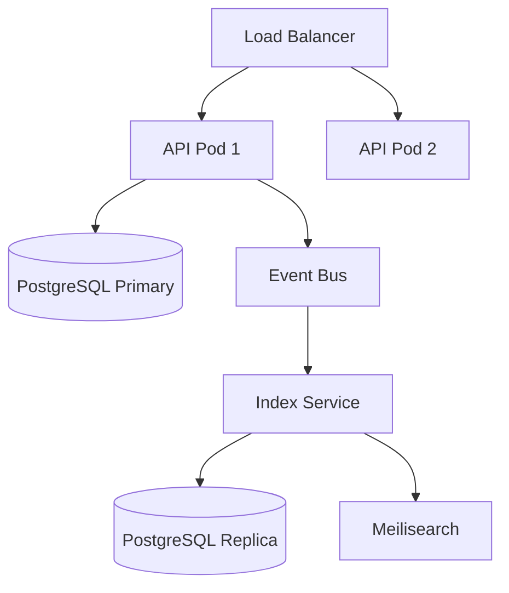

# RusToK — System Architecture Manifest v4.1

**Codename:** "The Highload Tank"  \
**Target:** AI Assistants (Cursor, Windsurf, Copilot, Claude)  \
**Role:** Senior Rust Architect & System Designer  \
**Philosophy:** "Write Optimized vs Read Optimized" / "Rust is ON. WordPress is OFF."


## 1. PROJECT IDENTITY

| Property | Value |
|----------|-------|
| **Name** | RusToK |
| **Type** | Event-Driven Enterprise Headless Platform |
| **Architecture** | Modular Monolith with CQRS & Event Sourcing elements |
| **Language** | Rust 100% |
| **License** | MIT |
| **Version** | 4.1 (The Highload Tank) |
| **Repository** | https://github.com/RustokCMS/RusToK |
| **Key Advantage** | First AI-Native Enterprise CMS |
| **Market Segment** | High-performance, low-cost enterprise commerce |

---

## 2. CORE PHILOSOPHY

### 2.1 The Tank Strategy
- **Stability First:** Мы строим "Танк", а не хрупкую экосистему плагинов.
- **Compile-Time Safety:** Если компилируется — работает.
- **Monorepo:** Backend, Admin и Storefront живут вместе.

### 2.2 Core Module, Specific Modules
- **Core Module (`rustok-core`):** Содержит только универсальные возможности (Traits, Auth, Events). Без таблиц БД.
- **Specialized Modules:** Товары, Блог и пр. — у каждого свои таблицы и бизнес-логика.
- **Empty Tables Cost Zero:** Неиспользуемые таблицы не нагружают систему.

### 2.3 CQRS (Write vs Read)
- **Write Model (Modules):** строгие реляционные таблицы (3NF), транзакции, валидация.
- **Read Model (Index/Catalog):** денормализованные JSONB-таблицы/индексы, GIN, быстрый поиск.
- **Event-Driven Sync:** изменения propagate через события.

### 2.4 Highload by Default
- **Event-Driven Glue:** модули не знают друг друга напрямую. Они общаются через EventBus.
- **No Heavy JOINs on Storefront:** данные "склеиваются" при записи (в Indexer), а не при чтении.

---

## 3. TECHNOLOGY STACK

| Layer | Technology | Details |
|-------|------------|---------|
| **Repository** | Cargo Workspace | Monorepo for all apps & crates |
| **Runtime** | Tokio | Async runtime |
| **Backend Framework** | Loco.rs | Axum-based, Rails-like MVC |
| **Admin UI** | Leptos CSR | Client-Side WASM |
| **Storefront** | Leptos SSR | Server-Side Rendering |
| **Database** | PostgreSQL 16+ | Partitioning, JSONB |
| **ORM** | SeaORM | Async, fully typed |
| **API** | async-graphql | Schema Federation |
| **IDs** | ULID | Generated via `ulid` crate, stored as `Uuid` |
| **Events** | tokio::broadcast | In-process pub/sub |
| **Search (optional)** | Meilisearch / Tantivy | Full-text search |

---

## 4. API ARCHITECTURE

### 4.1 Hybrid Design (REST + GraphQL)
RusToK uses a hybrid approach to provide both standard infrastructure endpoints and flexible data querying:
- **REST (Axum/Loco):** Authentication, Health, Swagger UI.
- **GraphQL (async-graphql):** Modular schema (MergedObject) for all domain operations.

### 4.2 Documentation
- **OpenAPI:** Automatically generated via `utoipa` and served at `/swagger`.
- **GQL Playground:** Integrated into the server for developer use.

---

## 5. PROJECT STRUCTURE (Workspace)

```text
rustok/
├── apps/
│   ├── server/                     # Loco.rs backend (API Gateway)
│   │   ├── src/
│   │   │   ├── controllers/        # REST & GraphQL Handlers
│   │   │   │   ├── auth.rs
│   │   │   │   ├── content/
│   │   │   │   ├── swagger.rs      # OpenAPI Definition
│   │   │   │   └── graphql.rs      # Main GQL Endpoint
│   │   │   ├── graphql/            # GQL Resolvers & Schema
│   │   │   ├── models/             # Shared entities
│   │   │   └── app.rs              # App orchestration
│   │   └── migration/              # Main migrations
│   ├── admin/                      # Leptos CSR (Management)
│   └── storefront/                 # Leptos SSR (Public)
│
├── crates/
│   ├── rustok-core/                # 🧠 Infrastructure (Auth, Events, RBAC)
│   ├── rustok-content/             # 📝 CMS (Nodes, Bodies, Categories)
│   ├── rustok-blog/                # 📰 Blogging Module
│   ├── rustok-commerce/            # 🛒 Shop Module (Products, Orders)
│   └── rustok-index/               # 🔎 CQRS Read Models (Fast Search)
│
├── docs/                           # 📚 Documentation & Architecture
├── Cargo.toml                      # Workspace setup
└── docker-compose.yml
```

---

## 6. DATABASE ARCHITECTURE

### 6.1 ID Generation (ULID → UUID)

```rust
// crates/rustok-core/src/id.rs
use ulid::Ulid;
use uuid::Uuid;

pub fn generate_id() -> Uuid {
    Uuid::from(Ulid::new())
}

pub fn parse_id(s: &str) -> Result<Uuid, IdError> {
    s.parse::<Ulid>()
        .map(Uuid::from)
        .or_else(|_| s.parse::<Uuid>())
        .map_err(|_| IdError::InvalidFormat(s.to_string()))
}
```

### 6.2 RusToK App Core (Server)
`apps/server/src/models`

```sql
-- SERVER: Tenants
CREATE TABLE tenants (
    id              UUID PRIMARY KEY,
    name            VARCHAR(255) NOT NULL,
    slug            VARCHAR(64) NOT NULL UNIQUE,
    settings        JSONB NOT NULL DEFAULT '{}',
    is_active       BOOLEAN NOT NULL DEFAULT true,
    created_at      TIMESTAMPTZ NOT NULL DEFAULT NOW(),
    updated_at      TIMESTAMPTZ NOT NULL DEFAULT NOW()
);

-- SERVER: Users
CREATE TABLE users (
    id              UUID PRIMARY KEY,
    tenant_id       UUID NOT NULL REFERENCES tenants(id) ON DELETE CASCADE,
    email           VARCHAR(255) NOT NULL,
    password_hash   VARCHAR(255) NOT NULL,
    role            VARCHAR(32) NOT NULL DEFAULT 'customer',
    status          VARCHAR(32) NOT NULL DEFAULT 'active',
    metadata        JSONB NOT NULL DEFAULT '{}',
    created_at      TIMESTAMPTZ NOT NULL DEFAULT NOW(),
    updated_at      TIMESTAMPTZ NOT NULL DEFAULT NOW(),
    UNIQUE (tenant_id, email)
);

-- SERVER: Module Toggles
CREATE TABLE tenant_modules (
    id              UUID PRIMARY KEY,
    tenant_id       UUID NOT NULL REFERENCES tenants(id) ON DELETE CASCADE,
    module_slug     VARCHAR(64) NOT NULL,
    enabled         BOOLEAN NOT NULL DEFAULT true,
    settings        JSONB NOT NULL DEFAULT '{}',
    created_at      TIMESTAMPTZ NOT NULL DEFAULT NOW(),
    UNIQUE (tenant_id, module_slug)
);
```

### 6.3 RusToK Content (Module)
`crates/rustok-content/src/entities`

```sql
-- CONTENT: Nodes (универсальный контент)
CREATE TABLE nodes (
    id              UUID PRIMARY KEY,
    tenant_id       UUID NOT NULL REFERENCES tenants(id) ON DELETE CASCADE,
    parent_id       UUID REFERENCES nodes(id) ON DELETE CASCADE,
    author_id       UUID REFERENCES users(id) ON DELETE SET NULL,
    kind            VARCHAR(32) NOT NULL,       -- 'page', 'post', 'comment'
    title           VARCHAR(255),
    slug            VARCHAR(255),
    excerpt         TEXT,
    category_id     UUID,
    status          VARCHAR(32) NOT NULL DEFAULT 'draft',
    position        INT DEFAULT 0,
    depth           INT DEFAULT 0,
    reply_count     INT DEFAULT 0,
    metadata        JSONB NOT NULL DEFAULT '{}',
    created_at      TIMESTAMPTZ NOT NULL DEFAULT NOW(),
    updated_at      TIMESTAMPTZ NOT NULL DEFAULT NOW(),
    published_at    TIMESTAMPTZ,
    UNIQUE (tenant_id, kind, slug) WHERE slug IS NOT NULL
);

-- CONTENT: Bodies (тяжёлый контент отдельно)
CREATE TABLE bodies (
    node_id         UUID PRIMARY KEY REFERENCES nodes(id) ON DELETE CASCADE,
    body            TEXT,
    format          VARCHAR(16) NOT NULL DEFAULT 'markdown',
    search_vector   TSVECTOR,
    updated_at      TIMESTAMPTZ NOT NULL DEFAULT NOW()
);
```

### 6.4 RusToK Commerce (Module)

```sql
-- COMMERCE: Products
CREATE TABLE commerce_products (
    id              UUID PRIMARY KEY,
    tenant_id       UUID NOT NULL REFERENCES tenants(id) ON DELETE CASCADE,
    title           VARCHAR(255) NOT NULL,
    subtitle        VARCHAR(255),
    handle          VARCHAR(255) NOT NULL,
    description     TEXT,
    status          VARCHAR(32) NOT NULL DEFAULT 'draft',
    discountable    BOOLEAN NOT NULL DEFAULT true,
    metadata        JSONB NOT NULL DEFAULT '{}',
    created_at      TIMESTAMPTZ NOT NULL DEFAULT NOW(),
    updated_at      TIMESTAMPTZ NOT NULL DEFAULT NOW(),
    UNIQUE (tenant_id, handle)
);

-- COMMERCE: Variants
CREATE TABLE commerce_variants (
    id              UUID PRIMARY KEY,
    product_id      UUID NOT NULL REFERENCES commerce_products(id) ON DELETE CASCADE,
    title           VARCHAR(255) NOT NULL,
    sku             VARCHAR(64),
    barcode         VARCHAR(64),
    manage_inventory BOOLEAN NOT NULL DEFAULT true,
    allow_backorder  BOOLEAN NOT NULL DEFAULT false,
    weight          INT,
    length          INT,
    height          INT,
    width           INT,
    position        INT NOT NULL DEFAULT 0,
    metadata        JSONB NOT NULL DEFAULT '{}',
    created_at      TIMESTAMPTZ NOT NULL DEFAULT NOW()
);

-- COMMERCE: Prices
CREATE TABLE commerce_prices (
    id              UUID PRIMARY KEY,
    variant_id      UUID NOT NULL REFERENCES commerce_variants(id) ON DELETE CASCADE,
    amount          BIGINT NOT NULL,
    currency_code   CHAR(3) NOT NULL,
    price_list_id   UUID,
    min_quantity    INT NOT NULL DEFAULT 1,
    created_at      TIMESTAMPTZ NOT NULL DEFAULT NOW(),
    UNIQUE (variant_id, currency_code, price_list_id, min_quantity)
);

-- COMMERCE: Orders
CREATE TABLE commerce_orders (
    id              UUID PRIMARY KEY,
    tenant_id       UUID NOT NULL REFERENCES tenants(id) ON DELETE CASCADE,
    customer_id     UUID REFERENCES users(id) ON DELETE SET NULL,
    display_id      SERIAL,
    status          VARCHAR(32) NOT NULL DEFAULT 'pending',
    email           VARCHAR(255),
    currency_code   CHAR(3) NOT NULL,
    subtotal        BIGINT NOT NULL,
    tax_total       BIGINT NOT NULL DEFAULT 0,
    shipping_total  BIGINT NOT NULL DEFAULT 0,
    discount_total  BIGINT NOT NULL DEFAULT 0,
    total           BIGINT NOT NULL,
    shipping_address JSONB,
    billing_address  JSONB,
    metadata        JSONB NOT NULL DEFAULT '{}',
    created_at      TIMESTAMPTZ NOT NULL DEFAULT NOW(),
    updated_at      TIMESTAMPTZ NOT NULL DEFAULT NOW()
);
```

### 6.5 RusToK Index/Catalog (CQRS Read Model)

```sql
-- INDEX: Денормализованные продукты для поиска
CREATE TABLE index_products (
    id              UUID PRIMARY KEY,
    tenant_id       UUID NOT NULL,
    product_id      UUID NOT NULL,
    title           VARCHAR(255) NOT NULL,
    subtitle        VARCHAR(255),
    handle          VARCHAR(255) NOT NULL,
    description     TEXT,
    status          VARCHAR(32) NOT NULL,
    min_price       BIGINT,
    max_price       BIGINT,
    currencies      CHAR(3)[],
    total_stock     INT,
    has_stock       BOOLEAN,
    categories      JSONB,
    tags            TEXT[],
    meta_title      VARCHAR(255),
    meta_description VARCHAR(500),
    search_vector   TSVECTOR,
    indexed_at      TIMESTAMPTZ NOT NULL DEFAULT NOW(),
    UNIQUE (product_id)
);

-- INDEX: Денормализованный контент для поиска
CREATE TABLE index_content (
    id              UUID PRIMARY KEY,
    tenant_id       UUID NOT NULL,
    node_id         UUID NOT NULL,
    kind            VARCHAR(32) NOT NULL,
    title           VARCHAR(255),
    slug            VARCHAR(255),
    excerpt         TEXT,
    body_preview    TEXT,
    status          VARCHAR(32) NOT NULL,
    author_id       UUID,
    author_name     VARCHAR(255),
    category_id     UUID,
    category_name   VARCHAR(255),
    category_slug   VARCHAR(255),
    tags            TEXT[],
    parent_id       UUID,
    reply_count     INT,
    meta_title      VARCHAR(255),
    meta_description VARCHAR(500),
    search_vector   TSVECTOR,
    published_at    TIMESTAMPTZ,
    indexed_at      TIMESTAMPTZ NOT NULL DEFAULT NOW(),
    UNIQUE (node_id)
);
```

### 6.6 Partitioning Strategy (Highload)

```sql
-- PARTITIONING: Orders по дате
CREATE TABLE commerce_orders_partitioned (
    id              UUID NOT NULL,
    tenant_id       UUID NOT NULL,
    created_at      TIMESTAMPTZ NOT NULL,
    PRIMARY KEY (id, created_at)
) PARTITION BY RANGE (created_at);

CREATE TABLE commerce_orders_2025_q1 PARTITION OF commerce_orders_partitioned FOR VALUES FROM ('2025-01-01') TO ('2025-04-01');

-- PARTITIONING: Nodes по tenant
CREATE TABLE nodes_partitioned (
    id              UUID NOT NULL,
    tenant_id       UUID NOT NULL,
    PRIMARY KEY (id, tenant_id)
) PARTITION BY HASH (tenant_id);

CREATE TABLE nodes_p0 PARTITION OF nodes_partitioned FOR VALUES WITH (MODULUS 8, REMAINDER 0);
```

### 6.7 Architecture Scaling (CQRS-lite + Index Module)

**Идея:** нормализованные write-таблицы остаются быстрыми и строгими, а для чтения строятся денормализованные индексы через Event Bus / Handlers.

```text
WRITE: GraphQL API -> Service -> SeaORM -> PostgreSQL -> EventBus
READ:  User -> Index Tables (denormalized) -> Search Results
```

---

## 7. TRAITS & INTERFACES (Rust Code)

### 7.1 Entity Identification
Все сущности должны использовать `Uuid` (генерируемый из `Ulid`).

### 7.2 Module Interface (`RusToKModule`)
`crates/rustok-core/src/module.rs`

```rust
#[async_trait]
pub trait RusToKModule: Send + Sync + MigrationSource {
    fn slug(&self) -> &'static str;
    fn name(&self) -> &'static str;
    fn description(&self) -> &'static str;
    fn version(&self) -> &'static str;
    
    fn dependencies(&self) -> &[&'static str] { &[] }
    
    fn event_listeners(&self) -> Vec<Box<dyn EventListener>> {
        Vec::new()
    }

    async fn on_enable(&self, ctx: ModuleContext<'_>) -> Result<()> { Ok(()) }
    async fn on_disable(&self, ctx: ModuleContext<'_>) -> Result<()> { Ok(()) }
}
```

### 7.3 Service Pattern
Использование `NodeService` как эталона для бизнес-логики (CRUD + Event Publishing).

---

## 8. EVENT SYSTEM

### 8.1 Domain Events

```rust
// crates/rustok-core/src/events/types.rs
#[derive(Clone, Debug, Serialize, Deserialize, PartialEq)]
#[serde(tag = "type", content = "data")]
pub enum DomainEvent {
    // CONTENT
    NodeCreated { node_id: Uuid, kind: String, author_id: Option<Uuid> },
    NodeUpdated { node_id: Uuid, kind: String },
    NodePublished { node_id: Uuid, kind: String },
    NodeDeleted { node_id: Uuid, kind: String },

    // USER
    UserRegistered { user_id: Uuid, email: String },
    UserLoggedIn { user_id: Uuid },

    // COMMERCE
    ProductCreated { product_id: Uuid },
    OrderPlaced { order_id: Uuid, customer_id: Option<Uuid>, total: i64, currency: String },

    // INDEX (CQRS)
    ReindexRequested { target_type: String, target_id: Option<Uuid> },
    IndexUpdated { index_name: String, target_id: Uuid },

    // TENANT
    TenantCreated { tenant_id: Uuid },
}
```

### 8.2 Event Bus

```rust
// crates/rustok-core/src/events/bus.rs
pub struct EventBus {
    sender: broadcast::Sender<EventEnvelope>,
    stats: Arc<EventBusStats>,
}

impl EventBus {
    pub fn publish(&self, tenant_id: Uuid, actor_id: Option<Uuid>, event: DomainEvent) -> Result<()> {
        let envelope = EventEnvelope::new(tenant_id, actor_id, event);
        match self.sender.send(envelope) {
            Ok(_) => { /* update stats */ Ok(()) }
            Err(e) => {
                tracing::warn!("Event dropped: {:?}", e);
                Ok(())
            }
        }
    }

    pub fn subscribe(&self) -> broadcast::Receiver<EventEnvelope> {
        self.sender.subscribe()
    }
}
```

### 8.3 Event Handlers

```rust
// crates/rustok-core/src/events/handler.rs
#[async_trait]
pub trait EventHandler: Send + Sync {
    fn handles(&self, event: &DomainEvent) -> bool;
    async fn handle(&self, envelope: &EventEnvelope) -> Result<()>;
}

pub struct EventDispatcher {
    bus: EventBus,
    handlers: Vec<Arc<dyn EventHandler>>,
}
```

---

## 9. INDEX MODULE (CQRS)

### 9.1 Index Configuration

```rust
pub struct IndexConfig {
    pub batch_size: usize,
    pub workers: usize,
    pub realtime_sync: bool,
    pub reindex_schedule: Option<String>,
}
```

### 9.2 Product Indexer Pattern

```rust
#[async_trait]
impl EventHandler for ProductIndexer {
    async fn handle(&self, envelope: &EventEnvelope) -> Result<()> {
        let product_id = match &envelope.event {
            DomainEvent::ProductCreated { product_id } => *product_id,
            DomainEvent::ProductUpdated { product_id } => *product_id,
            _ => return Ok(()),
        };
        self.index_product(product_id).await
    }
}
```

---

## 10. MODULE REGISTRATION

```rust
// crates/rustok-core/src/registry.rs
pub struct ModuleRegistry {
    modules: HashMap<String, Box<dyn RusToKModule>>,
}

impl ModuleRegistry {
    pub fn register(&mut self, module: Box<dyn RusToKModule>) {
        self.modules.insert(module.slug().to_string(), module);
    }
}
```

---

## 11. DEPLOYMENT ARCHITECTURE

### 11.1 Monolith (Default)
Standard `docker-compose.yml` with PostgreSQL and Redis.

### 11.2 Microservices (Scale)
Scaling API instances and isolating the Index Service for heavy read loads using streaming replication for DB.

### 11.3 Architecture Diagram



---

## 12. SUMMARY: What Lives Where

| Layer | Tables/Entities | Purpose |
|-------|----------------|---------|
| **Core** | users, tenants, tenant_modules | Universal foundation |
| **Content** | nodes, bodies, categories, tags | CMS / Blog domain |
| **Commerce** | products, variants, orders | E-commerce domain |
| **Index** | index_products, index_content | CQRS read models |

---

## 13. DATA FLOW

```text
┌──────────────────────────────────────────────────────────────────┐
│                         WRITE PATH                               │
│  User Request -> GraphQL API -> Service -> SeaORM -> PostgreSQL  │
│                      |                                           │
│                      v                                           │
│                 [ Event Bus ]                                    │
└──────────────────────|───────────────────────────────────────────┘
                       |
                       v
┌──────────────────────────────────────────────────────────────────┐
│                         READ PATH                                │
│                 [ Index Handlers ]                               │
│                        |                                         │
│                        v                                         │
│                 [ INDEX TABLES ]                                 │
│            User -> Search Queries -> Results                     │
└──────────────────────────────────────────────────────────────────┘
```

---

## 14. SUMMARY: WHY THIS ROCKS

1. **Independent Scaling:** Index tables можно вынести отдельно.
2. **Zero-Bloat Core:** Нет ненужных таблиц, если модуль не используется.
3. **Fast Storefront:** Нет тяжёлых JOIN-ов при чтении.
4. **Admin DX:** Админка выглядит монолитной, но под капотом разрозненные сервисы.

---

---

## 15. CODING STANDARDS (The "Golden Rules")

Для обеспечения консистентности кода и предсказуемости для ИИ:

1.  **Strict Result Handling**: Все функции, которые могут упасть, возвращают `Result<T, RusToKError>`. Использование `.unwrap()` или `.expect()` запрещено (кроме тестов).
2.  **DTO Separation**: Никогда не отдавать SeaORM-модели (Entity) в API напрямую.
    *   `Create[Name]Request` — для ввода.
    *   `Update[Name]Request` — для редактирования.
    *   `[Name]Response` — для вывода.
3.  **Snake Case everywhere**: БД таблицы и поля в Rust — `snake_case`. GraphQL — `camelCase` (автоматически через библиотеку).
4.  **Tenant Isolation**: Любой запрос к БД обязан содержать фильтр по `tenant_id`. Если его нет — это баг безопасности.
5.  **Event-First**: Изменение данных в БД должно сопровождаться публикацией события. Если события нет — индекс (Search) не узнает об изменениях.

---

## 16. ARCHITECTURAL PATTERNS

### 16.1 The Service Layer Pattern
Контроллеры (REST) и Резолверы (GQL) — это просто тонкие обертки. Вся логика живет в `Services`.

```rust
pub struct NodeService;

impl NodeService {
    pub async fn create(db: &DatabaseConnection, input: CreateNodeInput) -> Result<NodeResponse, RusToKError> {
        // 1. Logic & Validation
        // 2. Database Persistence
        // 3. Event Dispatching
        // 4. Transform to DTO Response
    }
}
```

### 16.2 The Transactional Pattern
Для операций с несколькими таблицами всегда передавайте `&C where C: ConnectionTrait` в методы сервисов, чтобы можно было прокинуть транзакцию.

---

## 17. RECIPE: Creating a New Module

Чтобы добавить новый функционал (например, "Tickets"), следуй этому алгоритму:

1.  **Database**: Создай миграцию в `apps/server/migration` (таблицы с `tenant_id`).
2.  **Entities**: Сгенерируй модели SeaORM (`sea-orm-cli generate entity`).
3.  **Module Crate**: Создай или выбери крафт в `crates/`.
4.  **Logic**: Напиши `Service` для CRUD операций.
5.  **Events**: Добавь новые варианты в `DomainEvent` и публикуй их в `Service`.
6.  **GraphQL**: Напиши резолверы и добавь их в `MergedObject` в `apps/server/src/graphql`.
7.  **Index**: Если нужен поиск — добавь `Handler` в `rustok-index`, который будет слушать события нового модуля.

---

## 18. FINAL CHECKLIST for AI

- [x] Использует `Uuid` (ULID) для всех ID.
- [x] `tenant_id` присутствует во всех фильтрах БД.
- [x] Логика вынесена в `Service`.
- [x] События отправляются в `EventBus`.
- [x] DTO отделены от моделей БД.
- [x] Ошибки типизированы через `RusToKError`.

---

## 19. STANDARD MODULE LAYOUT (Design Pattern)

Чтобы ИИ и разработчики могли ориентироваться в любом крайте (crate), мы вводим единый стандарт папок. Даже если папка пуста — она должна быть (или создаваться по мере роста).

### 19.1 Directory Structure
```text
crates/rustok-[name]/
├── src/
│   ├── entities/       # SeaORM модели (generate entity)
│   ├── dto/            # Request/Response структуры (Input/Output)
│   ├── services/       # Бизнес-логика (Service Layer)
│   ├── error.rs        # Типизированные ошибки модуля
│   └── lib.rs          # Регистрация модуля & Public API
├── Cargo.toml
└── README.md
```

### 19.2 Module Categorization
Мы разделяем модули на 4 типа, но структура папок остается **одинаковой**:

1.  **Core Components** (e.g., `rustok-content`): Базовые кирпичики системы. Имеют таблицы, но могут не иметь сложной бизнес-логики.
2.  **Domain Modules** (e.g., `rustok-commerce`): Полноценные бизнес-вертикали (Товары, Заказы). Имеют свои таблицы и логику.
3.  **Wrapper Modules** (e.g., `rustok-blog`): Надстройки. **Не имеют своих таблиц**. Используют таблицы `Core Components`, упаковывая их в специфичную бизнес-логику.
4.  **Infrastructural Modules** (e.g., `rustok-index`): Технические модули (Поиск, CQRS, Почта).

### 19.3 The lib.rs Standard
Все модули обязаны реализовывать `RusToKModule` для интеграции в `ModuleRegistry`.

```rust
pub struct MyModule;

#[async_trait]
impl RusToKModule for MyModule {
    fn slug(&self) -> &'static str { "my-module" }
    fn name(&self) -> &'static str { "My Module" }
    // ...
}
```

---

END OF MANIFEST v4.1
