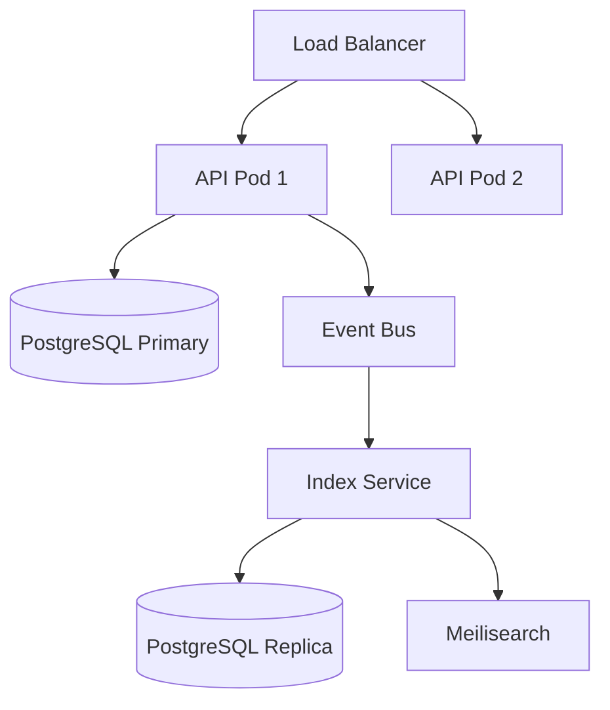

# RusToK — System Architecture Manifest v4.1

**Codename:** "The Highload Tank"  \
**Target:** AI Assistants (Cursor, Windsurf, Copilot, Claude)  \
**Role:** Senior Rust Architect & System Designer  \
**Philosophy:** "Write Optimized vs Read Optimized" / "Rust is ON. WordPress is OFF."


## 1. PROJECT IDENTITY

| Property | Value |
|----------|-------|
| **Name** | RusToK |
| **Type** | Event-Driven Enterprise Headless Platform |
| **Architecture** | Modular Monolith with CQRS & Event Sourcing elements |
| **Language** | Rust 100% |
| **License** | MIT |
| **Version** | 4.1 (The Highload Tank) |
| **Repository** | https://github.com/RustokCMS/RusToK |
| **Key Advantage** | First AI-Native Enterprise CMS |
| **Market Segment** | High-performance, low-cost enterprise commerce |

---

## 2. CORE PHILOSOPHY

### 2.1 The Tank Strategy
- **Stability First:** Мы строим "Танк", а не хрупкую экосистему плагинов.
- **Compile-Time Safety:** Если компилируется — работает.
- **Monorepo:** Backend, Admin и Storefront живут вместе.

### 2.2 Core Module, Specific Modules
- **Core Module (`rustok-core`):** Содержит только универсальные возможности (Traits, Events, Module Registry). Без таблиц БД.
- **Specialized Modules:** Товары, Блог и пр. — у каждого свои таблицы и бизнес-логика.
- **Empty Tables Cost Zero:** Неиспользуемые таблицы не нагружают систему.

**Module Contracts (code-aligned):**
`rustok-core` — инфраструктурный crate, не регистрируется как `RusToKModule`. Остальные модули реализуют единый контракт (slug/name/description/version) и стандартный набор unit-тестов для метаданных и миграций.

| Crate | slug | name | description |
|-------|------|------|-------------|
| `rustok-content` | `content` | Content | Core CMS Module (Nodes, Bodies, Categories) |
| `rustok-blog` | `blog` | Blog | Posts, Pages, Comments |
| `rustok-commerce` | `commerce` | Commerce | Products, Orders, Cart, Checkout |
| `rustok-pages` | `pages` | Pages | Static pages, menus, blocks |
| `rustok-tenant` | `tenant` | Tenant | Multi-tenancy helpers |
| `rustok-rbac` | `rbac` | RBAC | Roles & permissions |
| `rustok-index` | `index` | Index | CQRS Read Model (Fast Search) |

### 2.3 CQRS (Write vs Read)
- **Write Model (Modules):** строгие реляционные таблицы (3NF), транзакции, валидация.
- **Read Model (Index/Catalog):** денормализованные JSONB-таблицы/индексы, GIN, быстрый поиск.
- **Event-Driven Sync:** изменения propagate через события.

### 2.4 Highload by Default
- **Event-Driven Glue:** модули не знают друг друга напрямую. Они общаются через EventBus.
- **No Heavy JOINs on Storefront:** данные "склеиваются" при записи (в Indexer), а не при чтении.
- **Multilingual by Default:** многоязычность включена сразу; платформа по умолчанию полностью многоязычная.

### 2.5 Multilingual Implementation (Current State)
Многоязычность уже внедрена в ключевых доменных модулях:
- **Content:** переводы узлов и тела (`node_translation`, `body`) с `locale`.
- **Commerce:** переводы продуктов и вариантов (`product_translation`, `variant_translation`) с `locale`.
- **Blog:** DTO и сервисы принимают `locale`.
- **Index:** индексация поддерживает `locale` и пересборку по локалям.

### 2.6 Loco RS Foundation (Current State)
Используем Loco RS как базовый каркас, чтобы не дублировать инфраструктуру:
- **Config:** `apps/server/config/*.yaml`, секция `rustok` для кастомных настроек.
- **Auth:** встроенные Users + JWT access/refresh + bcrypt.
- **Cache:** Redis через Loco cache.
- **Workers/Queue:** фоновые задачи и очереди Loco.
- **Mailer:** SMTP через Loco mailer.
- **Storage:** Local/S3 через Loco storage (`object_store`).

**Следствие:** отдельные crates `rustok-config`, `rustok-cache`, `rustok-auth`, `rustok-storage` **не нужны**.

**RusToK settings (Loco `settings.rustok`):**
- `tenant.enabled` / `tenant.resolution` / `tenant.header_name` / `tenant.default_id`
- `search.enabled` / `search.driver` / `search.url` / `search.api_key` / `search.index_prefix`
- `features.registration_enabled` / `features.email_verification` / `features.multi_tenant` / `features.search_indexing` / `features.oauth_enabled`
- `rate_limit.enabled` / `rate_limit.requests_per_minute` / `rate_limit.burst`

---

## 3. TECHNOLOGY STACK (Approved)

| Layer | Technology | Details |
|-------|------------|---------|
| **Repository** | Cargo Workspace | Monorepo for all apps & crates |
| **Runtime** | Tokio | Async runtime |
| **Application Framework** | Loco RS (Axum-based) | "Rust on Rails" foundation for app boot, auth, workers, mailers |
| **HTTP Framework** | Axum | REST + middleware (via Loco) |
| **OpenAPI Docs** | Utoipa | `utoipa`, `utoipa-swagger-ui` |
| **Validation** | Validator | `validator` crate |
| **Database** | PostgreSQL 16+ | Partitioning, JSONB |
| **ORM** | SeaORM | Async, fully typed |
| **SQL Driver** | SQLx | For raw queries/migrations |
| **Config** | Loco YAML | `apps/server/config/*.yaml` with env overrides |
| **Events (L0)** | tokio::sync::mpsc | In-memory transport |
| **Events (L1)** | Outbox Pattern | Custom crate `rustok-outbox` |
| **Events (L2)** | Iggy | Streaming (remote/embedded) |
| **Cache** | Loco Cache (Redis) | Built-in cache integration |
| **Search** | Tantivy | Embedded full-text search |
| **Storage** | object_store | Unified object storage API |
| **Tracing** | tracing + OpenTelemetry | `tracing`, `tracing-opentelemetry` |
| **Metrics** | Prometheus | `metrics`, `metrics-exporter-prometheus` |
| **Auth** | Loco Auth (JWT) | Users + JWT access/refresh, bcrypt hashing |
| **Mailer** | Loco Mailer (SMTP) | Built-in mail delivery + templates |
| **Workers/Queue** | Loco Workers | Async workers + Redis/Postgres queue |
| **Storage** | Loco Storage | Local/S3 via `object_store` |
| **Serialization** | Serde | `serde`, `serde_json` |

---

## 4. API ARCHITECTURE

### 4.1 REST + GraphQL in Parallel
RusToK develops REST and GraphQL APIs simultaneously for platform and domain endpoints:
- **REST (Axum):** Authentication, Health, Admin endpoints.
- **GraphQL:** Modular schema (MergedObject) for domain operations.

### 4.2 Documentation
- **OpenAPI:** Generated via `utoipa` and served at `/swagger`.

---

## 5. PROJECT STRUCTURE (Workspace)

```text
rustok/
├── Cargo.toml                 # Workspace
├── crates/
│   ├── rustok-core/           # Core traits/events
│   ├── rustok-content         # CMS domain
│   ├── rustok-blog            # Blog domain
│   ├── rustok-forum           # Forum domain
│   ├── rustok-pages           # Pages domain
│   ├── rustok-commerce        # Commerce domain
│   ├── rustok-index           # CQRS read model
│   ├── rustok-tenant          # Multi-tenancy helpers
│   ├── rustok-rbac            # Roles & permissions
│   ├── rustok-outbox          # Outbox transport
│   └── rustok-iggy            # Streaming (optional)
│
└── apps/
    ├── server/                # Loco RS backend
    │   ├── config/            # Loco YAML configs
    │   ├── migration/         # SeaORM migrations
    │   └── src/
    │       ├── app.rs         # Loco hooks & routes
    │       └── main.rs
    ├── admin/                 # Admin UI
    └── storefront/            # Storefront UI
```

---

## 6. DATABASE ARCHITECTURE

### 6.1 ID Generation (ULID → UUID)

```rust
// crates/rustok-core/src/id.rs
use ulid::Ulid;
use uuid::Uuid;

pub fn generate_id() -> Uuid {
    Uuid::from(Ulid::new())
}

pub fn parse_id(s: &str) -> Result<Uuid, IdError> {
    s.parse::<Ulid>()
        .map(Uuid::from)
        .or_else(|_| s.parse::<Uuid>())
        .map_err(|_| IdError::InvalidFormat(s.to_string()))
}
```

### 6.2 RusToK App Core (Server)
`apps/server/src/models`

```sql
-- SERVER: Tenants
CREATE TABLE tenants (
    id              UUID PRIMARY KEY,
    name            VARCHAR(255) NOT NULL,
    slug            VARCHAR(64) NOT NULL UNIQUE,
    settings        JSONB NOT NULL DEFAULT '{}',
    is_active       BOOLEAN NOT NULL DEFAULT true,
    created_at      TIMESTAMPTZ NOT NULL DEFAULT NOW(),
    updated_at      TIMESTAMPTZ NOT NULL DEFAULT NOW()
);

-- SERVER: Users
CREATE TABLE users (
    id              UUID PRIMARY KEY,
    tenant_id       UUID NOT NULL REFERENCES tenants(id) ON DELETE CASCADE,
    email           VARCHAR(255) NOT NULL,
    password_hash   VARCHAR(255) NOT NULL,
    role            VARCHAR(32) NOT NULL DEFAULT 'customer',
    status          VARCHAR(32) NOT NULL DEFAULT 'active',
    metadata        JSONB NOT NULL DEFAULT '{}',
    created_at      TIMESTAMPTZ NOT NULL DEFAULT NOW(),
    updated_at      TIMESTAMPTZ NOT NULL DEFAULT NOW(),
    UNIQUE (tenant_id, email)
);

-- SERVER: Module Toggles
CREATE TABLE tenant_modules (
    id              UUID PRIMARY KEY,
    tenant_id       UUID NOT NULL REFERENCES tenants(id) ON DELETE CASCADE,
    module_slug     VARCHAR(64) NOT NULL,
    enabled         BOOLEAN NOT NULL DEFAULT true,
    settings        JSONB NOT NULL DEFAULT '{}',
    created_at      TIMESTAMPTZ NOT NULL DEFAULT NOW(),
    UNIQUE (tenant_id, module_slug)
);
```

### 6.3 RusToK Content (Module)
`crates/rustok-content/src/entities`

```sql
-- CONTENT: Nodes (универсальный контент)
CREATE TABLE nodes (
    id              UUID PRIMARY KEY,
    tenant_id       UUID NOT NULL REFERENCES tenants(id) ON DELETE CASCADE,
    parent_id       UUID REFERENCES nodes(id) ON DELETE CASCADE,
    author_id       UUID REFERENCES users(id) ON DELETE SET NULL,
    kind            VARCHAR(32) NOT NULL,       -- 'page', 'post', 'comment'
    title           VARCHAR(255),
    slug            VARCHAR(255),
    excerpt         TEXT,
    category_id     UUID,
    status          VARCHAR(32) NOT NULL DEFAULT 'draft',
    position        INT DEFAULT 0,
    depth           INT DEFAULT 0,
    reply_count     INT DEFAULT 0,
    metadata        JSONB NOT NULL DEFAULT '{}',
    created_at      TIMESTAMPTZ NOT NULL DEFAULT NOW(),
    updated_at      TIMESTAMPTZ NOT NULL DEFAULT NOW(),
    published_at    TIMESTAMPTZ,
    UNIQUE (tenant_id, kind, slug) WHERE slug IS NOT NULL
);

-- CONTENT: Bodies (тяжёлый контент отдельно)
CREATE TABLE bodies (
    node_id         UUID PRIMARY KEY REFERENCES nodes(id) ON DELETE CASCADE,
    body            TEXT,
    format          VARCHAR(16) NOT NULL DEFAULT 'markdown',
    search_vector   TSVECTOR,
    updated_at      TIMESTAMPTZ NOT NULL DEFAULT NOW()
);
```

### 6.4 RusToK Commerce (Module)

```sql
-- COMMERCE: Products
CREATE TABLE commerce_products (
    id              UUID PRIMARY KEY,
    tenant_id       UUID NOT NULL REFERENCES tenants(id) ON DELETE CASCADE,
    title           VARCHAR(255) NOT NULL,
    subtitle        VARCHAR(255),
    handle          VARCHAR(255) NOT NULL,
    description     TEXT,
    status          VARCHAR(32) NOT NULL DEFAULT 'draft',
    discountable    BOOLEAN NOT NULL DEFAULT true,
    metadata        JSONB NOT NULL DEFAULT '{}',
    created_at      TIMESTAMPTZ NOT NULL DEFAULT NOW(),
    updated_at      TIMESTAMPTZ NOT NULL DEFAULT NOW(),
    UNIQUE (tenant_id, handle)
);

-- COMMERCE: Variants
CREATE TABLE commerce_variants (
    id              UUID PRIMARY KEY,
    product_id      UUID NOT NULL REFERENCES commerce_products(id) ON DELETE CASCADE,
    title           VARCHAR(255) NOT NULL,
    sku             VARCHAR(64),
    barcode         VARCHAR(64),
    manage_inventory BOOLEAN NOT NULL DEFAULT true,
    allow_backorder  BOOLEAN NOT NULL DEFAULT false,
    weight          INT,
    length          INT,
    height          INT,
    width           INT,
    position        INT NOT NULL DEFAULT 0,
    metadata        JSONB NOT NULL DEFAULT '{}',
    created_at      TIMESTAMPTZ NOT NULL DEFAULT NOW()
);

-- COMMERCE: Prices
CREATE TABLE commerce_prices (
    id              UUID PRIMARY KEY,
    variant_id      UUID NOT NULL REFERENCES commerce_variants(id) ON DELETE CASCADE,
    amount          BIGINT NOT NULL,
    currency_code   CHAR(3) NOT NULL,
    price_list_id   UUID,
    min_quantity    INT NOT NULL DEFAULT 1,
    created_at      TIMESTAMPTZ NOT NULL DEFAULT NOW(),
    UNIQUE (variant_id, currency_code, price_list_id, min_quantity)
);

-- COMMERCE: Orders
CREATE TABLE commerce_orders (
    id              UUID PRIMARY KEY,
    tenant_id       UUID NOT NULL REFERENCES tenants(id) ON DELETE CASCADE,
    customer_id     UUID REFERENCES users(id) ON DELETE SET NULL,
    display_id      SERIAL,
    status          VARCHAR(32) NOT NULL DEFAULT 'pending',
    email           VARCHAR(255),
    currency_code   CHAR(3) NOT NULL,
    subtotal        BIGINT NOT NULL,
    tax_total       BIGINT NOT NULL DEFAULT 0,
    shipping_total  BIGINT NOT NULL DEFAULT 0,
    discount_total  BIGINT NOT NULL DEFAULT 0,
    total           BIGINT NOT NULL,
    shipping_address JSONB,
    billing_address  JSONB,
    metadata        JSONB NOT NULL DEFAULT '{}',
    created_at      TIMESTAMPTZ NOT NULL DEFAULT NOW(),
    updated_at      TIMESTAMPTZ NOT NULL DEFAULT NOW()
);
```

### 6.5 RusToK Index/Catalog (CQRS Read Model)

```sql
-- INDEX: Денормализованные продукты для поиска
CREATE TABLE index_products (
    id              UUID PRIMARY KEY,
    tenant_id       UUID NOT NULL,
    product_id      UUID NOT NULL,
    title           VARCHAR(255) NOT NULL,
    subtitle        VARCHAR(255),
    handle          VARCHAR(255) NOT NULL,
    description     TEXT,
    status          VARCHAR(32) NOT NULL,
    min_price       BIGINT,
    max_price       BIGINT,
    currencies      CHAR(3)[],
    total_stock     INT,
    has_stock       BOOLEAN,
    categories      JSONB,
    tags            TEXT[],
    meta_title      VARCHAR(255),
    meta_description VARCHAR(500),
    search_vector   TSVECTOR,
    indexed_at      TIMESTAMPTZ NOT NULL DEFAULT NOW(),
    UNIQUE (product_id)
);

-- INDEX: Денормализованный контент для поиска
CREATE TABLE index_content (
    id              UUID PRIMARY KEY,
    tenant_id       UUID NOT NULL,
    node_id         UUID NOT NULL,
    kind            VARCHAR(32) NOT NULL,
    title           VARCHAR(255),
    slug            VARCHAR(255),
    excerpt         TEXT,
    body_preview    TEXT,
    status          VARCHAR(32) NOT NULL,
    author_id       UUID,
    author_name     VARCHAR(255),
    category_id     UUID,
    category_name   VARCHAR(255),
    category_slug   VARCHAR(255),
    tags            TEXT[],
    parent_id       UUID,
    reply_count     INT,
    meta_title      VARCHAR(255),
    meta_description VARCHAR(500),
    search_vector   TSVECTOR,
    published_at    TIMESTAMPTZ,
    indexed_at      TIMESTAMPTZ NOT NULL DEFAULT NOW(),
    UNIQUE (node_id)
);
```

### 6.6 Partitioning Strategy (Highload)

```sql
-- PARTITIONING: Orders по дате
CREATE TABLE commerce_orders_partitioned (
    id              UUID NOT NULL,
    tenant_id       UUID NOT NULL,
    created_at      TIMESTAMPTZ NOT NULL,
    PRIMARY KEY (id, created_at)
) PARTITION BY RANGE (created_at);

CREATE TABLE commerce_orders_2025_q1 PARTITION OF commerce_orders_partitioned FOR VALUES FROM ('2025-01-01') TO ('2025-04-01');

-- PARTITIONING: Nodes по tenant
CREATE TABLE nodes_partitioned (
    id              UUID NOT NULL,
    tenant_id       UUID NOT NULL,
    PRIMARY KEY (id, tenant_id)
) PARTITION BY HASH (tenant_id);

CREATE TABLE nodes_p0 PARTITION OF nodes_partitioned FOR VALUES WITH (MODULUS 8, REMAINDER 0);
```

### 6.7 Architecture Scaling (CQRS-lite + Index Module)

**Идея:** нормализованные write-таблицы остаются быстрыми и строгими, а для чтения строятся денормализованные индексы через Event Bus / Handlers.

```text
WRITE: REST/GraphQL API -> Service -> SeaORM -> PostgreSQL -> EventBus
READ:  User -> Index Tables (denormalized) -> Search Results
```

---

## 7. TRAITS & INTERFACES (Rust Code)

### 7.1 Entity Identification
Все сущности должны использовать `Uuid` (генерируемый из `Ulid`).

### 7.2 Module Interface (`RusToKModule`)
`crates/rustok-core/src/module.rs`

```rust
#[async_trait]
pub trait RusToKModule: Send + Sync + MigrationSource {
    fn slug(&self) -> &'static str;
    fn name(&self) -> &'static str;
    fn description(&self) -> &'static str;
    fn version(&self) -> &'static str;
    
    fn dependencies(&self) -> &[&'static str] { &[] }
    
    fn event_listeners(&self) -> Vec<Box<dyn EventListener>> {
        Vec::new()
    }

    async fn on_enable(&self, ctx: ModuleContext<'_>) -> Result<()> { Ok(()) }
    async fn on_disable(&self, ctx: ModuleContext<'_>) -> Result<()> { Ok(()) }
}
```

### 7.3 Service Pattern
Использование `NodeService` как эталона для бизнес-логики (CRUD + Event Publishing).

---

## 8. EVENT SYSTEM

### 8.0 Event System Consensus (Status)

| Decision | Status |
|----------|--------|
| EventTransport trait in Core | ✅ |
| MemoryTransport (MPSC) in Core | ✅ |
| OutboxTransport in separate crate | ✅ |
| Transactional publish_in_tx | ✅ |
| EventEnvelope with correlation/causation | ✅ |
| sys_events migration in apps/server | ✅ |

### 8.1 Domain Events

```rust
// crates/rustok-core/src/events/types.rs
#[derive(Clone, Debug, Serialize, Deserialize, PartialEq)]
#[serde(tag = "type", content = "data")]
pub enum DomainEvent {
    // CONTENT
    NodeCreated { node_id: Uuid, kind: String, author_id: Option<Uuid> },
    NodeUpdated { node_id: Uuid, kind: String },
    NodePublished { node_id: Uuid, kind: String },
    NodeDeleted { node_id: Uuid, kind: String },

    // USER
    UserRegistered { user_id: Uuid, email: String },
    UserLoggedIn { user_id: Uuid },

    // COMMERCE
    ProductCreated { product_id: Uuid },
    OrderPlaced { order_id: Uuid, customer_id: Option<Uuid>, total: i64, currency: String },

    // INDEX (CQRS)
    ReindexRequested { target_type: String, target_id: Option<Uuid> },
    IndexUpdated { index_name: String, target_id: Uuid },

    // TENANT
    TenantCreated { tenant_id: Uuid },
}
```

### 8.2 Event Bus

```rust
// crates/rustok-core/src/events/bus.rs
pub struct EventBus {
    sender: broadcast::Sender<EventEnvelope>,
    stats: Arc<EventBusStats>,
}

impl EventBus {
    pub fn publish(&self, tenant_id: Uuid, actor_id: Option<Uuid>, event: DomainEvent) -> Result<()> {
        let envelope = EventEnvelope::new(tenant_id, actor_id, event);
        match self.sender.send(envelope) {
            Ok(_) => { /* update stats */ Ok(()) }
            Err(e) => {
                tracing::warn!("Event dropped: {:?}", e);
                Ok(())
            }
        }
    }

    pub fn subscribe(&self) -> broadcast::Receiver<EventEnvelope> {
        self.sender.subscribe()
    }
}
```

### 8.3 Event Handlers

```rust
// crates/rustok-core/src/events/handler.rs
#[async_trait]
pub trait EventHandler: Send + Sync {
    fn handles(&self, event: &DomainEvent) -> bool;
    async fn handle(&self, envelope: &EventEnvelope) -> Result<()>;
}

pub struct EventDispatcher {
    bus: EventBus,
    handlers: Vec<Arc<dyn EventHandler>>,
}
```

---

## 9. INDEX MODULE (CQRS)

### 9.1 Index Configuration

```rust
pub struct IndexConfig {
    pub batch_size: usize,
    pub workers: usize,
    pub realtime_sync: bool,
    pub reindex_schedule: Option<String>,
}
```

### 9.2 Product Indexer Pattern

```rust
#[async_trait]
impl EventHandler for ProductIndexer {
    async fn handle(&self, envelope: &EventEnvelope) -> Result<()> {
        let product_id = match &envelope.event {
            DomainEvent::ProductCreated { product_id } => *product_id,
            DomainEvent::ProductUpdated { product_id } => *product_id,
            _ => return Ok(()),
        };
        self.index_product(product_id).await
    }
}
```

---

## 10. MODULE REGISTRATION

```rust
// crates/rustok-core/src/registry.rs
pub struct ModuleRegistry {
    modules: HashMap<String, Box<dyn RusToKModule>>,
}

impl ModuleRegistry {
    pub fn register(&mut self, module: Box<dyn RusToKModule>) {
        self.modules.insert(module.slug().to_string(), module);
    }
}
```

---

## 11. DEPLOYMENT ARCHITECTURE

### 11.1 Monolith (Default)
Standard `docker-compose.yml` with PostgreSQL and Redis.

### 11.2 Microservices (Scale)
Scaling API instances and isolating the Index Service for heavy read loads using streaming replication for DB.

### 11.3 Architecture Diagram



---

## 12. SUMMARY: What Lives Where

| Layer | Tables/Entities | Purpose |
|-------|----------------|---------|
| **Core** | users, tenants, tenant_modules | Universal foundation |
| **Content** | nodes, bodies, categories, tags | CMS / Blog domain |
| **Commerce** | products, variants, orders | E-commerce domain |
| **Index** | index_products, index_content | CQRS read models |

---

## 13. DATA FLOW

```text
┌──────────────────────────────────────────────────────────────────┐
│                         WRITE PATH                               │
│  User Request -> REST/GraphQL API -> Service -> SeaORM -> PostgreSQL │
│                      |                                           │
│                      v                                           │
│                 [ Event Bus ]                                    │
└──────────────────────|───────────────────────────────────────────┘
                       |
                       v
┌──────────────────────────────────────────────────────────────────┐
│                         READ PATH                                │
│                 [ Index Handlers ]                               │
│                        |                                         │
│                        v                                         │
│                 [ INDEX TABLES ]                                 │
│            User -> Search Queries -> Results                     │
└──────────────────────────────────────────────────────────────────┘
```

---

## 14. SUMMARY: WHY THIS ROCKS

1. **Independent Scaling:** Index tables можно вынести отдельно.
2. **Zero-Bloat Core:** Нет ненужных таблиц, если модуль не используется.
3. **Fast Storefront:** Нет тяжёлых JOIN-ов при чтении.
4. **Admin DX:** Админка выглядит монолитной, но под капотом разрозненные сервисы.

---

## 15. MODULES: DETAILED RESPONSIBILITIES (No Duplication)

Ниже перечислены все модули и их обязанности. Цель: **не дублировать функциональность Loco RS** и не вводить параллельные инфраструктурные слои.

### 15.1 Loco RS (Infrastructure — используем как есть)
- **Config:** `apps/server/config/*.yaml`, кастомные поля в `settings.rustok`.
- **Auth:** Users + JWT access/refresh, hashing.
- **Cache:** Redis cache.
- **Workers/Queue:** фоновые задачи.
- **Mailer:** SMTP + templates.
- **Storage:** Local/S3 через `object_store`.

### 15.2 `rustok-core` (Infrastructure, без таблиц)
**Роль:** только общие типы и контракты.
- ID generation (ULID → UUID), общие типы.
- Event bus, envelope, transport traits.
- `RusToKModule` interface + registry.
- Ошибки и базовые helpers.

### 15.3 `rustok-tenant` (Multi-tenancy helpers)
**Роль:** логика тенантов и доступ к metadata, но **не** инфраструктура.
- Tenant helpers/DTOs/сервисы.
- Модель тенанта остаётся в `apps/server` (Loco + SeaORM).
- Конфиг резолюции тенанта — в `settings.rustok.tenant`.

### 15.4 `rustok-rbac` (Roles & Permissions)
**Роль:** правила доступа поверх Loco Users.
- Проверки прав/ролей.
- Политики доступа (permission checks).
- Не дублирует Loco Auth.

### 15.5 `rustok-content` (Core CMS write model)
**Роль:** универсальный контент.
- Nodes/Bodies/Categories/Tags.
- Версионирование, локализации.
- События изменений → EventBus.

### 15.6 `rustok-blog` (Wrapper module)
**Роль:** надстройка над `rustok-content`.
- Бизнес-логика для постов/комментариев.
- Не создаёт собственных таблиц, использует content tables.

### 15.7 `rustok-forum` (Wrapper module)
**Роль:** форумная логика поверх `rustok-content`.
- Topics/Replies как специализация nodes.
- Не дублирует storage/config/auth.

### 15.8 `rustok-pages` (Pages & Menus)
**Роль:** статические страницы, меню, блоки.
- Реализуется на основе content tables или собственных страниц.
- Не дублирует базовый CMS слой.

### 15.9 `rustok-commerce` (Commerce domain)
**Роль:** товары/заказы/цены.
- Commerce write model + события.
- Мульти-tenant фильтрация обязательна.

### 15.10 `rustok-index` (CQRS Read Model)
**Роль:** быстрый поиск и denormalized read tables.
- Подписка на события.
- Построение `index_*` таблиц / search индекс.

### 15.11 `rustok-outbox` (Event delivery)
**Роль:** надёжная доставка событий (Outbox pattern).
- Не заменяет EventBus, а расширяет транспорт.

### 15.12 `rustok-iggy` (Streaming transport)
**Роль:** потоковый транспорт событий (опционально).
- Реализация `EventTransport` для L2.

---

## 16. CODING STANDARDS (The "Golden Rules")

Для обеспечения консистентности кода и предсказуемости для ИИ:

1.  **Strict Result Handling**: Все функции, которые могут упасть, возвращают `Result<T, RusToKError>`. Использование `.unwrap()` или `.expect()` запрещено (кроме тестов).
2.  **DTO Separation**: Никогда не отдавать SeaORM-модели (Entity) в API напрямую.
    *   `Create[Name]Request` — для ввода.
    *   `Update[Name]Request` — для редактирования.
    *   `[Name]Response` — для вывода.
3.  **Snake Case everywhere**: БД таблицы и поля в Rust — `snake_case`. GraphQL — `camelCase` (автоматически через библиотеку).
4.  **Tenant Isolation**: Любой запрос к БД обязан содержать фильтр по `tenant_id`. Если его нет — это баг безопасности.
5.  **Event-First**: Изменение данных в БД должно сопровождаться публикацией события. Если события нет — индекс (Search) не узнает об изменениях.

---

## 17. ARCHITECTURAL PATTERNS

### 17.1 The Service Layer Pattern
Контроллеры (REST) и резолверы (GraphQL) — это просто тонкие обертки. Вся логика живет в `Services`.

```rust
pub struct NodeService;

impl NodeService {
    pub async fn create(db: &DatabaseConnection, input: CreateNodeInput) -> Result<NodeResponse, RusToKError> {
        // 1. Logic & Validation
        // 2. Database Persistence
        // 3. Event Dispatching
        // 4. Transform to DTO Response
    }
}
```

### 17.2 The Transactional Pattern
Для операций с несколькими таблицами всегда передавайте `&C where C: ConnectionTrait` в методы сервисов, чтобы можно было прокинуть транзакцию.

---

## 18. RECIPE: Creating a New Module

Чтобы добавить новый функционал (например, "Tickets"), следуй этому алгоритму:

1.  **Database**: Создай миграцию в `apps/server/migration` (таблицы с `tenant_id`).
2.  **Entities**: Сгенерируй модели SeaORM (`sea-orm-cli generate entity`).
3.  **Module Crate**: Создай или выбери крафт в `crates/`.
4.  **Logic**: Напиши `Service` для CRUD операций.
5.  **Events**: Добавь новые варианты в `DomainEvent` и публикуй их в `Service`.
6.  **GraphQL**: Напиши резолверы и добавь их в общий `MergedObject`.
7.  **Index**: Если нужен поиск — добавь `Handler` в `rustok-search`, который будет слушать события нового модуля.

---

## 19. FINAL CHECKLIST for AI

- [x] Использует `Uuid` (ULID) для всех ID.
- [x] `tenant_id` присутствует во всех фильтрах БД.
- [x] Логика вынесена в `Service`.
- [x] События отправляются в `EventBus`.
- [x] DTO отделены от моделей БД.
- [x] Ошибки типизированы через `RusToKError`.

---

## 20. STANDARD MODULE LAYOUT (Design Pattern)

Чтобы ИИ и разработчики могли ориентироваться в любом крайте (crate), мы вводим единый стандарт папок. Даже если папка пуста — она должна быть (или создаваться по мере роста).

### 20.1 Directory Structure
```text
crates/rustok-[name]/
├── src/
│   ├── entities/       # SeaORM модели (generate entity)
│   ├── dto/            # Request/Response структуры (Input/Output)
│   ├── services/       # Бизнес-логика (Service Layer)
│   ├── error.rs        # Типизированные ошибки модуля
│   └── lib.rs          # Регистрация модуля & Public API
├── Cargo.toml
└── README.md
```

### 20.2 Module Categorization
Мы разделяем модули на 4 типа, но структура папок остается **одинаковой**:

1.  **Core Components** (e.g., `rustok-content`): Базовые кирпичики системы. Имеют таблицы, но могут не иметь сложной бизнес-логики.
2.  **Domain Modules** (e.g., `rustok-commerce`): Полноценные бизнес-вертикали (Товары, Заказы). Имеют свои таблицы и логику.
3.  **Wrapper Modules** (e.g., `rustok-blog`): Надстройки. **Не имеют своих таблиц**. Используют таблицы `Core Components`, упаковывая их в специфичную бизнес-логику.
4.  **Infrastructural Modules** (e.g., `rustok-index`): Технические модули (Поиск, CQRS, Почта).

### 20.3 The lib.rs Standard
Все модули обязаны реализовывать `RusToKModule` для интеграции в `ModuleRegistry`.

```rust
pub struct MyModule;

#[async_trait]
impl RusToKModule for MyModule {
    fn slug(&self) -> &'static str { "my-module" }
    fn name(&self) -> &'static str { "My Module" }
    // ...
}
```

---

## 21. IGGY INTEGRATION (Consensus)

| Decision | Status |
|----------|--------|
| Embedded + Remote modes | ✅ |
| Library → Subprocess fallback | ✅ |
| 3 Topics: domain, system, dlq | ✅ |
| Partition by tenant_id | ✅ |
| Auto consumer groups | ✅ |
| JSON default, Bincode optional | ✅ |

## 22. PLATFORM FOUNDATION (Consensus)

| Decision | Status |
|----------|--------|
| Simple RusToKModule trait | ✅ |
| Arc<AppContext> (no DI) | ✅ |
| Loco RS foundation | ✅ |
| Loco YAML config | ✅ |
| Axum + utoipa (via Loco) | ✅ |
| Tantivy embedded | ✅ |
| Loco Storage (object_store) | ✅ |
| Loco Cache (Redis) | ✅ |
| tracing + metrics | ✅ |
| GraphQL in backlog | ✅ |

## 23. MASTER PLAN v4.1 (Implementation Order)

```text
PHASE 1: Foundation (Week 1-2)
□ 1.1 Loco app bootstrap + config
□ 1.2 rustok-core (module trait + context)
□ 1.3 rustok-telemetry

PHASE 2: Event System (Week 2-3)
□ 2.1 rustok-core/events (traits + envelope)
□ 2.2 rustok-core/events (MemoryTransport)
□ 2.3 rustok-outbox
□ 2.4 apps/server (sys_events migration)

PHASE 3: Infrastructure (Week 3-4)
□ 3.1 rustok-index (tantivy backend)
□ 3.2 Loco storage/cache integrations (via apps/server)

PHASE 4: Iggy Integration (Week 4-5)
□ 4.1 rustok-iggy (remote backend)
□ 4.2 rustok-iggy (embedded backend)
□ 4.3 rustok-iggy (topology + consumer groups)

PHASE 5: Business Modules (Week 5+)
□ 5.1 rustok-content (example module)
□ 5.2 rustok-forum (community module)
□ 5.3 rustok-blog (blog module)
□ 5.4 rustok-commerce (commerce module)
```

---

## 24. CHANGE PLAN (Consensus-Driven)

### 24.1 Overview by Stage

| Stage | Area | Change Type |
|-------|------|-------------|
| 1 | Event System | Expansion + new crate |
| 2 | Iggy Integration | New crate |
| 3 | Platform Foundation | Refactor + improvements |

### 24.2 Stage 1: Event System — Detailed Changes

**1.1 Extend `EventEnvelope` (P0)**  
**File:** `crates/rustok-core/src/events/envelope.rs` (or current location)  
Add fields:
- `correlation_id: Uuid` — link events in a chain
- `causation_id: Option<Uuid>` — source event ID
- `tenant_id: Uuid` — multi-tenant context
- `retry_count: u32` — retry counter
- `timestamp: DateTime<Utc>` — if not already present

**1.2 Extend `EventTransport` trait (P0)**  
**File:** `crates/rustok-core/src/events/transport.rs` (or current location)  
Add methods:
- `async fn publish_batch(&self, events: Vec<EventEnvelope>) -> Result<()>`
- `async fn acknowledge(&self, event_id: Uuid) -> Result<()>` (Outbox/Iggy)
- `fn reliability_level(&self) -> ReliabilityLevel` (L0/L1/L2)

**1.3 New crate `rustok-outbox` (P0)**  
**Path:** `crates/rustok-outbox/`  
Structure:
```
crates/rustok-outbox/
├── Cargo.toml
└── src/
    ├── lib.rs
    ├── transport.rs      # OutboxTransport impl EventTransport
    ├── entity.rs         # sys_events SeaORM entity
    ├── relay.rs          # background relay worker
    └── migration.rs      # SQL migration for sys_events
```
Key components:
- `sys_events` table (`id`, `payload`, `status`, `created_at`, `dispatched_at`)
- `OutboxTransport` writes transactionally
- Relay worker publishes pending events and marks dispatched

**1.4 Add `MemoryTransport` if missing (P1)**  
**File:** `crates/rustok-core/src/events/memory.rs`  
In-memory transport via `tokio::sync::broadcast`.

### 24.3 Stage 2: Iggy Integration — Detailed Changes

**2.1 New crate `rustok-iggy` (P1)**  
**Path:** `crates/rustok-iggy/`  
Structure:
```
crates/rustok-iggy/
├── Cargo.toml
└── src/
    ├── lib.rs
    ├── config.rs           # IggyConfig (mirrors apps/server config)
    ├── transport.rs        # IggyTransport impl EventTransport
    ├── backend/
    │   ├── mod.rs          # IggyBackend trait
    │   ├── embedded.rs     # EmbeddedBackend
    │   └── remote.rs       # RemoteBackend
    ├── topology.rs         # auto-create streams/topics
    ├── partitioning.rs     # partition by tenant_id
    ├── consumer.rs         # consumer group management
    └── replay.rs           # event replay API
```

**2.2 Add Iggy config (P1)**  
**File:** `apps/server/config/*.yaml` (section `rustok.iggy`)  
Add:
- `IggyConfig`
- `IggyEmbeddedConfig`
- `IggyRemoteConfig`
- `IggyTopologyConfig`

**2.3 Feature flag for Iggy (P1)**  
**File:** `crates/rustok-core/Cargo.toml` or workspace  
Add:
```toml
[features]
iggy = ["rustok-iggy"]
```

### 24.4 Stage 3: Platform Foundation — Detailed Changes

**3.1 Extend `RusToKModule` trait (P0)**  
**File:** `crates/rustok-core/src/module.rs`  
Add:
- `fn dependencies(&self) -> &'static [&'static str]` (topological sort)
- `async fn health(&self) -> HealthStatus` (K8s probes)

Add enum:
- `HealthStatus { Healthy, Degraded, Unhealthy }`

**3.2 Improve `AppContext` (P0)**  
**File:** `crates/rustok-core/src/context.rs`  
Add fields (if missing):
- `events: Arc<dyn EventTransport>`
- `cache: Arc<dyn CacheBackend>` (Phase 2)
- `search: Arc<dyn SearchBackend>` (Phase 2)

**3.3 Telemetry improvements (P1)**  
**File:** `crates/rustok-telemetry/`  
Check/add:
- JSON logging for production
- Prometheus metrics endpoint
- TraceId propagation in events

**3.4 Config hierarchy (P1)**  
**File:** `apps/server/config/*.yaml`  
Check/add:
- `development.yaml/production.yaml/test.yaml` layering
- Env overrides supported by Loco

### 24.5 Summary Table of Changes

| # | Change | Type | File/Crate | Priority |
|---|--------|------|-----------|----------|
| 1.1 | EventEnvelope fields | Modify | `rustok-core/events` | P0 |
| 1.2 | EventTransport methods | Modify | `rustok-core/events` | P0 |
| 1.3 | OutboxTransport | New crate | `rustok-outbox` | P0 |
| 1.4 | MemoryTransport | Add/Check | `rustok-core/events` | P1 |
| 2.1 | IggyTransport | New crate | `rustok-iggy` | P1 |
| 2.2 | Iggy config | Add | `apps/server/config` | P1 |
| 2.3 | Iggy feature flag | Add | `Cargo.toml` | P1 |
| 3.1 | Module dependencies/health | Modify | `rustok-core/module` | P0 |
| 3.2 | AppContext fields | Modify | `rustok-core/context` | P0 |
| 3.3 | Telemetry improvements | Check/Add | `rustok-telemetry` | P1 |
| 3.4 | Config hierarchy | Check/Add | `apps/server/config` | P1 |

### 24.6 Delivery Order

**Week 1 (P0):**
- 1.1 EventEnvelope extension
- 1.2 EventTransport extension
- 3.1 RusToKModule extension
- 3.2 AppContext extension

**Week 2 (P0 continued):**
- 1.3 `rustok-outbox` crate (full implementation)

**Week 3 (P1, production-ready):**
- 2.1 `rustok-iggy` crate
- 2.2 Iggy config
- 2.3 Feature flags
- 3.3 Telemetry check
- 3.4 Config check

### 24.7 Implementation Status (Repo Snapshot)

| Item | Status | Notes |
|------|--------|-------|
| 1.1 EventEnvelope fields | ✅ Done | correlation/causation/retry/timestamp are present |
| 1.2 EventTransport methods | ✅ Done | publish/publish_batch/ack/reliability |
| 1.3 OutboxTransport crate | ✅ Done (scaffold) | entity/migration/relay/transport skeleton |
| 1.4 MemoryTransport | ✅ Done | in-memory transport via EventBus |
| 2.1 rustok-iggy crate | ✅ Done (skeleton) | backend/transport/topology/serialization stubs |
| 2.2 Iggy config | ✅ Done | config, topology, retention, serialization |
| 2.3 Iggy feature flag | ⛔ Not yet | feature flag wiring in workspace/core |
| 3.1 Module dependencies/health | ✅ Done | HealthStatus + default health() |
| 3.2 AppContext fields | ✅ Done (scaffold) | events/cache/search traits present |
| 3.3 Telemetry improvements | ⛔ Not yet | JSON logs/metrics/trace propagation |
| 3.4 Config hierarchy | ✅ Done | Loco YAML configs + env overrides |

END OF MANIFEST v4.1
