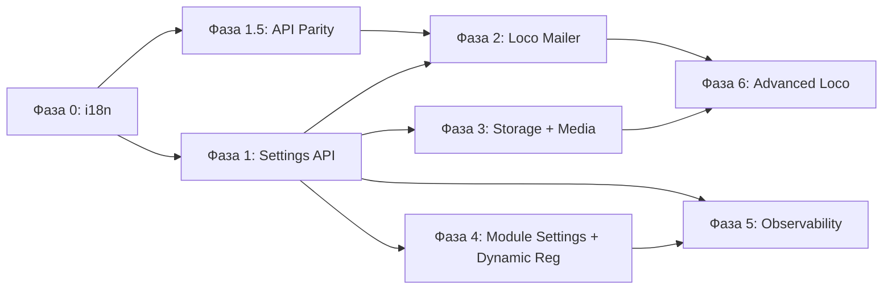

# План полной интеграции Loco RS + Core с управлением из админки

**Дата:** 2026-03-12
**Обновлён:** 2026-03-15 (на основе ревью `loco-integration-review.md`)
**Статус:** Принят к реализации

## 1. Контекст и цель

RusToK использует Loco RS v0.16 как framework, но ряд его возможностей задействован частично или заменён самописными решениями. Настройки платформы не экспонированы через админку.

> [!IMPORTANT]
> **Архитектурный инвариант:** Ядро (`apps/server` + core crates) **не знает** о конкретных доменных модулях. Server предоставляет контракты (`RusToKModule`, `ModuleRegistry`, `EventTransport`, `StorageAdapter`, `CacheBackend`), а доменные модули подключаются через них автономно. Упоминания доменных модулей в этом документе относятся к уровню **модульной автономии**, не к ядру.

**Цель:**

1. Все зрелые возможности Loco задействованы по назначению (без дублирования).
2. Все настройки платформы (Loco + Core) доступны из admin-панели.
3. Настройки хранятся в БД (per-tenant), YAML — только bootstrap defaults.
4. i18n (многоязычность) работает по умолчанию на всех уровнях.
5. Ядро не содержит domain-specific логики — только контракты.

---

## 2. Текущее состояние

### 2.1 Loco: задействовано ✅

| Capability | Код |
|---|---|
| Application hooks (Hooks trait) | `app.rs` — все 8 hooks |
| Конфигурация (Config + typed settings) | `settings.rs`, `config/*.yaml` |
| REST + GraphQL роутинг | `controllers/*`, `graphql/*` |
| ORM / Migrations / Entities | `migration/`, `models/` |
| Auth framework (JWT) | `services/rbac_service.rs`, `services/auth_lifecycle.rs` |
| Tasks (`cargo loco task`) | `tasks/cleanup.rs` |
| Initializers | `initializers/telemetry.rs` |
| Testing support | `tests/` |
| Shared store | `AppContext.shared_store` для runtime state |

### 2.2 Loco: НЕ задействовано ❌

| Capability | Текущая реализация | Проблема |
|---|---|---|
| **Mailer** | Самописный `EmailService` (`lettre`) | Дублирует Loco Mailer; inline HTML вместо шаблонов; нет observability |
| **Storage** | Нет единого storage layer | Ad-hoc; модули без shared-доступа к файлам |
| **Channels** | Не используется | Loco WebSocket channels не задействованы |

### 2.3 Loco: осознанный самопис (НЕ мигрировать) ✋

| Capability | Текущая реализация | Обоснование |
|---|---|---|
| **Cache** | `rustok-core::CacheBackend` (Moka + Redis + FallbackCacheBackend) | Значительно функциональнее Loco Cache: circuit breaker, anti-stampede coalescing, negative cache, Redis pub/sub invalidation, metrics, graceful degradation. Loco Cache — тонкая обёртка без этих features |
| **Event bus / outbox** | `rustok-outbox` + transport factory | Loco queue не подходит для event sourcing; outbox pattern |
| **Workers** (outbox relay) | `spawn_outbox_relay_worker` | Привязан к event bus lifecycle |
| **RBAC engine** | `rustok-rbac` | Loco не имеет RBAC |

### 2.4 Core: не управляется из админки

| Компонент | Настройки из админки |
|---|---|
| `rustok-tenant` — lifecycle, domain mapping | ❌ |
| `rustok-rbac` — роли, права | ❌ |
| `rustok-index` — CQRS read-model | ❌ (нет trigger reindex) |
| `rustok-outbox` — relay, DLQ | ❌ (нет мониторинга) |
| `rustok-core::i18n` — локализация | ⚠️ Код есть; не включён по умолчанию |
| Module settings | ⚠️ toggle есть; `tenant_modules.settings` = `{}` |
| Platform settings (rate limit, search, features, email) | ❌ Только YAML |

### 2.5 Нарушение принципа Core Agnosticism

> [!WARNING]
> `apps/server/src/graphql/schema.rs` содержит **hard-coded** импорты доменных модулей:
> `ContentQuery`, `BlogQuery`, `CommerceQuery`, `ForumQuery`, `PagesQuery`, `AlloyQuery`, `OAuthQuery`.
> Это нарушает инвариант «ядро не знает о модулях». Необходимо перейти на **динамическую регистрацию** GraphQL partial schemas через `ModuleRegistry`.

---

## 3. План по фазам

### Фаза 0 — i18n по умолчанию (prerequisite)

**Цель:** Многоязычность работает из коробки.

- [AUDIT] Инвентаризация hard-coded строк в `controllers/`, `graphql/`, `services/` — сколько их и как собирать.
- [DECIDE] Формат файлов переводов: рекомендуется Fluent `.ftl` (стандарт Mozilla, есть `fluent-rs`).
- [MODIFY] `rustok-core::i18n` — активировать по умолчанию; locale resolution chain: `Accept-Language → tenant default → ru`.
- [MODIFY] `apps/server` — middleware для locale resolution; все API ответы через i18n.
- [MODIFY] Админки — language switcher; все строки через i18n.
- [CONTRACT] `RusToKModule::translations()` — модули предоставляют свои translation bundles автономно.
  Convention до Фазы 4: `{module_slug}/translations/{locale}.ftl`. Фаза 4 формализует через trait.

---

### Фаза 1 — Settings API (фундамент)

**Цель:** Настройки в БД с runtime-API и UI.

#### 1.1 [NEW] Таблица `platform_settings`

```sql
CREATE TABLE platform_settings (
  id UUID PRIMARY KEY DEFAULT gen_random_uuid(),
  tenant_id UUID NOT NULL REFERENCES tenants(id),
  category VARCHAR(64) NOT NULL,  -- 'general', 'email', 'search', 'rate_limit', 'events', 'features', 'i18n'
  settings JSONB NOT NULL DEFAULT '{}',
  updated_by UUID REFERENCES users(id),
  created_at TIMESTAMPTZ NOT NULL DEFAULT now(),
  updated_at TIMESTAMPTZ NOT NULL DEFAULT now(),
  UNIQUE(tenant_id, category)
);
```

#### 1.2 [MODIFY] `settings.rs`

- `SettingsService` с fallback: `DB → YAML → defaults`.
- Ядро хранит настройки **по категориям** через generic API — не знает, какие модули их потребляют.

#### 1.3 [MODIFY] `tenant_modules.settings`

- При `on_enable()` модуль записывает default settings из `settings_schema()`.
- Ядро хранит как opaque JSONB; валидацию делает модуль.

#### 1.2a [ADD] Версионирование схемы настроек

Добавить поле `schema_version INTEGER NOT NULL DEFAULT 1` в `platform_settings`.
`SettingsService` при чтении проверяет версию и запускает lazy migration при несоответствии.
Эмитировать событие `PlatformSettingsChanged { category, diff, changed_by }` через outbox для аудита.

#### 1.2b [ADD] Валидатор платформенных настроек

Ввести `SettingsValidator` trait в server. Для каждой платформенной категории (`email`, `rate_limit`, `events`, `oauth`) регистрируется валидатор на стороне server. Модули валидируют через `module.validate_settings()`.

#### 1.2c [ADD] OAuth providers как категория настроек

Добавить `oauth` категорию (или отдельную таблицу `oauth_providers` per-tenant). Управление OAuth-провайдерами из admin UI.

#### 1.2d [ADD] Rate limit как DB-категория

`rate_limit` явно добавить как категорию `platform_settings`. Per-tenant лимиты для SaaS-тарифов.

#### 1.4 [NEW] GraphQL API

- `mutation updatePlatformSettings(category, settings)`
- `query platformSettings(category)`, `allPlatformSettings`
- RBAC: `settings:read`, `settings:manage`

#### 1.5 [NEW] Страница «Settings» в обеих админках

---

### Фаза 1.5 — API Parity (~1 нед, параллельно с Фазой 1)

**Цель:** Закрыть критичные GraphQL-пробелы для работы фронтендов.

> **Принцип:** Фронтенды и админки работают только через GraphQL. REST существует для внешних интеграций.

| # | Шаг | Файлы | Тип |
|---|-----|-------|-----|
| 1.5.1 | `logout` mutation | `graphql/auth/mutation.rs` | Модификация |
| 1.5.2 | `me` / `currentUser` query | `graphql/auth/query.rs` | Модификация |
| 1.5.3 | `sessions` query | `graphql/auth/query.rs` | Новое |
| 1.5.4 | `revokeSession` mutation | `graphql/auth/mutation.rs` | Новое |
| 1.5.5 | `revokeAllSessions` mutation | `graphql/auth/mutation.rs` | Новое |
| 1.5.6 | `acceptInvite` mutation | `graphql/auth/mutation.rs` | Новое |
| 1.5.7 | REST: User management | `controllers/users.rs` | Новое |
| 1.5.8 | REST: Session list/revoke | `controllers/auth.rs` | Модификация |
| 1.5.9 | Тесты | `tests/` | Новое |

---

### Фаза 2 — Миграция Mailer на Loco API

**Цель:** Email через Loco Mailer; управление из админки.

- [MODIFY] `email.rs` — Loco Mailer adapter + feature flag `email.provider`.
- [NEW] `templates/email/` — Tera шаблоны с i18n.
- [NEW] `EmailTemplateProvider` trait — контракт для модулей (commerce: заказ, forum: уведомление).
  Convention: `templates/email/{module_slug}/{locale}.tera`. Модули поставляют шаблоны через trait.
- [MODIFY] Settings → Email — provider, credentials, тестовая отправка.
- [DELETE] Legacy SMTP-only path после стабилизации.

---

### Фаза 3 — Storage + Media

**Цель:** Единый storage layer с CMS-grade организацией файлов; медиа-менеджер в админке.

> [!IMPORTANT]
> **Loco RS 0.16 не имеет встроенного Storage** — нечего расширять. Файловая реализация полностью наша.
>
> **Архитектура: два независимых crate, по аналогии с `rustok-events`.**
> - `rustok-storage` (leaf crate, уровень 0) — КАК хранить: `StorageBackend` trait + backends.
> - `rustok-media` (Core module, уровень 2) — ЧТО хранить и зачем: `MediaService`, thumbnails, quota.

#### 3.1 Контекст: медиа-инфраструктура уже частично заложена

| Что | Где | Статус |
|-----|-----|--------|
| Миграция `media` + `media_translations` | `migration/m20250130_000009_create_media.rs` | ✅ Готово |
| Events: `MediaUploaded`, `MediaDeleted` | `rustok-events` | ✅ Готово |
| Permissions: `Resource::Media` | `rustok-content` | ✅ Готово |
| `ProductImage.media_id` (FK на media) | `rustok-commerce` | ✅ Готово |
| Файловый backend, `MediaService`, endpoints | — | ❌ Отсутствует |

#### 3.2 Подфаза 3a — [NEW] crate `rustok-storage` (leaf)

**Содержит:** инфраструктуру файлового хранения — КАК хранить.

```rust
pub trait StorageBackend: Send + Sync {
    async fn put(&self, path: &StoragePath, bytes: Bytes) -> Result<()>;
    async fn get(&self, path: &StoragePath) -> Result<Bytes>;
    async fn delete(&self, path: &StoragePath) -> Result<()>;
    async fn exists(&self, path: &StoragePath) -> Result<bool>;
    async fn list(&self, prefix: &StoragePath) -> Result<Vec<StorageEntry>>;
    fn public_url(&self, path: &StoragePath) -> Option<String>;
}

// Реализации
pub struct LocalStorageBackend { ... }
pub struct S3StorageBackend { ... }    // feature = "s3"
pub struct InMemoryStorageBackend { ... } // для тестов

// Организация пути
pub struct StoragePolicy;
impl StoragePolicy {
    pub fn resolve_path(&self, tenant_id: Uuid, filename: &str) -> StoragePath;
    pub fn validate_mime(&self, mime: &str, whitelist: &[String]) -> Result<()>;
}
```

Не зависит от `rustok-core`. Core зависит от него и ре-экспортирует.
Регистрируется в server через `StorageModule` (паттерн AlloyModule, `ModuleKind::Core`).

#### 3.3 Подфаза 3b — [NEW] crate `rustok-media` (Core module)

**Содержит:** доменную логику медиа — ЧТО хранить.

| Компонент | Ответственность |
|-----------|-----------------|
| `MediaModule` | `impl RusToKModule`, `ModuleKind::Core`, миграции, permissions |
| `MediaService` | CRUD метаданных, вызов `StorageBackend`, emit events |
| `ThumbnailService` | Ресайз изображений (`image` crate), lazy generation |
| `QuotaService` | `SUM(size_bytes)` per tenant, лимиты из settings |
| `MediaRepository` | SeaORM queries: `media`, `media_translations` |

Контракт расширяется по сравнению с первоначальным планом (`delete`, `soft_delete`, `gc_orphans`):

```rust
async fn upload(&self, tenant_id: Uuid, file: UploadFile) -> Result<MediaAsset>;
async fn download(&self, tenant_id: Uuid, asset_id: Uuid) -> Result<Bytes>;
async fn delete(&self, tenant_id: Uuid, asset_id: Uuid) -> Result<()>;
async fn soft_delete(&self, tenant_id: Uuid, asset_id: Uuid) -> Result<()>;
async fn gc_orphans(&self, tenant_id: Uuid, older_than: Duration) -> Result<u64>;
fn public_url(&self, asset: &MediaAsset) -> String;
async fn thumbnail(&self, tenant_id: Uuid, asset_id: Uuid, size: ThumbnailSize) -> Result<Bytes>;
```

Поле `deleted_at` в `media` (soft delete). GC — scheduled task в Фазе 6.

#### 3.4 Подфаза 3c — Интеграция в server

- [NEW] `apps/server/src/modules/storage.rs` — `StorageModule` adapter (паттерн AlloyModule).
- [MODIFY] `apps/server/src/app.rs` — регистрация `StorageModule` + `MediaModule`.
- [NEW] `apps/server/src/controllers/media.rs` — REST endpoints (upload, download, delete).
- [NEW] `apps/server/src/graphql/media/` — GraphQL queries/mutations.
- [MODIFY] Миграция из `m20250130_000009_create_media.rs` → переносится в `rustok-media`.

#### 3.5 [NEW] Config через `platform_settings.storage`

```json
{
  "provider": "local",
  "base_path": "/var/rustok/uploads",
  "cdn_base_url": null,
  "allowed_mime_types": ["image/*", "application/pdf", "video/mp4"],
  "max_file_size_mb": 50,
  "quota_per_tenant_gb": 10,
  "thumbnail_sizes": [150, 300, 600],
  "soft_delete_retention_days": 30
}
```

#### 3.6 [NEW] Страница «Media» в админке

- Файловый менеджер: upload (drag-and-drop), browse, delete, search.
- Preview для изображений / видео.
- Alt-text редактирование, metadata просмотр.
- Quota usage per-tenant.
- Инвентаризация существующих файлов и migration task для переноса в новую структуру.

---

### Фаза 4 — Module Settings UI + Dynamic Registration

**Цель:** Модули управляются из админки; ядро не знает о конкретных модулях.

#### 4.1 [MODIFY] `RusToKModule` trait

```rust
fn settings_schema(&self) -> serde_json::Value;     // JSON Schema → UI form
fn validate_settings(&self, settings: &Value) -> Result<(), Vec<String>>;
fn translations(&self) -> Option<TranslationBundle>;
fn graphql_schema_fragment(&self) -> Option<SchemaFragment>; // Dynamic GraphQL registration
```

#### 4.2 [CRITICAL] Dynamic GraphQL Schema Registration

> [!NOTE]
> **Архитектурное решение:** `async-graphql` использует `#[derive(MergedObject)]` — это compile-time merge.
> Полностью runtime-динамическая schema (`async_graphql::dynamic::*`) теряет типобезопасность и derive-макросы.
>
> **Рекомендуемый подход: compile-time регистрация через Cargo features + runtime toggle.**
>
> ```rust
> #[derive(MergedObject, Default)]
> pub struct Query(
>     RootQuery,
>     AuthQuery,
>     #[cfg(feature = "mod-commerce")] CommerceQuery,
>     #[cfg(feature = "mod-content")]  ContentQuery,
>     #[cfg(feature = "mod-blog")]     BlogQuery,
>     // ...
> );
> ```
>
> Модуль компилируется в бинарь, но resolvers проверяют `module.is_enabled(tenant_id)` в runtime.
> Это убирает hard-coded импорты (заменяя на conditional compilation) и сохраняет типобезопасность.

- [MODIFY] `schema.rs` — заменить прямые импорты на `#[cfg(feature = "mod-*")]`.
- [ADD] `Cargo.toml` features: `mod-content`, `mod-commerce`, `mod-blog`, `mod-forum`, `mod-pages`, `mod-alloy`.
- [MODIFY] Resolver guards: проверка `is_enabled(tenant_id)` перед выполнением.

#### 4.3 [MODIFY] Страница «Modules» — settings panel, health badge, dependency tree.

---

### Фаза 5 — Observability Dashboard

**Цель:** Мониторинг из admin-панели.

- [NEW] GraphQL: `systemHealth`, `eventQueueStats`, `cacheStats`, `recentErrors` (с pagination).
- [NEW] GraphQL: `dlqEvents` query + `replayDlqEvent` mutation.
- [NEW] Страница «System» — health, event pipeline, cache, scheduled tasks.
- [NEW] Trigger actions: reindex, flush cache, retry DLQ.
- [NEW] `AlertRule` сущность — пороги и каналы уведомлений (Channels/email/webhook).
- [NEW] Ring-buffer для `recentErrors` (in-memory, ограниченный размер) или таблица с автоочисткой.
- [NEW] REST endpoints: `GET /api/modules`, `GET /api/dashboard/stats`, `GET /api/builds`.

---

### Фаза 6 — Advanced Loco Features

#### 6.1 Channels (WebSocket)

- Loco Channels для real-time уведомлений (module state changes, metrics, alerts).

#### 6.2 Scheduler

> [!NOTE]
> **Scheduler ≠ Outbox relay.** Outbox relay = реактивная доставка событий (непрерывный worker). Scheduler = cron-задачи по времени. Разные уровни, не пересекаются.

- Session/token cleanup, index consistency check, RBAC audit, stale outbox cleanup.
- Медиа GC: `gc_orphans` для ассетов без ссылок (older_than = `soft_delete_retention_days`).
- Управление расписанием из админки.
- **Leader election:** advisory locks (`pg_advisory_lock`) — в multi-instance только один запускает задачу.
- **Overlap protection:** флаг `skip_if_running` на задачах.
- **Retry policy:** наследовать от `RelayRetryPolicy`.

#### 6.3 Graceful Shutdown Protocol

- WebSocket-соединения (Channels) корректно закрываются.
- Outbox relay worker завершает текущий batch перед остановкой.
- Storage upload-in-progress не оставляет сирот (upload transaction → commit → или rollback + cleanup).
- Drain timeout: настраиваемый период ожидания in-flight запросов.

---

## 4. Что убрать / переделать

### 4.1 Убрать

| Компонент | Причина | Фаза |
|---|---|---|
| `email.rs` legacy SMTP sender | → Loco Mailer | 2 |
| `EmailSettings.smtp` | → `platform_settings` | 2 |
| Ad-hoc upload логика | → `StorageAdapter` | 3 |
| Hard-coded domain imports в `schema.rs` | → Dynamic registration | 4 |
| `AppContext.scripting` hard-wire в `context.rs` | → опциональный через shared_store | 4 |

### 4.2 Переделать

| Компонент | Изменение | Фаза |
|---|---|---|
| `RustokSettings::from_settings()` | DB fallback | 1 |
| `rustok-core::i18n` | Включить по умолчанию | 0 |
| `tenant_modules.settings` | Typed defaults при `on_enable()` | 4 |
| `ModuleLifecycleService` | Валидация settings при toggle | 4 |
| `schema.rs` | Dynamic module registration | 4 |

### 4.3 Оставить (осознанные решения)

| Компонент | Обоснование |
|---|---|
| `CacheBackend` (Moka + Redis + Fallback) | Значительно функциональнее Loco Cache |
| Event bus / outbox transport | Loco queue не подходит |
| Outbox relay worker | Event delivery ≠ scheduling |
| RBAC engine | Loco не имеет RBAC |

---

## 5. Граф зависимостей



Фаза 0 → {1, 1.5} → {2, 3, 4} параллельно → 5 → 6.

---

## 6. Оценка объёма

| Фаза | Объём | Приоритет |
|---|---|---|
| 0. i18n | ~1.5 нед | 🔴 prerequisite |
| 1. Settings API + UI | ~2 нед | 🔴 критичный |
| 1.5. API Parity | ~1 нед | 🔴 критичный |
| 2. Loco Mailer | ~1 нед | 🟡 высокий |
| 3. Storage (3a) + Media (3b) + Server (3c) | ~3 нед | 🟡 высокий |
| 4. Module Settings + Dynamic Reg | ~2 нед | 🟡 высокий |
| 5. Observability | ~1.5 нед | 🟢 средний |
| 6. Advanced Loco (Channels + Scheduler + Shutdown) | ~2.5 нед | 🔵 низкий |

**Итого:** ~14.5 нед последовательно; ~8 нед с параллелизацией.

---

## 7. Definition of Done

### Фаза 0
- [ ] Аудит hard-coded строк завершён; формат переводов зафиксирован
- [ ] i18n работает по умолчанию; per-tenant locale selection
- [ ] Translation bundles конвенция для модулей задокументирована

### Фазы 1 / 1.5
- [ ] `platform_settings` с `schema_version`; lazy migration работает
- [ ] `PlatformSettingsChanged` event через outbox
- [ ] `SettingsValidator` для платформенных категорий
- [ ] OAuth providers управляются из UI
- [ ] Rate limit per-tenant управляется из UI
- [ ] `logout`, `me`, `sessions`, `revokeSession` GraphQL операции
- [ ] REST user management + session management
- [ ] Все настройки из UI обеих админок; YAML = только bootstrap defaults

### Фазы 2 / 3
- [ ] Mailer через Loco API; legacy удалён
- [ ] `EmailTemplateProvider` для модулей
- [ ] `rustok-storage` leaf crate: LocalBackend + S3Backend + InMemoryBackend
- [ ] `rustok-media` Core module: MediaService, ThumbnailService, QuotaService
- [ ] `StorageModule` adapter в server (паттерн AlloyModule)
- [ ] Soft delete + GC task зарегистрирован в Фазе 6
- [ ] Медиа-менеджер в admin UI
- [ ] Инвентаризация существующих файлов; migration task

### Фаза 4
- [ ] `schema.rs` — compile-time feature flags, нет hard-coded imports
- [ ] Resolver guards: `is_enabled(tenant_id)` per-resolver
- [ ] `AppContext` в `rustok-core` — без ScriptingContext hard-wire
- [ ] Module settings schema + UI

### Фаза 5
- [ ] Observability из admin dashboard (с pagination)
- [ ] AlertRule + уведомления
- [ ] DLQ GraphQL операции

### Фаза 6
- [ ] Channels (WebSocket) для real-time уведомлений
- [ ] Scheduler с leader election (pg_advisory_lock)
- [ ] Graceful Shutdown Protocol
- [ ] Server не содержит domain-specific логики
- [ ] Integration tests покрывают все изменения
- [ ] Документация обновлена

---

## Связанные документы

- [Ревью плана (детальный анализ пробелов)](./loco-integration-review.md)
- [Loco Feature Support Matrix](./LOCO_FEATURE_SUPPORT.md)
- [Cache Stampede Protection](./CACHE_STAMPEDE_PROTECTION.md)
- [Module & App Registry](../../docs/modules/registry.md)
- [Architecture Overview](../../docs/architecture/overview.md)
- [Module Architecture](../../docs/architecture/modules.md)
- [i18n Architecture](../../docs/architecture/i18n.md)
- [Events and Outbox](../../docs/architecture/events.md)
- [Loco Reference](../../docs/references/loco/README.md)
- [rustok-cache docs](../../crates/rustok-cache/docs/README.md)
