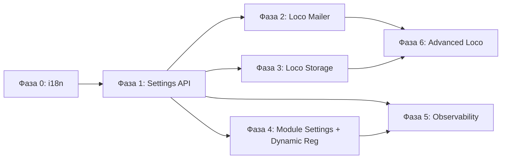

# План полной интеграции Loco RS + Core с управлением из админки

**Дата:** 2026-03-12
**Статус:** RFC (Request for Comments)

## 1. Контекст и цель

RusToK использует Loco RS v0.16 как framework, но ряд его возможностей задействован частично или заменён самописными решениями. Настройки платформы не экспонированы через админку.

> [!IMPORTANT]
> **Архитектурный инвариант:** Ядро (`apps/server` + core crates) **не знает** о конкретных доменных модулях. Server предоставляет контракты (`RusToKModule`, `ModuleRegistry`, `EventTransport`, `StorageAdapter`, `CacheBackend`), а доменные модули подключаются через них автономно. Упоминания доменных модулей в этом документе относятся к уровню **модульной автономии**, не к ядру.

**Цель:**

1. Все зрелые возможности Loco задействованы по назначению (без дублирования).
2. Все настройки платформы (Loco + Core) доступны из admin-панели.
3. Настройки хранятся в БД (per-tenant), YAML — только bootstrap defaults.
4. i18n (многоязычность) работает по умолчанию на всех уровнях.
5. Ядро не содержит domain-specific логики — только контракты.

---

## 2. Текущее состояние

### 2.1 Loco: задействовано ✅

| Capability | Код |
|---|---|
| Application hooks (Hooks trait) | `app.rs` — все 8 hooks |
| Конфигурация (Config + typed settings) | `settings.rs`, `config/*.yaml` |
| REST + GraphQL роутинг | `controllers/*`, `graphql/*` |
| ORM / Migrations / Entities | `migration/`, `models/` |
| Auth framework (JWT) | `services/rbac_service.rs`, `services/auth_lifecycle.rs` |
| Tasks (`cargo loco task`) | `tasks/cleanup.rs` |
| Initializers | `initializers/telemetry.rs` |
| Testing support | `tests/` |
| Shared store | `AppContext.shared_store` для runtime state |

### 2.2 Loco: НЕ задействовано ❌

| Capability | Текущая реализация | Проблема |
|---|---|---|
| **Mailer** | Самописный `EmailService` (`lettre`) | Дублирует Loco Mailer; inline HTML вместо шаблонов; нет observability |
| **Storage** | Нет единого storage layer | Ad-hoc; модули без shared-доступа к файлам |
| **Channels** | Не используется | Loco WebSocket channels не задействованы |

### 2.3 Loco: осознанный самопис (НЕ мигрировать) ✋

| Capability | Текущая реализация | Обоснование |
|---|---|---|
| **Cache** | `rustok-core::CacheBackend` (Moka + Redis + FallbackCacheBackend) | Значительно функциональнее Loco Cache: circuit breaker, anti-stampede coalescing, negative cache, Redis pub/sub invalidation, metrics, graceful degradation. Loco Cache — тонкая обёртка без этих features |
| **Event bus / outbox** | `rustok-outbox` + transport factory | Loco queue не подходит для event sourcing; outbox pattern |
| **Workers** (outbox relay) | `spawn_outbox_relay_worker` | Привязан к event bus lifecycle |
| **RBAC engine** | `rustok-rbac` | Loco не имеет RBAC |

### 2.4 Core: не управляется из админки

| Компонент | Настройки из админки |
|---|---|
| `rustok-tenant` — lifecycle, domain mapping | ❌ |
| `rustok-rbac` — роли, права | ❌ |
| `rustok-index` — CQRS read-model | ❌ (нет trigger reindex) |
| `rustok-outbox` — relay, DLQ | ❌ (нет мониторинга) |
| `rustok-core::i18n` — локализация | ⚠️ Код есть; не включён по умолчанию |
| Module settings | ⚠️ toggle есть; `tenant_modules.settings` = `{}` |
| Platform settings (rate limit, search, features, email) | ❌ Только YAML |

### 2.5 Нарушение принципа Core Agnosticism

> [!WARNING]
> `apps/server/src/graphql/schema.rs` содержит **hard-coded** импорты доменных модулей:
> `ContentQuery`, `BlogQuery`, `CommerceQuery`, `ForumQuery`, `PagesQuery`, `AlloyQuery`, `OAuthQuery`.
> Это нарушает инвариант «ядро не знает о модулях». Необходимо перейти на **динамическую регистрацию** GraphQL partial schemas через `ModuleRegistry`.

---

## 3. План по фазам

### Фаза 0 — i18n по умолчанию (prerequisite)

**Цель:** Многоязычность работает из коробки.

- [MODIFY] `rustok-core::i18n` — активировать по умолчанию; locale resolution chain: `Accept-Language → tenant default → ru`.
- [MODIFY] `apps/server` — middleware для locale resolution; все API ответы через i18n.
- [MODIFY] Админки — language switcher; все строки через i18n.
- [CONTRACT] `RusToKModule::translations()` — модули предоставляют свои translation bundles автономно.

---

### Фаза 1 — Settings API (фундамент)

**Цель:** Настройки в БД с runtime-API и UI.

#### 1.1 [NEW] Таблица `platform_settings`

```sql
CREATE TABLE platform_settings (
  id UUID PRIMARY KEY DEFAULT gen_random_uuid(),
  tenant_id UUID NOT NULL REFERENCES tenants(id),
  category VARCHAR(64) NOT NULL,  -- 'general', 'email', 'search', 'rate_limit', 'events', 'features', 'i18n'
  settings JSONB NOT NULL DEFAULT '{}',
  updated_by UUID REFERENCES users(id),
  created_at TIMESTAMPTZ NOT NULL DEFAULT now(),
  updated_at TIMESTAMPTZ NOT NULL DEFAULT now(),
  UNIQUE(tenant_id, category)
);
```

#### 1.2 [MODIFY] `settings.rs`

- `SettingsService` с fallback: `DB → YAML → defaults`.
- Ядро хранит настройки **по категориям** через generic API — не знает, какие модули их потребляют.

#### 1.3 [MODIFY] `tenant_modules.settings`

- При `on_enable()` модуль записывает default settings из `settings_schema()`.
- Ядро хранит как opaque JSONB; валидацию делает модуль.

#### 1.4 [NEW] GraphQL API

- `mutation updatePlatformSettings(category, settings)`
- `query platformSettings(category)`, `allPlatformSettings`
- RBAC: `settings:read`, `settings:manage`

#### 1.5 [NEW] Страница «Settings» в обеих админках

---

### Фаза 2 — Миграция Mailer на Loco API

**Цель:** Email через Loco Mailer; управление из админки.

- [MODIFY] `email.rs` — Loco Mailer adapter + feature flag `email.provider`.
- [NEW] `templates/email/` — Tera шаблоны с i18n.
- [MODIFY] Settings → Email — provider, credentials, тестовая отправка.
- [DELETE] Legacy SMTP-only path после стабилизации.

---

### Фаза 3 — Storage + Media

**Цель:** Единый storage layer с CMS-grade организацией файлов; медиа-менеджер в админке.

> [!IMPORTANT]
> **Loco Storage = транспортный слой, не CMS.** Loco Storage (`upload(path, bytes)`) — это низкоуровневая абстракция (как `std::fs` с поддержкой S3). Он не организует файлы, не генерирует уникальные имена, не хранит metadata. Для CMS нужен **свой слой поверх**.

#### 3.1 Архитектура: два слоя

```
┌─────────────────────────────────────────────┐
│  StorageAdapter (платформенный)              │
│  - tenant isolation: {tenant_id}/YYYY/MM/   │
│  - UUID naming + dedup                       │
│  - MIME validation (whitelist)               │
│  - metadata → media_assets table             │
│  - thumbnails generation (images)            │
│  - per-tenant quota management               │
│  - CDN URL rewrite                           │
├─────────────────────────────────────────────┤
│  Loco Storage (transport)                    │
│  - drivers: local FS, S3, GCP, Azure         │
│  - strategies: single, mirror, backup        │
│  - API: upload, download, delete, rename     │
└─────────────────────────────────────────────┘
```

#### 3.2 Что Loco Storage даёт vs что нужно для CMS

| Возможность | Loco Storage | Нужно для CMS |
| --- | --- | --- |
| Multi-backend (FS, S3, Azure, GCP) | ✅ через OpenDAL | ✅ используем |
| Mirror/Backup strategies | ✅ | ✅ используем |
| Организация по дате (`2026/03/`) | ❌ | ✅ `StorageAdapter` |
| Уникальные имена (UUID/slug) | ❌ | ✅ `StorageAdapter` |
| Thumbnails / Image resize | ❌ | ✅ `StorageAdapter` |
| Metadata в БД (media library) | ❌ | ✅ `media_assets` table |
| Per-tenant isolation | ❌ | ✅ `{tenant_id}/` prefix |
| Quota management | ❌ | ✅ `StorageAdapter` |
| MIME validation | ❌ | ✅ whitelist в settings |
| CDN URL generation | ❌ | ✅ `StorageAdapter` |

#### 3.3 [NEW] Таблица `media_assets`

```sql
CREATE TABLE media_assets (
  id UUID PRIMARY KEY DEFAULT gen_random_uuid(),
  tenant_id UUID NOT NULL REFERENCES tenants(id),
  storage_path TEXT NOT NULL,          -- '{tenant_id}/2026/03/{uuid}.jpg'
  original_name VARCHAR(512) NOT NULL,
  mime_type VARCHAR(128) NOT NULL,
  size_bytes BIGINT NOT NULL,
  alt_text TEXT,
  metadata JSONB DEFAULT '{}',         -- EXIF, dimensions, thumbnails paths
  uploaded_by UUID REFERENCES users(id),
  created_at TIMESTAMPTZ NOT NULL DEFAULT now(),
  updated_at TIMESTAMPTZ NOT NULL DEFAULT now()
);
```

#### 3.4 [NEW] `StorageAdapter` contract

```rust
#[async_trait]
pub trait StorageAdapter: Send + Sync {
    /// Upload с автоматической организацией: tenant/YYYY/MM/{uuid}.{ext}
    async fn upload(&self, tenant_id: Uuid, file: UploadFile) -> Result<MediaAsset>;
    /// Download по ID ассета (не по пути)
    async fn download(&self, tenant_id: Uuid, asset_id: Uuid) -> Result<Bytes>;
    /// Public URL (с CDN rewrite если настроено)
    fn public_url(&self, asset: &MediaAsset) -> String;
    /// Проверка quota
    async fn check_quota(&self, tenant_id: Uuid, additional_bytes: u64) -> Result<bool>;
    /// Thumbnail (lazy generation при первом запросе)
    async fn thumbnail(&self, tenant_id: Uuid, asset_id: Uuid, size: ThumbnailSize) -> Result<Bytes>;
}
```

#### 3.5 [NEW] Config через `platform_settings.storage`

```json
{
  "provider": "s3",
  "bucket": "rustok-media",
  "region": "eu-central-1",
  "cdn_base_url": "https://cdn.example.com",
  "allowed_mime_types": ["image/*", "application/pdf", "video/mp4"],
  "max_file_size_mb": 50,
  "quota_per_tenant_gb": 10,
  "thumbnail_sizes": [150, 300, 600]
}
```

#### 3.6 [NEW] Страница «Media» в админке

- Файловый менеджер: upload (drag-and-drop), browse, delete, search.
- Preview для изображений / видео.
- Alt-text редактирование, metadata просмотр.
- Quota usage per-tenant.

---

### Фаза 4 — Module Settings UI + Dynamic Registration

**Цель:** Модули управляются из админки; ядро не знает о конкретных модулях.

#### 4.1 [MODIFY] `RusToKModule` trait

```rust
fn settings_schema(&self) -> serde_json::Value;     // JSON Schema → UI form
fn validate_settings(&self, settings: &Value) -> Result<(), Vec<String>>;
fn translations(&self) -> Option<TranslationBundle>;
fn graphql_schema_fragment(&self) -> Option<SchemaFragment>; // Dynamic GraphQL registration
```

#### 4.2 [CRITICAL] Dynamic GraphQL Schema Registration

- Убрать hard-coded `ContentQuery, BlogQuery, ...` из `schema.rs`.
- `ModuleRegistry` собирает GraphQL fragments от всех зарегистрированных модулей.
- Ядро вызывает `module.graphql_schema_fragment()` и мержит в общую schema.

#### 4.3 [MODIFY] Страница «Modules» — settings panel, health badge, dependency tree.

---

### Фаза 5 — Observability Dashboard

**Цель:** Мониторинг из admin-панели.

- [NEW] GraphQL: `systemHealth`, `eventQueueStats`, `cacheStats`, `recentErrors`.
- [NEW] Страница «System» — health, event pipeline, cache, scheduled tasks.
- [NEW] Trigger actions: reindex, flush cache, retry DLQ.

---

### Фаза 6 — Advanced Loco Features

#### 6.1 Channels (WebSocket)

- Loco Channels для real-time уведомлений (module state changes, metrics).

#### 6.2 Scheduler

> [!NOTE]
> **Scheduler ≠ Outbox relay.** Outbox relay = реактивная доставка событий (непрерывный worker). Scheduler = cron-задачи по времени. Разные уровни, не пересекаются.

- Session/token cleanup, index consistency check, RBAC audit, stale outbox cleanup.
- Управление расписанием из админки.

---

## 4. Что убрать / переделать

### 4.1 Убрать

| Компонент | Причина | Фаза |
|---|---|---|
| `email.rs` legacy SMTP sender | → Loco Mailer | 2 |
| `EmailSettings.smtp` | → `platform_settings` | 2 |
| Ad-hoc upload логика | → `StorageAdapter` | 3 |
| Hard-coded domain imports в `schema.rs` | → Dynamic registration | 4 |
| `AppContext.scripting` hard-wire в `context.rs` | → опциональный через shared_store | 4 |

### 4.2 Переделать

| Компонент | Изменение | Фаза |
|---|---|---|
| `RustokSettings::from_settings()` | DB fallback | 1 |
| `rustok-core::i18n` | Включить по умолчанию | 0 |
| `tenant_modules.settings` | Typed defaults при `on_enable()` | 4 |
| `ModuleLifecycleService` | Валидация settings при toggle | 4 |
| `schema.rs` | Dynamic module registration | 4 |

### 4.3 Оставить (осознанные решения)

| Компонент | Обоснование |
|---|---|
| `CacheBackend` (Moka + Redis + Fallback) | Значительно функциональнее Loco Cache |
| Event bus / outbox transport | Loco queue не подходит |
| Outbox relay worker | Event delivery ≠ scheduling |
| RBAC engine | Loco не имеет RBAC |

---

## 5. Граф зависимостей



Фаза 0 → 1 → {2, 3, 4} параллельно → 5 → 6.

---

## 6. Оценка объёма

| Фаза | Объём | Приоритет |
|---|---|---|
| 0. i18n | ~1 нед | 🔴 prerequisite |
| 1. Settings API + UI | ~2 нед | 🔴 критичный |
| 2. Loco Mailer | ~1 нед | 🟡 высокий |
| 3. Loco Storage + Media | ~2 нед | 🟡 высокий |
| 4. Module Settings + Dynamic Reg | ~2 нед | 🟡 высокий |
| 5. Observability | ~1 нед | 🟢 средний |
| 6. Advanced Loco | ~2 нед | 🔵 низкий |

**Итого:** ~11 нед последовательно; ~7 нед с параллелизацией.

---

## 7. Definition of Done

- [ ] i18n работает по умолчанию; per-tenant locale selection
- [ ] Все настройки из UI обеих админок
- [ ] YAML = только bootstrap defaults
- [ ] Mailer через Loco API; legacy удалён
- [ ] Единый `StorageAdapter`; Media manager
- [ ] Module settings schema + UI
- [ ] `schema.rs` — dynamic registration (нет hard-coded imports)
- [ ] `AppContext` в `rustok-core` — без ScriptingContext hard-wire
- [ ] Observability из admin dashboard
- [ ] Server не содержит domain-specific логики
- [ ] Integration tests покрывают все изменения
- [ ] Документация обновлена

---

## Связанные документы

- [Loco Feature Support Matrix](./LOCO_FEATURE_SUPPORT.md)
- [Cache Stampede Protection](./CACHE_STAMPEDE_PROTECTION.md)
- [Architecture Overview](../../docs/architecture/overview.md)
- [Module Architecture](../../docs/architecture/modules.md)
- [i18n Architecture](../../docs/architecture/i18n.md)
- [Events and Outbox](../../docs/architecture/events.md)
- [Loco Reference](../../docs/references/loco/README.md)

