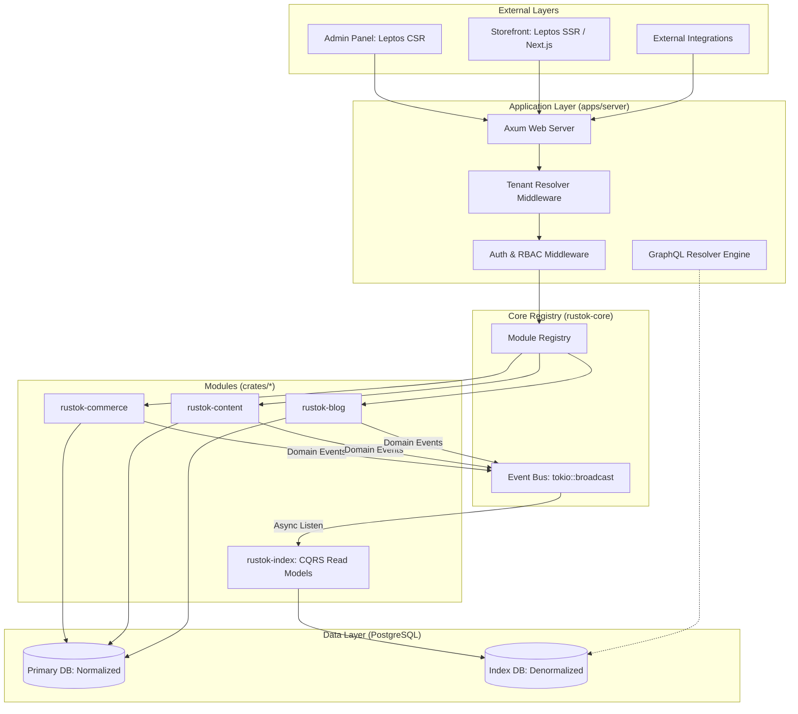

# Architecture & System Logic

RusTok is a high-performance, event-driven modular monolith designed for enterprise content and commerce. It balances the developer productivity of frameworks like Rails (via Loco.rs) with the uncompromising performance and safety of Rust.

---

## 🛰️ High-Level Architecture

The platform is structured as a **Modular Monolith**. While all modules are compiled into a single binary, they remain decoupled through a central **Event Bus** and a **Module Registry**.

---

## 🧠 Core System Logic

### 1. Multi-Tenant Isolation
Every request passes through the `TenantContext` middleware, which identifies the tenant (site/store) based on headers or hostname. All database queries are automatically scoped by `tenant_id`.

### 1.1. Request-Level Caching (Tenant Context)
**Current behavior (code today)**  
Tenant resolution now uses a shared infrastructure object (`TenantCacheInfrastructure`) stored in the application context (`AppContext.shared_store`) instead of process-global static caches. The middleware resolves tenant IDs (`uuid`, `slug`, `host`) via a unified versioned key-builder and caches results through `CacheBackend`.

**Key details**
- **Versioned key namespace**: tenant keys are generated in a unified format with explicit versioning (`v1`) for `uuid`/`slug`/`host`, plus separate negative-cache keys.
- **Two cache layers**:
  - Positive cache: tenant context (TTL 5 minutes, capacity 1000).
  - Negative cache: not-found lookups (TTL 60 seconds, capacity 1000).
- **Backend selection**:
  - Uses `RedisCacheBackend` when Redis URL is available (`RUSTOK_REDIS_URL`, fallback `REDIS_URL`).
  - Falls back to in-memory cache backend when Redis is unavailable.
- **Cross-instance invalidation**:
  - Tenant/domain updates publish cache invalidation messages to Redis pub/sub channel `tenant.cache.invalidate`.
  - Every instance subscribes and invalidates matching positive + negative keys.
- **Metrics**:
  - `/metrics` exports tenant cache hit/miss and negative-cache counters from shared cache metrics.
  - In Redis mode counters are stored/read via Redis keys, so metrics reflect shared multi-instance behavior (not only local process state).

### 2. CQRS-lite (Write vs Read)
To ensure maximum Performance on read paths (Storefront) without sacrificing data integrity on write paths (Admin), RusTok uses a **CQRS-lite** approach:

- **Write Path (Normalized):** Data is stored in 3rd Normal Form (3NF). Transactions and complex validations happen here. Optimized for safety.
- **Read Path (Denormalized):** When data changes, a `DomainEvent` is published. The `rustok-index` module listens and builds a "Flat" version of the data in specialized index tables. Optimized for blazingly fast queries and search.

### 3. Event-Driven Decoupling
Modules do not call each other directly. 
- If `rustok-commerce` updates inventory or pricing, it emits `InventoryUpdated`/`PriceUpdated` events (with `product_id` for index refreshes).
- The `rustok-index` module reacts and updates the search index.
- A notification module (if present) might react and send an email.

### 4. Module Registry
The `ModuleRegistry` is the brain of the system. It tracks which modules are compiled and allows for runtime toggling per tenant. Each module provides its own migrations, GraphQL resolvers, and event listeners.

---

## 🔌 API Architecture

RusToK uses a hybrid API approach to balance system tasks and domain-specific content management.

### 1. Hybrid Design
- **REST API (Axum/Loco.rs):** Used for infrastructure and system-level tasks.
  - Authentication (`/api/auth`)
  - Health checks (`/api/health`)
  - OpenAPI/Swagger UI (`/swagger`)
- **GraphQL API (async-graphql):** The primary interface for domain data and complex queries.
  - Modular schema via `MergedObject`.
  - Federated extensions (Commerce, Content, Blog).
  - Single endpoint: `/api/graphql`.

### 2. Service-Oriented Logic
Interaction follows a strict hierarchy:
1. **Controllers/Resolvers:** Handle request parsing, RBAC (Role-Based Access Control), and Tenant context.
2. **Domain Services:** Located in `crates/*`, these handle business logic, database transactions, and event publishing.
3. **Data Access:** Performed via SeaORM entities.

### 3. Standards & Documentation
- **OpenAPI 3.0:** Fully supported via `utoipa`. Schemas are derive-based, ensuring documentation always matches the code.
- **DTOs:** Strong separation between API Input/Response structures and internal Database models.
- **Error Handling:** Unified error types and GraphQL-specific error extensions.

---

## 📂 Project Structure Overview

| Component | Path | Responsibility |
|-----------|------|----------------|
| **Server** | `apps/server` | Main API entry point, route orchestration, and configuration. |
| **Admin** | `apps/admin` | WASM-based dashboard for managing content and store. |
| **Storefront** | `apps/storefront` / `apps/next-frontend` | SEO-optimized public-facing site with SSR (Leptos) or Next.js. |
| **Core** | `crates/rustok-core` | Shared logic: Auth, Events, ID generation (ULID), and Registry. |
| **Content** | `crates/rustok-content` | Universal content model (Nodes & Bodies). |
| **Commerce** | `crates/rustok-commerce` | E-commerce engine: Products, Variants, Inventory, and Prices. |
| **Index** | `crates/rustok-index` | Search and high-speed read models (CQRS logic). |

---

## 🛠️ Data Flow Example

1. **User** updates a Blog Post in the **Admin Panel**.
2. **Admin Panel** sends a GraphQL mutation to `apps/server`.
3. `rustok-content` receives the command, validates it, and updates the `nodes` table in **PostgreSQL**.
4. `rustok-content` publishes a `NodeUpdated` event to the **Event Bus**.
5. `rustok-index` receives the event and runs its **Indexer**.
6. The **Indexer** fetches the updated post, merges it with tags and author info, and saves it to the `index_content` table.
7. **Storefront** users see the update near-instantly by querying the fast `index_content` table.

This is an alpha version and requires clarification. Be careful, there may be errors in the text. So that no one thinks that this is an immutable rule.
