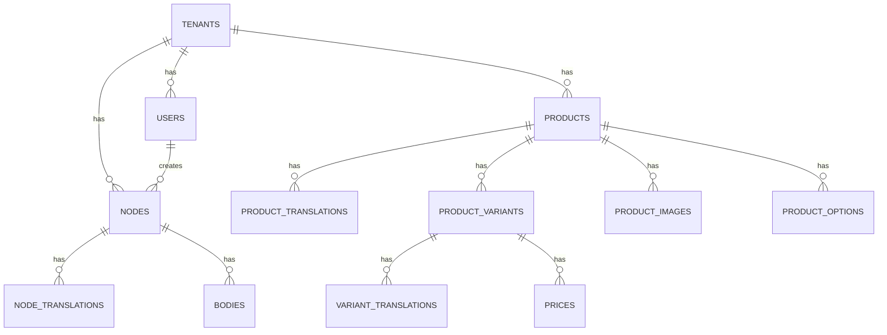

# RusToK Database Schema

> **Полная карта таблиц БД с многоязычной поддержкой**  
> **Обновлено:** 2026-02-11  
> **См. также**: [I18N_ARCHITECTURE.md](I18N_ARCHITECTURE.md) - Comprehensive i18n guide

---

## Overview

| Module | Tables Count | Prefix |
|--------|:------------:|--------|
| Core/Auth | 1 | - |
| Content | 3 | - |
| Commerce | 6 | - |
| Scripting | 1 | - |
| Infrastructure | 1 | sys_ |

**Total Tables:** 12+

---

## Core / Auth Tables

### `users`
>
> **Module:** rustok-core  
> **Entity:** `rustok-core/src/auth/user.rs`

| Column | Type | Description |
|--------|------|-------------|
| id | UUID | Primary key |
| tenant_id | UUID | FK → tenants |
| email | VARCHAR | Unique email |
| password_hash | VARCHAR | Hashed password |
| role | VARCHAR | User role |
| status | VARCHAR | Account status |
| created_at | TIMESTAMPTZ | Creation time |
| updated_at | TIMESTAMPTZ | Last update |

---

## Content Module Tables

### `nodes`
>
> **Module:** rustok-content  
> **Entity:** `rustok-content/src/entities/node.rs`

| Column | Type | Description |
|--------|------|-------------|
| id | UUID | Primary key |
| tenant_id | UUID | FK → tenants |
| kind | VARCHAR(32) | Node type: 'page', 'post', 'topic' |
| slug | VARCHAR(255) | URL slug |
| author_id | UUID | FK → users |
| status | VARCHAR | draft/published/archived |
| published_at | TIMESTAMPTZ | Publication date |
| created_at | TIMESTAMPTZ | Creation time |
| updated_at | TIMESTAMPTZ | Last update |

### `node_translations`
>
> **Module:** rustok-content  
> **Entity:** `rustok-content/src/entities/node_translation.rs`

| Column | Type | Description |
|--------|------|-------------|
| id | UUID | Primary key |
| node_id | UUID | FK → nodes |
| locale | VARCHAR(10) | Language code |
| title | VARCHAR(255) | Localized title |
| excerpt | TEXT | Short description |
| metadata | JSONB | SEO, custom fields |

### `bodies`
>
> **Module:** rustok-content  
> **Entity:** `rustok-content/src/entities/body.rs`

| Column | Type | Description |
|--------|------|-------------|
| node_id | UUID | PK, FK → nodes |
| locale | VARCHAR(10) | PK, language code |
| body | TEXT | Rich content (HTML/Markdown) |
| format | VARCHAR | Content format |

---

## Commerce Module Tables

### `products`
>
> **Module:** rustok-commerce  
> **Entity:** `rustok-commerce/src/entities/product.rs`

| Column | Type | Description |
|--------|------|-------------|
| id | UUID | Primary key |
| tenant_id | UUID | FK → tenants |
| handle | VARCHAR(255) | URL-friendly slug |
| status | VARCHAR | draft/active/archived |
| product_type | VARCHAR | Product type |
| vendor | VARCHAR | Vendor name |
| created_at | TIMESTAMPTZ | Creation time |
| updated_at | TIMESTAMPTZ | Last update |

### `product_translations`
>
> **Module:** rustok-commerce  
> **Entity:** `rustok-commerce/src/entities/product_translation.rs`

| Column | Type | Description |
|--------|------|-------------|
| id | UUID | Primary key |
| product_id | UUID | FK → products |
| locale | VARCHAR(10) | Language code |
| title | VARCHAR(255) | Localized title |
| description | TEXT | Localized description |
| seo_title | VARCHAR | SEO title |
| seo_description | TEXT | SEO description |

### `product_variants`
>
> **Module:** rustok-commerce  
> **Entity:** `rustok-commerce/src/entities/product_variant.rs`

| Column | Type | Description |
|--------|------|-------------|
| id | UUID | Primary key |
| product_id | UUID | FK → products |
| sku | VARCHAR(100) | Stock keeping unit |
| barcode | VARCHAR(50) | Barcode |
| weight | DECIMAL | Weight |
| inventory_quantity | INT | Stock quantity |
| position | INT | Sort order |

### `variant_translations`
>
> **Module:** rustok-commerce  
> **Entity:** `rustok-commerce/src/entities/variant_translation.rs`

| Column | Type | Description |
|--------|------|-------------|
| id | UUID | Primary key |
| variant_id | UUID | FK → product_variants |
| locale | VARCHAR(10) | Language code |
| title | VARCHAR(255) | Localized title |

### `prices`
>
> **Module:** rustok-commerce  
> **Entity:** `rustok-commerce/src/entities/price.rs`

| Column | Type | Description |
|--------|------|-------------|
| id | UUID | Primary key |
| variant_id | UUID | FK → product_variants |
| currency | VARCHAR(3) | Currency code (USD, EUR) |
| amount | BIGINT | Price in cents |
| compare_at | BIGINT | Original price |

### `product_images`
>
> **Module:** rustok-commerce  
> **Entity:** `rustok-commerce/src/entities/product_image.rs`

| Column | Type | Description |
|--------|------|-------------|
| id | UUID | Primary key |
| product_id | UUID | FK → products |
| url | VARCHAR | Image URL |
| alt | VARCHAR | Alt text |
| position | INT | Sort order |

### `product_options`
>
> **Module:** rustok-commerce  
> **Entity:** `rustok-commerce/src/entities/product_option.rs`

| Column | Type | Description |
|--------|------|-------------|
| id | UUID | Primary key |
| product_id | UUID | FK → products |
| name | VARCHAR | Option name (Size, Color) |
| values | JSONB | Option values |
| position | INT | Sort order |

---

## Scripting Tables

### `scripts`
>
> **Module:** alloy-scripting  
> **Entity:** `alloy-scripting/src/storage/sea_orm.rs`

| Column | Type | Description |
|--------|------|-------------|
| id | UUID | Primary key |
| name | VARCHAR | Script name |
| code | TEXT | Rhai script code |
| schedule | VARCHAR | Cron expression |
| enabled | BOOL | Is active |
| last_run | TIMESTAMPTZ | Last execution |

---

## Infrastructure Tables

### `sys_events` (Outbox)
>
> **Module:** rustok-outbox  
> **Entity:** `rustok-outbox/src/entity.rs`

| Column | Type | Description |
|--------|------|-------------|
| id | UUID | Primary key |
| payload | JSONB | EventEnvelope serialized |
| status | VARCHAR | pending/dispatched |
| created_at | TIMESTAMPTZ | Creation time |
| dispatched_at | TIMESTAMPTZ | Dispatch time |

---

## Index Tables (CQRS Read Model)

> **Module:** rustok-index  
> Денормализованные таблицы для быстрого поиска

### `index_products` (planned)

| Column | Type | Description |
|--------|------|-------------|
| id | UUID | Primary key |
| tenant_id | UUID | Tenant |
| product_id | UUID | Source product |
| title | VARCHAR | Denormalized title |
| description | TEXT | Denormalized description |
| price_min | BIGINT | Min price |
| price_max | BIGINT | Max price |
| search_vector | TSVECTOR | Full-text search |
| indexed_at | TIMESTAMPTZ | Index time |

### `index_content` (planned)

| Column | Type | Description |
|--------|------|-------------|
| id | UUID | Primary key |
| tenant_id | UUID | Tenant |
| node_id | UUID | Source node |
| kind | VARCHAR | Node type |
| title | VARCHAR | Denormalized title |
| search_vector | TSVECTOR | Full-text search |
| indexed_at | TIMESTAMPTZ | Index time |

---

## Entity Relationship Diagram



---

## Migration Naming Convention

```
mYYYYMMDD_<module>_<nnn>_<description>.rs
```

**Examples:**

- `m20250201_content_001_create_nodes.rs`
- `m20250201_commerce_001_create_products.rs`

---

## Notes

- Все таблицы используют `UUID` как primary key
- `tenant_id` обязателен для multi-tenancy изоляции
- Timestamps используют `TIMESTAMPTZ` (timezone-aware)
- JSONB для гибких структур (metadata, options)
- Индексы: GIN для JSONB, GiST для full-text search

---

## См. также

- [MODULE_MATRIX.md](./modules/MODULE_MATRIX.md) — матрица модулей
- [ARCHITECTURE_GUIDE.md](./ARCHITECTURE_GUIDE.md) — архитектура

This is an alpha version and requires clarification. Be careful, there may be errors in the text. So that no one thinks that this is an immutable rule.
