# RusToK Architecture Diagrams

> Visual representation of the RusToK architecture

---

## System Architecture Overview

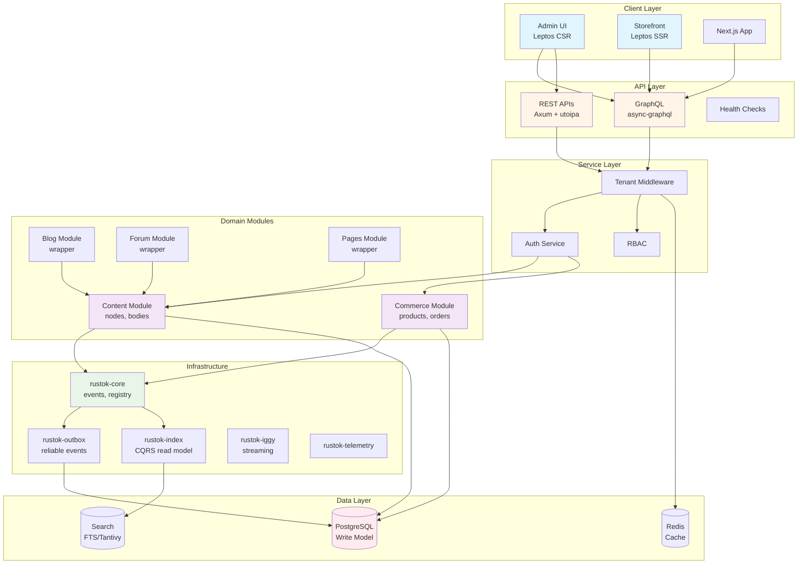

---

## Event Flow Architecture

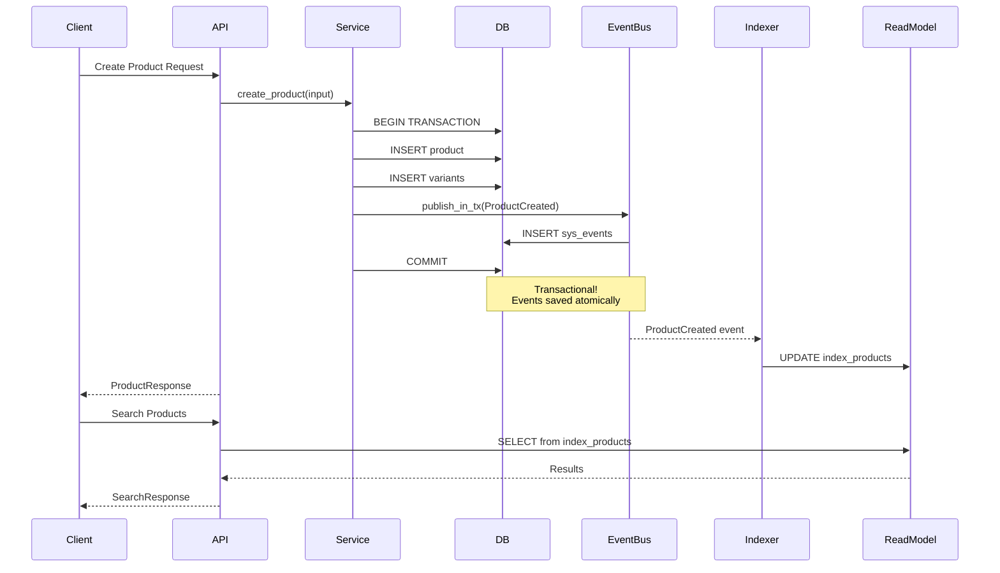

---

## Module Dependency Graph

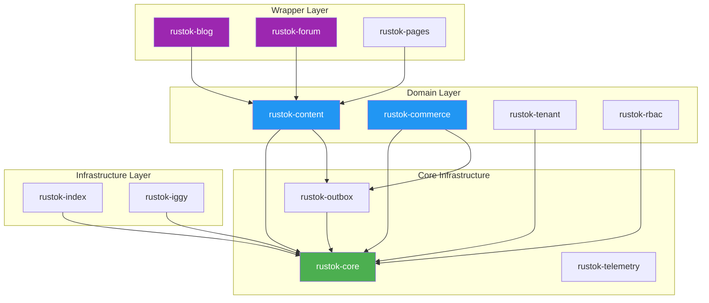

---

## CQRS Pattern Implementation

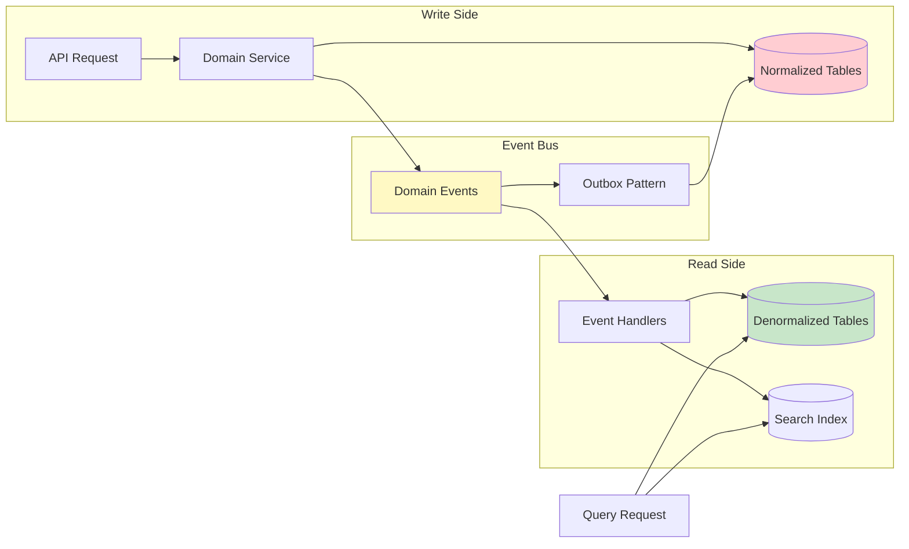

---

## Tenant Resolution Flow

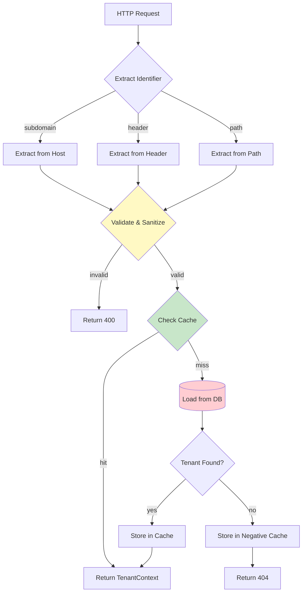

---

## Security Architecture

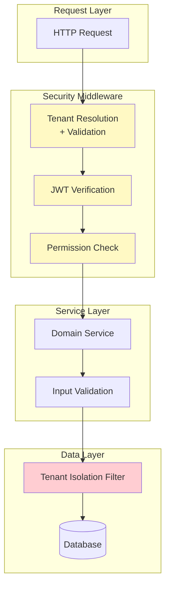

---

## Event Transport Levels

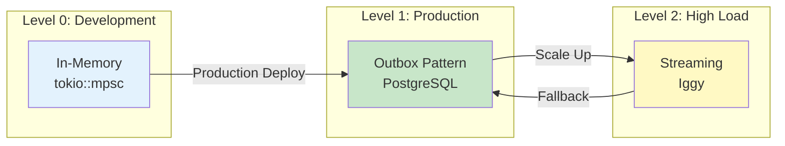

---

## Health Check Architecture

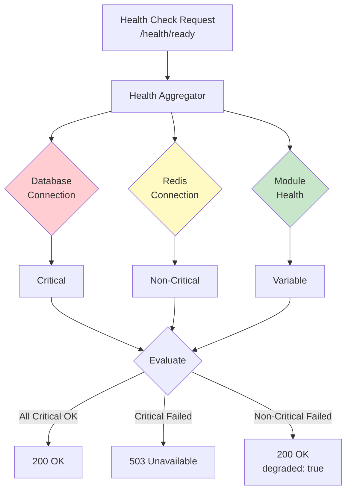

---

## Module Registry & Lifecycle

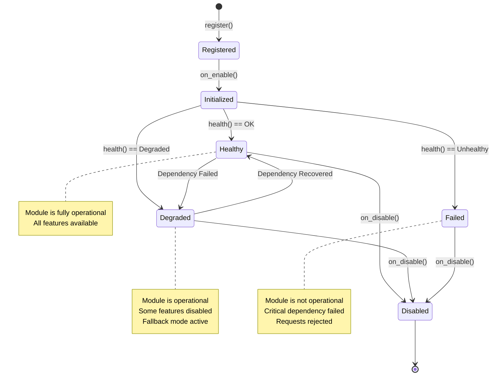

---

## Backpressure & Circuit Breaker

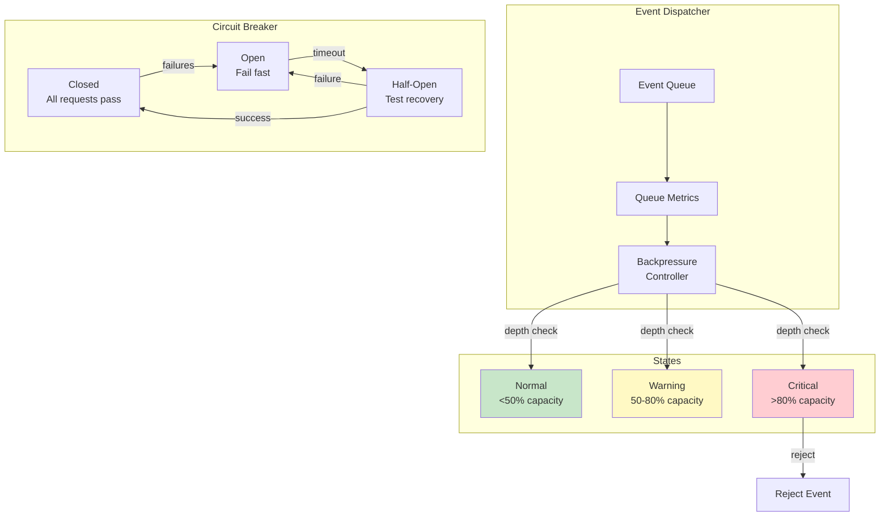

---

## Future: Event Sourcing Pattern

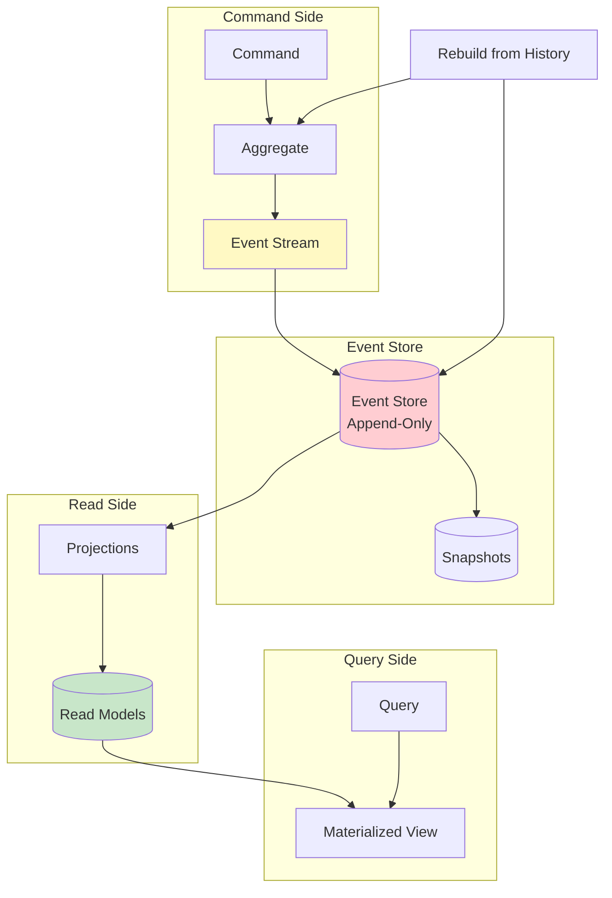

---

## Deployment Architecture

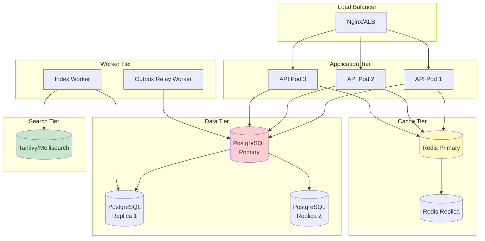

---

*These diagrams represent the current and planned architecture of RusToK.*
