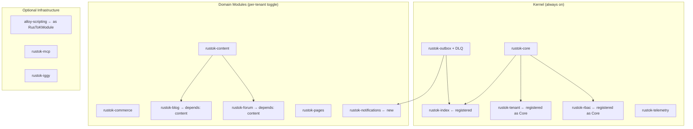

# RusToK — Architecture Improvement Recommendations

- Date: 2026-02-19
- Status: Proposed
- Author: Platform Architecture Review

---

## 1. Контекст: что мы видим в коде сегодня

Прежде чем давать рекомендации, зафиксируем реальное состояние системы.

### 1.1 Граница между ядром и опциональными модулями

После анализа кода можно выделить **три категории** компонентов:

#### Категория A — Compile-time Infrastructure (не `RusToKModule`, не регистрируются)

Это «невидимые» для реестра crate'ы. Они линкуются в бинарник всегда, но не участвуют в lifecycle модулей:

| Crate | Роль | Почему не `RusToKModule` |
|---|---|---|
| `rustok-core` | Контракты, EventBus, RBAC, кэш, Circuit Breaker, метрики | Это само ядро, определяет trait |
| `rustok-iggy` + `rustok-iggy-connector` | L2 streaming transport (опциональный транспорт) | Технический адаптер, не бизнес-логика |
| `rustok-telemetry` | OpenTelemetry, tracing, Prometheus | Сквозная зависимость |
| `rustok-test-utils` | Фикстуры, моки, хелперы для тестов | **Только `dev-dependencies`**, в production binary не входит |
| `utoipa-swagger-ui-vendored` | Vendored Swagger UI assets | Статический ресурс, не модуль платформы |
| `alloy-scripting` | Скриптовый движок Rhai | Сейчас инициализируется напрямую в `app.rs` |
| `tailwind-rs/css/ast` | CSS tooling | Build-time инструментарий |
| `rustok-mcp` | MCP адаптер с binary target | Отдельный сервер, не часть основного runtime |

#### Категория B — Core Platform Modules (регистрируются как `ModuleKind::Core`, нельзя отключить)

Это модули, реализующие `RusToKModule` и **обязательные для работы платформы**:

| Crate | Роль | Текущий статус |
|---|---|---|
| `rustok-index` | CQRS read-model, индексатор для storefront | Реализует `IndexModule`, но **не зарегистрирован** |
| `rustok-tenant` | Tenant metadata, lifecycle хуки | Реализует `TenantModule`, но **не зарегистрирован** |
| `rustok-rbac` | RBAC helpers, lifecycle хуки | Реализует `RbacModule`, но **не зарегистрирован** |

> **`rustok-outbox` — core-компонент платформы.** Он не реализует `RusToKModule` и не входит в registry, но относится к категории Core Infrastructure: `TransactionalEventBus` используется при каждой write-операции во всех domain-модулях. Инициализируется через `build_event_runtime()` в `app.rs`, а не через `ModuleRegistry`. Остановка outbox = потеря гарантий доставки событий для всей платформы.

#### Категория C — Optional Domain Modules (регистрируются как `ModuleKind::Optional`, per-tenant toggle)

| Crate | Тип | Depends on |
|---|---|---|
| `rustok-content` | Domain (фактически required) | `rustok-core` |
| `rustok-commerce` | Domain | `rustok-core` |
| `rustok-blog` | Wrapper | `rustok-content` |
| `rustok-forum` | Wrapper | `rustok-content` |
| `rustok-pages` | Domain | `rustok-core` |

**Ключевые наблюдения:**
- `rustok-index`, `rustok-tenant`, `rustok-rbac` — Категория B: реализуют `RusToKModule`, имеют lifecycle-хуки, но пока не зарегистрированы.
- `rustok-outbox` — ядро платформы, но **не через registry**: это `EventTransport`-слой, инициализируемый отдельно.
- `rustok-test-utils` — **исключительно `[dev-dependencies]`**, в production binary не входит никогда.
- `utoipa-swagger-ui-vendored` — vendored статика Swagger UI, не `RusToKModule`.

### 1.2 Реальное состояние событийной системы (три уровня)

Три транспортных уровня — это **не иерархия**, а **три независимых режима**, выбираемых через `settings.rustok.events.transport`:

```
build_event_runtime()  ←  вызывается в app.rs::after_routes()
         │
   ┌─────┴─────────────────────────────────────────┐
   │                    │                           │
   ▼                    ▼                           ▼
L0: MemoryTransport   L1: OutboxTransport      L2: IggyTransport
(tokio::broadcast)    (PostgreSQL sys_events)  (внешний Iggy-сервер)
  dev/MVP only          production default       highload / replay
                              │
                         OutboxRelay
                         (tokio::spawn loop)
                         batch=100, retry×5
                         backoff 1s → 60s
                         relay target: MemoryTransport  ← !
```

**Критические факты по коду:**

1. **L1 relay пишет обратно в `MemoryTransport`**, а не в Iggy. L1→L2 pipeline как связная цепочка **не реализован** — это три независимых режима.

2. **L2 (Iggy)** при выборе `transport = "iggy"` делает `connector.connect()` синхронно при старте сервера. Если Iggy-сервер недоступен → сервер **падает при старте** с ошибкой `BadRequest`.

3. **`replay()` в `IggyTransport`** — заглушка: проверяет `is_initialized()` и возвращает `Ok(())`. Replay событий не реализован.

4. **Текущий production-путь:** `outbox` (L1). `memory` — только dev. `iggy` — инфраструктурно готов, но функционально incomplete.

5. **`rustok-outbox` — самый критичный компонент платформы**: `TransactionalEventBus` вызывается при каждой write-операции во всех domain-модулях. Его остановка = полная остановка write-path.

### 1.3 Реализация кэша

Кэш **двухслойный** с автоматическим fallback и используется **только для tenant resolution**:

```
RUSTOK_REDIS_URL / REDIS_URL задан?
    ├── ДА  → RedisCacheBackend  (feature = "redis-cache")
    │            ├── CircuitBreaker на каждый GET/SET/DEL
    │            ├── При open circuit → Error::Cache, warn в лог
    │            └── Ключ: prefix + ":" + key
    └── НЕТ → InMemoryCacheBackend (moka)
                 TTL = global при инициализации
                 Capacity = 1000 записей
```

**Два отдельных кэша для каждого запроса:**

| Кэш | Ключ | TTL | Назначение |
|---|---|---|---|
| `tenant_cache` | `tenant:v1:{uuid\|slug\|host}:value` | 5 мин | Найденные tenants |
| `tenant_negative_cache` | `tenant_negative:v1:{uuid\|slug\|host}:value` | 60 сек | Несуществующие tenants (flood protection) |

**Stampede protection** через `in_flight: Arc<Mutex<HashMap<String, Arc<Notify>>>>`:
- 100 параллельных запросов по одному tenant → только **1** идёт в БД, остальные ждут `Notify::notified()`.

**Cross-instance invalidation** (только при Redis):
- При обновлении tenant → `PUBLISH tenant.cache.invalidate <key>|<neg_key>` в Redis pub/sub.
- Все инстансы подписаны и локально инвалидируют оба ключа.
- Метрики (hits/misses) тоже пишутся в Redis через `INCR` → `/metrics` показывает агрегат кластера.

**Известная проблема:** `InMemoryCacheBackend::set_with_ttl()` **игнорирует параметр `_ttl`**, используя только глобальный TTL, заданный при создании кэша. Per-entry TTL не работает в in-memory режиме.

---

## 2. Рекомендации

### 2.1 ✅ РЕАЛИЗОВАНО: Устранить размытую границу core / domain-module

**Проблема.** `rustok-tenant`, `rustok-rbac` и `rustok-index` имеют `impl RusToKModule`, но не регистрировались в `build_registry()`. Не было формального способа отличить обязательные модули от опциональных.

> **Что точно является Core (нельзя отключить):** `rustok-index`, `rustok-tenant`, `rustok-rbac`.
>
> **Что точно НЕ является частью `ModuleKind` системы:**
> - `rustok-test-utils` — это `[dev-dependencies]`, в production binary не входит вообще.
> - `utoipa-swagger-ui-vendored` — vendored статика Swagger UI, не `RusToKModule`.
> - `rustok-outbox` — не реализует `RusToKModule`; это инфраструктурный компонент, инициализируемый через `build_event_runtime()`, а не через registry.

**Рекомендация.** Ввести формальную классификацию на уровне trait'а:

```rust
// В rustok-core/src/module.rs
pub enum ModuleKind {
    /// Всегда активен, не может быть отключён tenant'ом
    Core,
    /// Регистрируется в реестре, может быть включён/отключён per-tenant
    Optional,
}

pub trait RusToKModule: Send + Sync + MigrationSource {
    fn kind(&self) -> ModuleKind {
        ModuleKind::Optional  // safe default
    }
    // ... остальное без изменений
}
```

**Решение реализовано:**
- В `rustok-core/src/module.rs` добавлен `ModuleKind { Core, Optional }` с doc-комментарием-предупреждением.
- `fn kind(&self) -> ModuleKind` добавлен в трейт `RusToKModule` с default `Optional`.
- `ModuleRegistry` разделён на два bucket'а: `core_modules` и `optional_modules`.
- `ModuleLifecycleService::toggle_module()` возвращает `ToggleModuleError::CoreModuleCannotBeDisabled` при попытке отключить core-модуль.
- `IndexModule`, `TenantModule`, `RbacModule` переопределяют `fn kind() -> ModuleKind::Core`.
- Все три зарегистрированы в `build_registry()` первыми.

---

### 2.2 ✅ РЕАЛИЗОВАНО: Зарегистрировать `rustok-index` в `build_registry()`

**Проблема.** `rustok-index` не был зарегистрирован. CQRS read-path не работал.

**Решение:** `IndexModule` добавлен в `apps/server/src/modules/mod.rs` как первый Core-модуль.

---

### 2.3 ✅ РЕАЛИЗОВАНО: Зарегистрировать `TenantModule` и `RbacModule`

**Проблема.** `TenantModule` и `RbacModule` реализовали `RusToKModule` с `health()`, но не были зарегистрированы — их health-статус отсутствовал в `/health/modules`.

**Решение:** Оба зарегистрированы в `build_registry()` как Core-модули. Теперь их health виден, хуки вызываются, миграции подхватываются автоматически.

---

### 2.4 ✅ РЕАЛИЗОВАНО: Проверка синхронизации `modules.toml` и `build_registry()`

**Решение.** Добавлена рантайм-проверка `modules::validate_registry_vs_manifest(&registry)` в `apps/server/src/app.rs` сразу после `build_registry()`. Сервер завершает запуск с ошибкой при рассинхроне slug'ов и/или конфликте `required` ↔ `ModuleKind::Core`.

**Важно:** `rustok-outbox` остаётся core-инфраструктурой в манифесте, но intentionally исключён из проверки registry-слотов, потому что это не `RusToKModule` и он инициализируется через event runtime.

```rust
let registry = modules::build_registry();
modules::validate_registry_vs_manifest(&registry)?;
```

---

### 2.5 ✅ РЕАЛИЗОВАНО: Добавить `dependencies` для Blog/Forum относительно Content

**Решение.** В `BlogModule` и `ForumModule` зависимости уже заданы как `&["content"]`, поэтому `ModuleLifecycleService` корректно блокирует неконсистентные toggle-операции (включение без dependency и отключение dependency при активных dependents).

---

### 2.6 ✅ РЕАЛИЗОВАНО: Ввести `required`/`depends_on` в `modules.toml` + валидацию

**Решение.** `modules.toml` уже содержит `required` и `depends_on`, а runtime-проверка `validate_registry_vs_manifest()` валидирует не только `required` ↔ `ModuleKind::Core`, но и соответствие `depends_on` из манифеста зависимостям, объявленным в `RusToKModule::dependencies()`.

---

### 2.7 🟡 ВАЖНО: Связать L1 (Outbox) и L2 (Iggy) в единый pipeline

**Проблема.** Сейчас три транспортных уровня — это три **независимых режима**, а не иерархия. `OutboxRelay` пишет события в `MemoryTransport` (не в Iggy). При выборе `transport = "iggy"` outbox-гарантии теряются. Нет плавного пути L1 → L2.

**Рекомендация.** Сделать `OutboxRelay` настраиваемым: relay target должен поддерживать `IggyTransport` как downstream:

```toml
[settings.rustok.events]
transport = "outbox"           # write-side: всегда outbox
relay_target = "iggy"         # read-side: relay в Iggy для replay и highload
```

Это обеспечит: AtLeastOnce через outbox + replay через Iggy + не падать при старте если Iggy временно недоступен (lazy connect).

---

### 2.8 ✅ РЕАЛИЗОВАНО: `InMemoryCacheBackend::set_with_ttl()` учитывает per-entry TTL

**Решение.** In-memory backend переведён на per-entry expiration через `moka::Expiry`: значение кэша теперь хранит `payload + ttl`, а `set_with_ttl()` выставляет TTL на уровне записи. `set()` использует `default_ttl` экземпляра backend и также проходит через `set_with_ttl()`.

Это устранило расхождение между API и фактическим поведением: теперь разный TTL для ключей внутри одного `InMemoryCacheBackend` поддерживается корректно.

---

### 2.9 🟡 В ПРОЦЕССЕ: Вынести `DomainEvent` из `rustok-core` в `rustok-events`

**Проблема.** `rustok-core/src/events/types.rs` содержит 37 556 байт — это огромный enum с событиями для content, blog, forum, commerce, user, pages, tenants, MCP. При добавлении нового модуля разработчик вынужден редактировать core, что нарушает принцип Open/Closed.

```rust
// сегодня: всё в одном месте
pub enum DomainEvent {
    NodeCreated { ... },      // content
    ProductCreated { ... },   // commerce
    OrderPlaced { ... },      // commerce
    PostPublished { ... },    // blog
    TopicCreated { ... },     // forum
    PagePublished { ... },    // pages
    // ...50+ вариантов
}
```

**Рекомендация.** Ввести паттерн расширяемых событий через типизированные "пространства":

```rust
// В rustok-core: только инфраструктурные события + envelope
pub enum CoreEvent {
    UserRegistered { user_id: Uuid, email: String },
    UserLoggedIn { user_id: Uuid },
    TenantCreated { tenant_id: Uuid },
}

// Каждый модуль объявляет свои события сам:
// rustok-commerce/src/events.rs
pub enum CommerceEvent {
    ProductCreated { product_id: Uuid },
    OrderPlaced { order_id: Uuid, tenant_id: Uuid },
}

// EventEnvelope параметризуется по payload:
pub struct EventEnvelope<E = serde_json::Value> {
    pub event_type: String,
    pub tenant_id: Uuid,
    pub event: E,
    // ...
}
```

**Текущий статус.** Реализован Phase 1: создан crate `rustok-events` как стабильная точка импорта для событийных контрактов, с совместимым re-export `DomainEvent`/`EventEnvelope` из `rustok-core`.

**Осталось до финала:** Phase 2/3 (фактический перенос определения enum и схем в `rustok-events`, затем cleanup зависимостей) остаются Breaking Change и требуют ADR.

---

### 2.10 🟢 УЛУЧШЕНИЕ: Добавить per-tenant module settings

**Проблема.** `tenant_modules.settings` (JSONB) уже существует в модели, но нигде не используется. `ModuleContext.config` принимает `&Value`, но сервисы его игнорируют.

**Рекомендация.** Ввести типизированный конфиг для модулей:

```rust
pub trait RusToKModule {
    type Config: DeserializeOwned + Default;

    fn parse_config(&self, raw: &Value) -> Result<Self::Config> {
        serde_json::from_value(raw.clone()).map_err(|e| Error::config(e))
    }
}
```

Это откроет возможность per-tenant настройки: лимиты постов для блога, список валют для commerce, кастомные SEO-поля и т.д.

---

### 2.11 🟢 УЛУЧШЕНИЕ: Добавить `rustok-notifications` как опциональный инфраструктурный модуль

**Проблема.** В RBAC и Events нет общего механизма уведомлений. Сейчас если нужно отправить email при `OrderPlaced` — это пишется в ad-hoc обработчиках.

**Рекомендация.** Создать `crates/rustok-notifications`:
- Подписывается на `DomainEvent` через EventBus.
- Поддерживает каналы: email (уже есть `apps/server/src/services/email.rs`), webhook, in-app.
- Конфигурируется per-tenant через `tenant_modules.settings`.
- Является опциональным Optional-модулем (не Core).

---

### 2.12 🟢 УЛУЧШЕНИЕ: Улучшить Outbox: добавить DLQ и мониторинг backlog

**Проблема.** `OutboxRelay::process_pending_once()` логирует ошибки но не отправляет застрявшие события в Dead Letter Queue. Нет метрик по backlog size.

**Рекомендация.**
1. Добавить `outbox_backlog_size` gauge в Prometheus metrics (экспортировать через `/metrics`).
2. Реализовать DLQ: после N попыток (конфигурируемое) переносить события в таблицу `sys_events_dlq`.
3. Добавить API endpoint `GET /api/admin/events/dlq` для просмотра и replay застрявших событий.

Базовый скелет DLQ уже есть в `crates/rustok-iggy/src/dlq.rs` — можно портировать логику в outbox-уровень.

---

### 2.13 🟢 УЛУЧШЕНИЕ: Формализовать Alloy Scripting как опциональный модуль

**Проблема.** `alloy-scripting` подключается напрямую в `app.rs` через `alloy_scripting::create_default_engine()` — минуя ModuleRegistry. Это нарушает единообразие модульной архитектуры.

**Рекомендация.** Обернуть в `RusToKModule`:

```rust
pub struct AlloyModule;

impl RusToKModule for AlloyModule {
    fn slug(&self) -> &'static str { "alloy" }
    fn kind(&self) -> ModuleKind { ModuleKind::Optional }
}
```

Это позволит:
- Включать/отключать скриптовый движок per-tenant.
- Отображать состояние в `/health/modules`.
- Ограничивать доступ через RBAC (`scripting:execute` permission).

---

### 2.14 🔵 СТРАТЕГИЧЕСКИ: Разделить `apps/server` на `core-server` + `module-bundles`

**Проблема.** Сейчас в `apps/server/src/app.rs` все маршруты (`commerce`, `blog`, `forum`, `content`, `pages`) захардкожены. При добавлении нового модуля нужно менять `app.rs`. Это создаёт coupling.

**Рекомендация.** Ввести автоматическую регистрацию роутов через trait:

```rust
pub trait HttpModule: RusToKModule {
    fn routes(&self) -> axum::Router;
}

// В app.rs:
fn routes(ctx: &AppContext) -> AppRoutes {
    let registry = modules::build_registry();
    let mut routes = AppRoutes::with_default_routes()
        .add_route(controllers::health::routes())
        .add_route(controllers::auth::routes())
        .add_route(controllers::graphql::routes());

    for module in registry.http_modules() {
        routes = routes.add_route(module.routes());
    }
    routes
}
```

Это позволит добавлять новые модули без изменения `app.rs`.

---

## 3. Приоритизированный план действий

| # | Рекомендация | Приоритет | Статус | Сложность | Блокирует |
|---|---|---|---|---|---|
| 2.1 | Ввести `ModuleKind::Core` / `Optional` | ✅ Готово | Done | — | — |
| 2.2 | Зарегистрировать `rustok-index` | ✅ Готово | Done | — | — |
| 2.3 | Зарегистрировать Tenant/RBAC как Core | ✅ Готово | Done | — | — |
| 2.4 | Синхронизация `modules.toml` ↔ `build_registry()` | ✅ Готово | Done | Средняя | Ops reliability |
| 2.8 | Исправить `set_with_ttl()` в InMemoryCache | ✅ Готово | Done | Низкая | Cache correctness |
| 2.5 | Заполнить `dependencies()` для Blog/Forum | ✅ Готово | Done | Низкая | Data integrity |
| 2.6 | `required` / `depends_on` в `modules.toml` | ✅ Готово | Done | Низкая | Ops tooling |
| 2.7 | Связать L1 (Outbox) → L2 (Iggy) pipeline | 🟡 Важно | Backlog | Высокая | Event highload |
| 2.12 | Outbox DLQ + backlog metrics | 🟢 Улучшение | Backlog | Средняя | Event reliability |
| 2.10 | Per-tenant typed module config | 🟢 Улучшение | Backlog | Средняя | Extensibility |
| 2.11 | `rustok-notifications` модуль | 🟢 Улучшение | Backlog | Высокая | New capability |
| 2.13 | Alloy как `RusToKModule` | 🟢 Улучшение | Backlog | Низкая | Consistency |
| 2.9 | Вынести `DomainEvent` из core | 🔵 Стратегически | In Progress (Phase 1) | Высокая | Extensibility |
| 2.14 | Авторегистрация HTTP routes | 🔵 Стратегически | ADR Needed | Высокая | DX / scalability |

---

## 4. Итоговая картина после применения рекомендаций



---


## 5. Предлагаемый roadmap (следующие 3 итерации)

> Формат: 1 итерация = 2 недели. Цель roadmap — перевести рекомендации из «архитектурных тезисов» в план поставки с измеримым DoD.

### 5.1 Итерация 1 (stability first)
**Scope**
- Проверка результата **2.5**: зависимости `blog/forum -> content` должны оставаться синхронизированными с runtime registry.
- Проверка результата **2.6**: `required`/`depends_on` из `modules.toml` должны валидироваться на старте сервера.
- Добавить smoke-тесты на `toggle_module()` для сценариев disable/enable с зависимостями.

**Deliverables**
- Обновлённый модульный контракт зависимостей (`blog/forum -> content`).
- Машиночитаемые ограничения в manifest-схеме (`required`, `depends_on`).
- Набор regression-тестов на lifecycle-ограничения.

**Критерии приёмки (DoD)**
- `content` нельзя отключить, пока активны зависимые `blog/forum`.
- Ошибка при нарушении зависимости детерминирована (стабильный error code/message).
- Тесты в CI воспроизводят и positive, и negative path.

### 5.2 Итерация 2 (event reliability)
**Scope**
- Закрыть **2.7**: реализовать relay target `iggy` для outbox.
- Закрыть **2.12**: backlog gauge + DLQ + admin read/replay endpoint.
- Добавить alerting (warning/critical) на backlog, retry spike, DLQ growth.

**Deliverables**
- Конфигурируемый pipeline `outbox -> relay_target`.
- Таблица/механика DLQ и административный replay flow.
- Набор метрик и alerts для операционного мониторинга.

**Критерии приёмки (DoD)**
- При недоступном downstream события не теряются и повторно отправляются после восстановления.
- Backlog и DLQ наблюдаемы через `/metrics` и дашборд.
- Replay из DLQ документирован и проходит контролируемо.

### 5.3 Итерация 3 (extensibility)
**Scope**
- Закрыть **2.10**: typed module config с backward-compatible migration для `tenant_modules.settings`.
- Закрыть **2.11** и **2.13**: notifications и alloy как опциональные модули через единый lifecycle.
- Подготовить ADR для **2.9** и **2.14** (breaking/strategic track).

**Deliverables**
- Типизированные per-tenant конфиги модулей.
- Унифицированное подключение optional infrastructure через `RusToKModule`.
- ADR-пакет для стратегических изменений event model и маршрутизации.

**Критерии приёмки (DoD)**
- Новые optional-модули подключаются без правки центрального роутинга.
- Миграция конфигов не ломает существующие tenant settings.
- ADR согласованы и готовы к реализации в следующем release train.

### 5.4 Governance и точки контроля
- **Еженедельный checkpoint:** статус по пунктам 2.x, риски, блокеры, owner на каждый item.
- **Документационный контроль:** любые изменения по модулям/событиям/маршрутизации синхронно отражаются в `docs/index.md` и профильных docs-файлах.
- **ADR-контроль:** для `2.9` Phase 1 допускается без ADR (совместимый слой), а финальный перенос контракта (Phase 2/3) и `2.14` не переводятся в implementation до публикации ADR в `DECISIONS/`.

---

## 6. Связанные документы

- [`docs/architecture/overview.md`](./overview.md) — архитектурный обзор
- [`docs/architecture/principles.md`](./principles.md) — принципы архитектуры
- [`docs/architecture/events.md`](./events.md) — транзакционная публикация событий
- [`docs/modules/registry.md`](../modules/registry.md) — реестр компонентов
- [`docs/modules/overview.md`](../modules/overview.md) — состояние модулей
- [`DECISIONS/`](../../DECISIONS/) — архитектурные решения (ADR)
