# Documentation Map

This file is the canonical map of RusToK documentation.

It covers both centralized docs (`docs/`) and distributed docs located inside apps, modules, and shared libraries.

## Why a "documentation tree" is needed

Да, нам нужен единый файл-карта. Документация реально распределена по репозиторию (`docs/`, `apps/*`, `crates/*`), и без общей схемы новые участники часто не находят нужный контекст.

Этот `docs/index.md` играет роль такой карты и должен обновляться при изменениях архитектуры, API, UI-контрактов и модулей.

## Graphical documentation map

```mermaid
graph TD
    ROOT[docs/index.md]

    ROOT --> D[docs/*]
    ROOT --> A[apps/* docs]
    ROOT --> C[crates/* docs]
    ROOT --> P[packages/* docs]
    ROOT --> R[Root docs]

    D --> DARCH[docs/architecture/*]
    D --> DGUIDE[docs/guides/*]
    D --> DMOD[docs/modules/*]
    D --> DUI[docs/UI/*]
    D --> DSTD[docs/standards/*]

    A --> ASRV[apps/server/docs/*]
    A --> AADMIN[apps/admin/docs/*]
    A --> ASF[apps/storefront/README.md]
    A --> ANEXTADMIN[apps/next-admin/docs/*]
    A --> ANEXTSF[apps/next-frontend/docs/*]
    A --> AMCP[apps/mcp → crates/rustok-mcp/docs/*]

    C --> CDOMAIN[crates/rustok-*/docs/*]
    C --> CUI[crates/leptos-*/docs/*]
    C --> CINFRA[crates/*/README.md]

    R --> RMANIFEST[RUSTOK_MANIFEST.md]
    R --> RCHANGELOG[CHANGELOG.md]
    R --> RAGENTS[AGENTS.md]
```

## AI session start (обязательно)

- [AI Context](./AI_CONTEXT.md) — обязательный стартовый контекст для AI-сессий перед анализом и генерацией кода.

## Root Documents

- [System Manifest](../RUSTOK_MANIFEST.md) — Философия, принципы и архитектурные инварианты платформы.
- [Agent Rules](../AGENTS.md) — Правила для AI-агентов и контрибьюторов.
- [Contributing](../CONTRIBUTING.md) — Инструкция по участию в разработке.
- [Changelog](../CHANGELOG.md) — История версий и релизов.
- [Roadmap](./roadmap.md) — Текущая дорожная карта и история релизов.
- [License](../LICENSE) — MIT License.

## Central docs (`docs/`)

### Architecture (`docs/architecture/`)

- [Overview](./architecture/overview.md)
- [Database Schema](./architecture/database.md)
- [API Architecture](./architecture/api.md)
- [RBAC Enforcement](./architecture/rbac.md)
- [Dataloader](./architecture/dataloader.md)
- [Modules Overview](./architecture/modules.md)
- [Routing Policy](./architecture/routing.md)
- [Events & Outbox](./architecture/events.md)
- [Transactional Publishing](./architecture/events-transactional.md)
- [Event Flow Contract](./architecture/event-flow-contract.md)
- [Tenancy](./architecture/tenancy.md)
- [Principles](./architecture/principles.md)
- [Improvement Recommendations](./architecture/improvement-recommendations.md) (living document, completion pass 2026-02-19)

### Guides (`docs/guides/`)

- [Quick Start](./guides/quickstart.md)
- [Observability](./guides/observability-quickstart.md)
- [Circuit Breaker](./guides/circuit-breaker.md)
- [State Machines](./guides/state-machine.md)
- [Error Handling](./guides/error-handling.md)
- [Input Validation](./guides/input-validation.md)
- [Rate Limiting](./guides/rate-limiting.md)
- [Module Metrics](./guides/module-metrics.md)
- [Testing](./guides/testing.md)
- [Integration Testing](./guides/testing-integration.md)
- [Property Testing](./guides/testing-property.md)
- [Security Audit](./guides/security-audit.md)
- [Lockfile Troubleshooting](./guides/lockfile-troubleshooting.md)

### Modules (`docs/modules/`)

- [Overview](./modules/overview.md)
- [Registry](./modules/registry.md)
- [Manifest](./modules/manifest.md)
- [Module Docs Index](./modules/_index.md)

### Standards (`docs/standards/`)

- [Coding Standards](./standards/coding.md)
- [Error Handling](./standards/errors.md)
- [Security](./standards/security.md)
- [Logging](./standards/logging.md)
- [Performance](./standards/performance.md)
- [Distributed Tracing](./standards/distributed-tracing.md)
- [OpenTelemetry Integration](./standards/opentelemetry-integration.md)
- [Instrumentation Examples](./standards/instrumentation-examples.md)
- [Transactional Outbox](./standards/transactional-outbox.md)

### AI (`docs/ai/`)

- [Session Template](./ai/SESSION_TEMPLATE.md)

### UI (`docs/UI/`)

- [UI Overview](./UI/README.md)
- [GraphQL Architecture](./UI/graphql-architecture.md)
- [Admin ↔ Server Connection](./UI/admin-server-connection-quickstart.md)
- [Leptos Storefront Notes](./UI/storefront.md)
- [Rust UI Component Catalog](./UI/rust-ui-component-catalog.md)

## Distributed docs (`apps/*`, `crates/*`)

### Application docs

- [Server docs](../apps/server/docs/README.md) (includes Loco feature matrix, auth password-reset email delivery, dev seed behavior notes, and build-request event publication wiring)
- [Leptos Admin docs](../apps/admin/docs/README.md)
- [Next.js Admin README](../apps/next-admin/README.md)
- [Next.js Admin RBAC doc](../apps/next-admin/docs/nav-rbac.md)
- [Next.js Admin Clerk setup](../apps/next-admin/docs/clerk_setup.md)
- [Next.js Admin themes](../apps/next-admin/docs/themes.md)
- [Leptos Storefront README](../apps/storefront/README.md)
- [Next.js Storefront docs](../apps/next-frontend/docs/README.md)
- [MCP crate docs](../crates/rustok-mcp/docs/README.md) (`apps/mcp` uses this crate)

### Module and crate docs

- [Domain module registry map](./modules/registry.md)
- [Platform core README](../crates/rustok-core/README.md)
- [Platform core implementation plan](../crates/rustok-core/docs/implementation-plan.md)
- [Event contracts crate README](../crates/rustok-events/README.md)
- [Content module docs](../crates/rustok-content/docs/README.md)
- [Content module implementation plan](../crates/rustok-content/docs/implementation-plan.md)
- [Commerce module docs](../crates/rustok-commerce/docs/README.md)
- [Commerce module implementation plan](../crates/rustok-commerce/docs/implementation-plan.md)
- [Blog module docs](../crates/rustok-blog/docs/README.md)
- [Blog module implementation plan](../crates/rustok-blog/docs/implementation-plan.md)
- [Forum module docs](../crates/rustok-forum/docs/README.md)
- [Forum module implementation plan](../crates/rustok-forum/docs/implementation-plan.md)
- [Pages module docs](../crates/rustok-pages/docs/README.md)
- [Pages module implementation plan](../crates/rustok-pages/docs/implementation-plan.md)
- [Index module docs](../crates/rustok-index/docs/README.md)
- [Index module implementation plan](../crates/rustok-index/docs/implementation-plan.md)
- [MCP integration crate docs](../crates/rustok-mcp/docs/README.md)
- [MCP implementation plan](../crates/rustok-mcp/docs/implementation-plan.md)
- [Tenant module docs](../crates/rustok-tenant/docs/README.md)
- [Tenant module implementation plan](../crates/rustok-tenant/docs/implementation-plan.md)
- [RBAC module docs](../crates/rustok-rbac/docs/README.md)
- [RBAC module implementation plan](../crates/rustok-rbac/docs/implementation-plan.md)
- [Iggy connector crate docs](../crates/rustok-iggy-connector/docs/README.md)
- [Iggy connector implementation plan](../crates/rustok-iggy-connector/docs/implementation-plan.md)
- [Iggy runtime docs](../crates/rustok-iggy/docs/README.md)
- [Iggy runtime implementation plan](../crates/rustok-iggy/docs/implementation-plan.md)
- [Outbox module docs](../crates/rustok-outbox/docs/README.md)
- [Outbox module implementation plan](../crates/rustok-outbox/docs/implementation-plan.md)
- [Telemetry docs](../crates/rustok-telemetry/docs/README.md)
- [Telemetry implementation plan](../crates/rustok-telemetry/docs/implementation-plan.md)

### Custom frontend libraries docs

**Rust/Leptos (in `crates/`)** — internal libraries used by `apps/admin` and `apps/storefront`:

- [leptos-auth docs](../crates/leptos-auth/docs/README.md)
- [leptos-graphql docs](../crates/leptos-graphql/docs/README.md)
- [leptos-hook-form docs](../crates/leptos-hook-form/docs/README.md)
- [leptos-shadcn-pagination docs](../crates/leptos-shadcn-pagination/docs/README.md)
- [leptos-table docs](../crates/leptos-table/docs/README.md)
- [leptos-zod docs](../crates/leptos-zod/docs/README.md)
- [leptos-zustand docs](../crates/leptos-zustand/docs/README.md)

**JavaScript/TypeScript (in `packages/`)** — internal packages used by `apps/next-admin` and `apps/next-frontend`:

- [packages/leptos-auth](../packages/leptos-auth/README.md)
- [packages/leptos-graphql](../packages/leptos-graphql/README.md) — shared GraphQL helpers for all frontends
- [packages/leptos-hook-form](../packages/leptos-hook-form/README.md)
- [packages/leptos-zod](../packages/leptos-zod/README.md)
- [packages/leptos-zustand](../packages/leptos-zustand/README.md)

## Full distributed documentation inventory (repo-wide)

Ниже — быстрый реестр по **всем приложениям и crate’ам**, чтобы можно было пройтись по коду и не пропустить локальные документы.

### Apps (`apps/*`)

- `apps/admin`
  - [README](../apps/admin/README.md)
  - [docs/README](../apps/admin/docs/README.md)
- `apps/next-admin`
  - [README](../apps/next-admin/README.md)
  - [docs/clerk_setup.md](../apps/next-admin/docs/clerk_setup.md)
  - [docs/nav-rbac.md](../apps/next-admin/docs/nav-rbac.md)
  - [docs/themes.md](../apps/next-admin/docs/themes.md)
- `apps/next-frontend`
  - [README](../apps/next-frontend/README.md)
  - [docs/README](../apps/next-frontend/docs/README.md)
- `apps/server`
  - [README](../apps/server/README.md)
  - [docs/README](../apps/server/docs/README.md)
- `apps/mcp`
  - (uses `crates/rustok-mcp` — see MCP crate docs below)
- `apps/storefront`
  - [README](../apps/storefront/README.md)

### Crates (`crates/*`)

- `alloy-scripting`: [README](../crates/alloy-scripting/README.md), [docs/README](../crates/alloy-scripting/docs/README.md)
- `leptos-auth`: [README](../crates/leptos-auth/README.md), [docs/README](../crates/leptos-auth/docs/README.md)
- `leptos-forms`: [README](../crates/leptos-forms/README.md)
- `leptos-graphql`: [README](../crates/leptos-graphql/README.md), [docs/README](../crates/leptos-graphql/docs/README.md)
- `leptos-hook-form`: [README](../crates/leptos-hook-form/README.md), [docs/README](../crates/leptos-hook-form/docs/README.md)
- `leptos-shadcn-pagination`: [README](../crates/leptos-shadcn-pagination/README.md), [docs/README](../crates/leptos-shadcn-pagination/docs/README.md)
- `leptos-table`: [README](../crates/leptos-table/README.md), [docs/README](../crates/leptos-table/docs/README.md)
- `leptos-ui`: [README](../crates/leptos-ui/README.md)
- `leptos-zod`: [README](../crates/leptos-zod/README.md), [docs/README](../crates/leptos-zod/docs/README.md)
- `leptos-zustand`: [README](../crates/leptos-zustand/README.md), [docs/README](../crates/leptos-zustand/docs/README.md)
- `tailwind-ast`: [Readme](../crates/tailwind-ast/Readme.md)
- `tailwind-css`: [Readme](../crates/tailwind-css/Readme.md)
- `tailwind-rs`: [Readme](../crates/tailwind-rs/Readme.md)
- `rustok-blog`: [README](../crates/rustok-blog/README.md), [docs/README](../crates/rustok-blog/docs/README.md), [docs/implementation-plan](../crates/rustok-blog/docs/implementation-plan.md)
- `rustok-commerce`: [README](../crates/rustok-commerce/README.md), [docs/README](../crates/rustok-commerce/docs/README.md), [docs/implementation-plan](../crates/rustok-commerce/docs/implementation-plan.md)
- `rustok-content`: [README](../crates/rustok-content/README.md), [docs/README](../crates/rustok-content/docs/README.md), [docs/implementation-plan](../crates/rustok-content/docs/implementation-plan.md)
- `rustok-core`: [README](../crates/rustok-core/README.md), [docs/README](../crates/rustok-core/docs/README.md), [docs/implementation-plan](../crates/rustok-core/docs/implementation-plan.md)
- `rustok-events`: [README](../crates/rustok-events/README.md)
- `rustok-forum`: [README](../crates/rustok-forum/README.md), [docs/README](../crates/rustok-forum/docs/README.md), [docs/implementation-plan](../crates/rustok-forum/docs/implementation-plan.md)
- `rustok-iggy`: [README](../crates/rustok-iggy/README.md), [docs/README](../crates/rustok-iggy/docs/README.md), [docs/implementation-plan](../crates/rustok-iggy/docs/implementation-plan.md)
- `rustok-iggy-connector`: [README](../crates/rustok-iggy-connector/README.md), [docs/README](../crates/rustok-iggy-connector/docs/README.md), [docs/implementation-plan](../crates/rustok-iggy-connector/docs/implementation-plan.md)
- `rustok-index`: [README](../crates/rustok-index/README.md), [docs/README](../crates/rustok-index/docs/README.md), [docs/implementation-plan](../crates/rustok-index/docs/implementation-plan.md)
- `rustok-mcp`: [README](../crates/rustok-mcp/README.md), [docs/README](../crates/rustok-mcp/docs/README.md)
- `rustok-outbox`: [README](../crates/rustok-outbox/README.md), [docs/README](../crates/rustok-outbox/docs/README.md), [docs/implementation-plan](../crates/rustok-outbox/docs/implementation-plan.md)
- `rustok-pages`: [README](../crates/rustok-pages/README.md), [docs/README](../crates/rustok-pages/docs/README.md), [docs/implementation-plan](../crates/rustok-pages/docs/implementation-plan.md)
- `rustok-rbac`: [README](../crates/rustok-rbac/README.md), [docs/README](../crates/rustok-rbac/docs/README.md), [docs/implementation-plan](../crates/rustok-rbac/docs/implementation-plan.md)
- `rustok-telemetry`: [README](../crates/rustok-telemetry/README.md), [docs/README](../crates/rustok-telemetry/docs/README.md), [docs/implementation-plan](../crates/rustok-telemetry/docs/implementation-plan.md)
- `rustok-tenant`: [README](../crates/rustok-tenant/README.md), [docs/README](../crates/rustok-tenant/docs/README.md), [docs/implementation-plan](../crates/rustok-tenant/docs/implementation-plan.md)
- `rustok-test-utils`: [README](../crates/rustok-test-utils/README.md)
- `utoipa-swagger-ui-vendored`: [README](../crates/utoipa-swagger-ui-vendored/README.md), [docs/README](../crates/utoipa-swagger-ui-vendored/docs/README.md)

### Packages (`packages/*`)

JavaScript/TypeScript internal packages for Next.js applications:

- `leptos-auth`: [README](../packages/leptos-auth/README.md)
- `leptos-graphql`: [README](../packages/leptos-graphql/README.md)
- `leptos-hook-form`: [README](../packages/leptos-hook-form/README.md)
- `leptos-zod`: [README](../packages/leptos-zod/README.md)
- `leptos-zustand`: [README](../packages/leptos-zustand/README.md)

## Maintenance checklist

When changing architecture/API/events/modules/tenancy/routing/UI contracts/observability:

1. Update the relevant local docs in the changed component (`apps/*` or `crates/*`).
2. Update the related central docs in `docs/`.
3. Update this file (`docs/index.md`) so the map remains accurate.
4. If module/app names changed, update [`docs/modules/registry.md`](./modules/registry.md).
