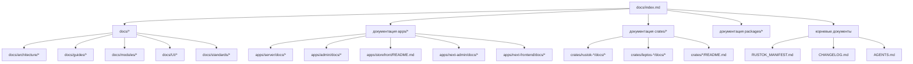

# Карта документации

Этот файл — каноническая карта документации RusToK.

Он охватывает как централизованную документацию (`docs/`), так и распределённую документацию внутри приложений, модулей и общих библиотек.

## Зачем нужно «дерево документации»

Да, нам нужен единый файл-карта. Документация реально распределена по репозиторию (`docs/`, `apps/*`, `crates/*`), и без общей схемы новые участники часто не находят нужный контекст.

Этот `docs/index.md` играет роль такой карты и должен обновляться при изменениях архитектуры, API, UI-контрактов и модулей.

## Графическая карта документации

```mermaid
graph TD
    ROOT[docs/index.md]

    ROOT --> D[docs/*]
    ROOT --> A[документация apps/*]
    ROOT --> C[документация crates/*]
    ROOT --> P[документация packages/*]
    ROOT --> R[корневые документы]

    D --> DARCH[docs/architecture/*]
    D --> DGUIDE[docs/guides/*]
    D --> DMOD[docs/modules/*]
    D --> DUI[docs/UI/*]
    D --> DSTD[docs/standards/*]

    A --> ASRV[apps/server/docs/*]
    A --> AADMIN[apps/admin/docs/*]
    A --> ASF[apps/storefront/README.md]
    A --> ANEXTADMIN[apps/next-admin/docs/*]
    A --> ANEXTSF[apps/next-frontend/docs/*]

    C --> CDOMAIN[crates/rustok-*/docs/*]
    C --> CUI[crates/leptos-*/docs/*]
    C --> CINFRA[crates/*/README.md]

    R --> RMANIFEST[RUSTOK_MANIFEST.md]
    R --> RCHANGELOG[CHANGELOG.md]
    R --> RAGENTS[AGENTS.md]
```

## Старт AI-сессии (обязательно)

- [AI Context](./AI_CONTEXT.md) — обязательный стартовый контекст для AI-сессий перед анализом и генерацией кода.

## Верификация платформы

- [План верификации платформы](./PLATFORM_VERIFICATION_PLAN.md) — глобальный чеклист верификации всей платформы (21 фаза, 400+ проверок). Включает реестр найденных проблем (Фаза 21).
- [Планы верификации](./verification/README.md) — каталог специализированных планов верификации (включая rolling-верификацию Leptos-библиотек).

## Корневые документы

- [Системный манифест](../RUSTOK_MANIFEST.md) — философия, принципы и архитектурные инварианты платформы.
- [Правила агентов](../AGENTS.md) — правила для AI-агентов и контрибьюторов.
- [Архитектурные решения](../DECISIONS/README.md) — реестр архитектурных решений (ADR).
- [Участие в разработке](../CONTRIBUTING.md) — инструкция по участию в разработке.
- [Журнал изменений](../CHANGELOG.md) — история версий и релизов.
- [Дорожная карта](./roadmap.md) — текущая дорожная карта и история релизов.
- [Лицензия](../LICENSE) — лицензия MIT.

## Централизованная документация (`docs/`)

### Архитектура (`docs/architecture/`)

- [Обзор](./architecture/overview.md)
- [Архитектура «Матрёшка» (7 слоёв)](./architecture/matryoshka.md) — базовое видение: семислойная модель платформы (RusToK / Alloy / Graal).
- [Схема базы данных](./architecture/database.md)
- [Performance baseline](./architecture/performance-baseline.md) — repeatable workflow for `pg_stat_statements` and `EXPLAIN` evidence on hot paths.
- [Архитектура API](./architecture/api.md)
  - включает раздел Rich-text input contract (`markdown` + `rt_json_v1`/`content_json`) для blog/forum/pages
  - включает актуальный раздел по auth lifecycle consistency и release-gate (`AuthLifecycleService` + `scripts/auth_release_gate.sh`)
- [Применение RBAC](./architecture/rbac.md)
- [План миграции связей RBAC](./architecture/rbac-relation-migration-plan.md)
- [DataLoader](./architecture/dataloader.md)
- [Обзор модулей](./architecture/modules.md)
- [Политика маршрутизации](./architecture/routing.md)
- [События и Outbox](./architecture/events.md) — событийная модель, outbox и runbook инцидентов для backlog/DLQ/reindex.
- [Транзакционная публикация](./architecture/events-transactional.md)
- [Контракт потока событий](./architecture/event-flow-contract.md) — канонический event-path и runtime-contract для consumer-loops.
- [WebSocket-каналы](./architecture/channels.md)
- [Многотенантность](./architecture/tenancy.md)
- [Локализация (i18n)](./architecture/i18n.md)
- [Принципы](./architecture/principles.md)
- [Рекомендации по улучшению](./architecture/improvement-recommendations.md) (живой backlog архитектурных улучшений, обновлено 2026-03-08).
- [План интеграции Loco + Core](../apps/server/docs/loco-core-integration-plan.md) — план интеграции Loco RS и Core с управлением из админки (7 фаз).
- [Верификация ядра](../apps/server/docs/CORE_VERIFICATION_PLAN.md) — периодический чеклист проверки целостности ядра (13 секций).

### Руководства (`docs/guides/`)

- [Быстрый старт](./guides/quickstart.md)
- [Наблюдаемость](./guides/observability-quickstart.md)
- [Паттерн Circuit Breaker](./guides/circuit-breaker.md)
- [Машины состояний](./guides/state-machine.md)
- [Обработка ошибок](./guides/error-handling.md)
- [Валидация ввода](./guides/input-validation.md)
- [Ограничение частоты](./guides/rate-limiting.md)
- [Метрики модулей](./guides/module-metrics.md)
- [Тестирование](./guides/testing.md)
- [Интеграционное тестирование](./guides/testing-integration.md)
- [Тестирование на основе свойств (property-based)](./guides/testing-property.md)
- [Аудит безопасности](./guides/security-audit.md)
- [Устранение проблем lockfile](./guides/lockfile-troubleshooting.md)
- [Подключение внешних приложений](./guides/connect-external-apps.md)
- [Планировщик задач](./guides/scheduler.md)

### Модули (`docs/modules/`)

- [Обзор](./modules/overview.md)
- [Реестр](./modules/registry.md)
- [Реестр crate-ов RusToK](./modules/crates-registry.md)
- [Манифест](./modules/manifest.md)
- [Plan внедрения Tiptap/Page Builder](./modules/tiptap-page-builder-implementation-plan.md)
- [Индекс модульной документации](./modules/_index.md)
- [Flex](./architecture/flex.md) — кастомные поля: план реализации
- [План реализации Flex](./architecture/flex.md)

### Стандарты (`docs/standards/`)

- [Стандарты кодирования](./standards/coding.md)
- [Паттерны и антипаттерны](./standards/patterns-vs-antipatterns.md) — **сводная таблица** правильных и неправильных подходов.
- [Запрещённые действия (НЕ ДЕЛАТЬ)](./standards/forbidden-actions.md) — **жёсткие запреты** с объяснением последствий.
- [Обработка ошибок](./standards/errors.md)
- [Безопасность](./standards/security.md)
- [Логирование](./standards/logging.md)
- [Производительность](./standards/performance.md)
- [Распределённая трассировка](./standards/distributed-tracing.md)
- [Интеграция OpenTelemetry](./standards/opentelemetry-integration.md)
- [Примеры инструментирования](./standards/instrumentation-examples.md)
- [Транзакционный Outbox](./standards/transactional-outbox.md)
- [Спецификация rt_json_v1](./standards/rt-json-v1.md)

### AI (`docs/ai/`)

- [Шаблон сессии](./ai/SESSION_TEMPLATE.md)
- [Известные подводные камни](./ai/KNOWN_PITFALLS.md)

### Alloy (`docs/`)

- [Концепция Alloy](./alloy-concept.md) — стратегическое видение: Self-Evolving Integration Runtime.
- [Техническое ревью Alloy](./alloy-review.md) — обзор текущей реализации `alloy-scripting`, проблемы и рекомендации.

### Справочные материалы (`docs/references/`)

- [Справочный пакет Loco](./references/loco/README.md)
- [Справочный пакет Iggy](./references/iggy/README.md)
- [Справочный пакет MCP](./references/mcp/README.md)
- [Справочный пакет Outbox](./references/outbox/README.md)
- [Справочный пакет Telemetry](./references/telemetry/README.md)

### UI (`docs/UI/`)

- [Обзор UI](./UI/README.md)
- [Архитектура GraphQL](./UI/graphql-architecture.md)
- [Подключение Admin ↔ Server](./UI/admin-server-connection-quickstart.md)
- [Заметки по Leptos Storefront](./UI/storefront.md)
- [Каталог UI-компонентов Rust](./UI/rust-ui-component-catalog.md)
- [План реструктуризации FSD](./UI/fsd-restructuring-plan.md)
- [Контракты IU API](../UI/docs/api-contracts.md)

## Распределённая документация (`apps/*`, `crates/*`)

### Документация приложений

- **Стандарт для всех приложений `apps/*` (обязательный минимум):**
  - `README.md`
  - `docs/README.md`
  - `docs/implementation-plan.md`

- [Документация Server](../apps/server/docs/README.md) (включает обязательный/критичный базовый набор core-модулей для агентов (6 модулей), матрицу возможностей Loco, доставку писем для сброса пароля в auth, заметки по поведению dev seed и схему публикации событий build-request).
- [План реализации Server](../apps/server/docs/implementation-plan.md)
- [Реестр Loco governance](../apps/server/docs/LOCO_FEATURE_SUPPORT.md#governance-register) — входная точка для архитектурных решений по возможностям Loco в server runtime.
- [Документация Leptos Admin](../apps/admin/docs/README.md)
- [План реализации Leptos Admin](../apps/admin/docs/implementation-plan.md)
- [README Next.js Admin](../apps/next-admin/README.md)
- [Документация Next.js Admin](../apps/next-admin/docs/README.md)
- [План реализации Next.js Admin](../apps/next-admin/docs/implementation-plan.md)
- [Документ Next.js Admin RBAC](../apps/next-admin/docs/nav-rbac.md)
- [Настройка Clerk для Next.js Admin](../apps/next-admin/docs/clerk_setup.md)
- [Темы Next.js Admin](../apps/next-admin/docs/themes.md)
- [README Leptos Storefront](../apps/storefront/README.md)
- [Документация Leptos Storefront](../apps/storefront/docs/README.md)
- [План реализации Leptos Storefront](../apps/storefront/docs/implementation-plan.md)
- [Документация Next.js Storefront](../apps/next-frontend/docs/README.md)
- [План реализации Next.js Storefront](../apps/next-frontend/docs/implementation-plan.md)
- [Документация crate `rustok-mcp`](../crates/rustok-mcp/docs/README.md)
- [Документация crate `rustok-cache`](../crates/rustok-cache/docs/README.md)
- [Документация crate `flex`](../crates/flex/docs/README.md)
- [План реализации crate `rustok-cache`](../crates/rustok-cache/docs/implementation-plan.md)

### Документация модулей и crate-ов

- [Карта реестра доменных модулей](./modules/registry.md)
- [README платформенного ядра](../crates/rustok-core/README.md)
- [План реализации платформенного ядра](../crates/rustok-core/docs/implementation-plan.md)
- [README crate-контрактов событий](../crates/rustok-events/README.md) — канонический источник `DomainEvent`/`EventEnvelope`.
- [Документация crate-контрактов событий](../crates/rustok-events/docs/README.md)
- [План реализации контрактов событий](../crates/rustok-events/docs/implementation-plan.md)
- [Документация модуля Content](../crates/rustok-content/docs/README.md)
- [План реализации модуля Content](../crates/rustok-content/docs/implementation-plan.md)
- [Документация модуля Commerce](../crates/rustok-commerce/docs/README.md)
- [План реализации модуля Commerce](../crates/rustok-commerce/docs/implementation-plan.md)
- [Документация модуля Blog](../crates/rustok-blog/docs/README.md)
- [Пакет админского UI для Blog](../crates/rustok-blog/ui/admin/README.md) *(если присутствует в ветке)*
- [План реализации модуля Blog](../crates/rustok-blog/docs/implementation-plan.md)
- [Документация модуля Forum](../crates/rustok-forum/docs/README.md)
- [План реализации модуля Forum](../crates/rustok-forum/docs/implementation-plan.md)
- [Документация модуля Pages](../crates/rustok-pages/docs/README.md)
- [План реализации модуля Pages](../crates/rustok-pages/docs/implementation-plan.md)
- [Документация модуля Index](../crates/rustok-index/docs/README.md)
- [План реализации модуля Index](../crates/rustok-index/docs/implementation-plan.md)
- [Документация интеграционного crate MCP](../crates/rustok-mcp/docs/README.md)
- [План реализации MCP](../crates/rustok-mcp/docs/implementation-plan.md)
- [Документация модуля Tenant](../crates/rustok-tenant/docs/README.md)
- [План реализации модуля Tenant](../crates/rustok-tenant/docs/implementation-plan.md)
- [Документация модуля RBAC](../crates/rustok-rbac/docs/README.md)
- [План реализации модуля RBAC](../crates/rustok-rbac/docs/implementation-plan.md)
- [Документация rustok-storage](../crates/rustok-storage/docs/README.md) — `StorageBackend` trait + `LocalStorage`, `StorageService`
- [Документация rustok-media](../crates/rustok-media/docs/README.md) — `MediaService`, upload/translations, REST + GraphQL API
- [Документация crate-коннектора Iggy](../crates/rustok-iggy-connector/docs/README.md)
- [План реализации коннектора Iggy](../crates/rustok-iggy-connector/docs/implementation-plan.md)
- [Документация рантайма Iggy](../crates/rustok-iggy/docs/README.md)
- [План реализации рантайма Iggy](../crates/rustok-iggy/docs/implementation-plan.md)
- [Документация модуля Outbox](../crates/rustok-outbox/docs/README.md)
- [План реализации модуля Outbox](../crates/rustok-outbox/docs/implementation-plan.md)
- [Документация Telemetry](../crates/rustok-telemetry/docs/README.md)
- [План реализации Telemetry](../crates/rustok-telemetry/docs/implementation-plan.md)
- [Документация test-utils](../crates/rustok-test-utils/docs/README.md)
- [План реализации test-utils](../crates/rustok-test-utils/docs/implementation-plan.md)

### Документация внутренних фронтенд-библиотек

**Rust/Leptos (в `crates/`)** — внутренние библиотеки, используемые `apps/admin` и `apps/storefront`:

- [Документация leptos-auth](../crates/leptos-auth/docs/README.md)
- [Документация leptos-graphql](../crates/leptos-graphql/docs/README.md)
- [Документация leptos-hook-form](../crates/leptos-hook-form/docs/README.md)
- [Документация leptos-shadcn-pagination](../crates/leptos-shadcn-pagination/docs/README.md)
- [Документация leptos-table](../crates/leptos-table/docs/README.md)
- [Документация leptos-zod](../crates/leptos-zod/docs/README.md)
- [Документация leptos-zustand](../crates/leptos-zustand/docs/README.md)

**JavaScript/TypeScript (в `packages/`)** — внутренние пакеты, используемые `apps/next-admin` и `apps/next-frontend`:

- [packages/leptos-auth](../packages/leptos-auth/README.md)
- [packages/leptos-graphql](../packages/leptos-graphql/README.md) — общие GraphQL-хелперы для всех фронтендов
- [packages/leptos-hook-form](../packages/leptos-hook-form/README.md)
- [packages/leptos-table](../packages/leptos-table/README.md)
- [packages/leptos-zod](../packages/leptos-zod/README.md)
- [packages/leptos-zustand](../packages/leptos-zustand/README.md)

## Полный реестр распределённой документации (по всему репозиторию)

Ниже — быстрый реестр по **всем приложениям и crate’ам**, чтобы можно было пройтись по коду и не пропустить локальные документы.

### Приложения (`apps/*`)

- `apps/admin`
  - [README](../apps/admin/README.md)
  - [docs/README](../apps/admin/docs/README.md)
  - [docs/implementation-plan](../apps/admin/docs/implementation-plan.md)
- `apps/next-admin`
  - [README](../apps/next-admin/README.md)
  - [docs/README](../apps/next-admin/docs/README.md)
  - [docs/implementation-plan](../apps/next-admin/docs/implementation-plan.md)
  - [docs/clerk_setup.md](../apps/next-admin/docs/clerk_setup.md)
  - [docs/nav-rbac.md](../apps/next-admin/docs/nav-rbac.md)
  - [docs/themes.md](../apps/next-admin/docs/themes.md)
- `apps/next-frontend`
  - [README](../apps/next-frontend/README.md)
  - [docs/README](../apps/next-frontend/docs/README.md)
  - [docs/implementation-plan](../apps/next-frontend/docs/implementation-plan.md)
- `apps/server`
  - [README](../apps/server/README.md)
  - [docs/README](../apps/server/docs/README.md)
  - [docs/implementation-plan](../apps/server/docs/implementation-plan.md)
- `apps/storefront`
  - [README](../apps/storefront/README.md)
  - [docs/README](../apps/storefront/docs/README.md)
  - [docs/implementation-plan](../apps/storefront/docs/implementation-plan.md)

### Крейты (`crates/*`)

- `alloy-scripting`: [README](../crates/alloy-scripting/README.md), [docs/README](../crates/alloy-scripting/docs/README.md)
- `leptos-auth`: [README](../crates/leptos-auth/README.md), [docs/README](../crates/leptos-auth/docs/README.md)
- `leptos-forms`: [README](../crates/leptos-forms/README.md)
- `leptos-graphql`: [README](../crates/leptos-graphql/README.md), [docs/README](../crates/leptos-graphql/docs/README.md)
- `leptos-hook-form`: [README](../crates/leptos-hook-form/README.md), [docs/README](../crates/leptos-hook-form/docs/README.md)
- `leptos-shadcn-pagination`: [README](../crates/leptos-shadcn-pagination/README.md), [docs/README](../crates/leptos-shadcn-pagination/docs/README.md)
- `leptos-table`: [README](../crates/leptos-table/README.md), [docs/README](../crates/leptos-table/docs/README.md)
- `leptos-ui`: [README](../crates/leptos-ui/README.md)
- `leptos-zod`: [README](../crates/leptos-zod/README.md), [docs/README](../crates/leptos-zod/docs/README.md)
- `leptos-zustand`: [README](../crates/leptos-zustand/README.md), [docs/README](../crates/leptos-zustand/docs/README.md)
- `iu-leptos` (UI/leptos): [README](../UI/leptos/README.md)
- `UI/next/components`: [index](../UI/next/components/index.ts) — обёртки IU для React/Next.js.
- `rustok-blog`: [README](../crates/rustok-blog/README.md), [docs/README](../crates/rustok-blog/docs/README.md), [docs/implementation-plan](../crates/rustok-blog/docs/implementation-plan.md)
- `rustok-commerce`: [README](../crates/rustok-commerce/README.md), [docs/README](../crates/rustok-commerce/docs/README.md), [docs/implementation-plan](../crates/rustok-commerce/docs/implementation-plan.md)
- `rustok-content`: [README](../crates/rustok-content/README.md), [docs/README](../crates/rustok-content/docs/README.md), [docs/implementation-plan](../crates/rustok-content/docs/implementation-plan.md)
- `rustok-core`: [README](../crates/rustok-core/README.md), [docs/README](../crates/rustok-core/docs/README.md), [docs/implementation-plan](../crates/rustok-core/docs/implementation-plan.md)
- `rustok-events`: [README](../crates/rustok-events/README.md) — канонический источник event-контрактов
- `rustok-forum`: [README](../crates/rustok-forum/README.md), [docs/README](../crates/rustok-forum/docs/README.md), [docs/implementation-plan](../crates/rustok-forum/docs/implementation-plan.md)
- `rustok-iggy`: [README](../crates/rustok-iggy/README.md), [docs/README](../crates/rustok-iggy/docs/README.md), [docs/implementation-plan](../crates/rustok-iggy/docs/implementation-plan.md)
- `rustok-iggy-connector`: [README](../crates/rustok-iggy-connector/README.md), [docs/README](../crates/rustok-iggy-connector/docs/README.md), [docs/implementation-plan](../crates/rustok-iggy-connector/docs/implementation-plan.md)
- `rustok-index`: [README](../crates/rustok-index/README.md), [docs/README](../crates/rustok-index/docs/README.md), [docs/implementation-plan](../crates/rustok-index/docs/implementation-plan.md)
- `rustok-mcp`: [README](../crates/rustok-mcp/README.md), [docs/README](../crates/rustok-mcp/docs/README.md)
- `rustok-outbox`: [README](../crates/rustok-outbox/README.md), [docs/README](../crates/rustok-outbox/docs/README.md), [docs/implementation-plan](../crates/rustok-outbox/docs/implementation-plan.md)
- `rustok-pages`: [README](../crates/rustok-pages/README.md), [docs/README](../crates/rustok-pages/docs/README.md), [docs/implementation-plan](../crates/rustok-pages/docs/implementation-plan.md)
- `rustok-rbac`: [README](../crates/rustok-rbac/README.md), [docs/README](../crates/rustok-rbac/docs/README.md), [docs/implementation-plan](../crates/rustok-rbac/docs/implementation-plan.md)
- `rustok-telemetry`: [README](../crates/rustok-telemetry/README.md), [docs/README](../crates/rustok-telemetry/docs/README.md), [docs/implementation-plan](../crates/rustok-telemetry/docs/implementation-plan.md)
- `rustok-tenant`: [README](../crates/rustok-tenant/README.md), [docs/README](../crates/rustok-tenant/docs/README.md), [docs/implementation-plan](../crates/rustok-tenant/docs/implementation-plan.md)
- `rustok-test-utils`: [README](../crates/rustok-test-utils/README.md)
- `utoipa-swagger-ui-vendored`: [README](../crates/utoipa-swagger-ui-vendored/README.md), [docs/README](../crates/utoipa-swagger-ui-vendored/docs/README.md)
- `rustok-cache`: [README](../crates/rustok-cache/README.md), [docs/README](../crates/rustok-cache/docs/README.md), [docs/implementation-plan](../crates/rustok-cache/docs/implementation-plan.md)
- `flex`: [README](../crates/flex/README.md), [docs/README](../crates/flex/docs/README.md) — extracted attached-mode registry contracts
- `rustok-storage`: [README](../crates/rustok-storage/README.md), [docs/README](../crates/rustok-storage/docs/README.md) — leaf crate, `StorageBackend` trait + `LocalStorage` backend
- `rustok-media`: [docs/README](../crates/rustok-media/docs/README.md) — Core module, `MediaService` + SeaORM entities, REST + GraphQL API
- `flex`: `crates/flex/` — optional crate, Phase 4.5 extraction target for Attached-mode contracts; Standalone mode planned later

### Пакеты (`packages/*`)

Внутренние пакеты JavaScript/TypeScript для приложений Next.js:

- `leptos-auth`: [README](../packages/leptos-auth/README.md)
- `leptos-graphql`: [README](../packages/leptos-graphql/README.md)
- `leptos-hook-form`: [README](../packages/leptos-hook-form/README.md)
- `leptos-zod`: [README](../packages/leptos-zod/README.md)
- `leptos-zustand`: [README](../packages/leptos-zustand/README.md)

## Чеклист сопровождения

При изменениях архитектуры/API/событий/модулей/тенантности/маршрутизации/UI-контрактов/наблюдаемости:

1. Обновите релевантную локальную документацию в изменённом компоненте (`apps/*` или `crates/*`).
2. Обновите соответствующую централизованную документацию в `docs/`.
3. Обновите этот файл (`docs/index.md`), чтобы карта оставалась актуальной.
4. Если изменились названия модулей/приложений, обновите [`docs/modules/registry.md`](./modules/registry.md).
