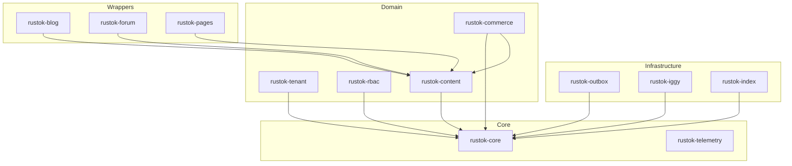

# RusToK Module Matrix

> **Полная карта модулей системы**  
> **Обновлено:** 2026-02-06

---

## Module Taxonomy

```
                    ┌─────────────────────────────────────┐
                    │           INFRASTRUCTURE            │
                    │  rustok-core, rustok-telemetry,     │
                    │  rustok-outbox, rustok-iggy,        │
                    │  rustok-index                       │
                    └─────────────────────────────────────┘
                                      ▲
                    ┌─────────────────┼─────────────────┐
                    │           DOMAIN MODULES           │
                    │  rustok-tenant, rustok-rbac,       │
                    │  rustok-content, rustok-commerce   │
                    └─────────────────────────────────────┘
                                      ▲
                    ┌─────────────────┼─────────────────┐
                    │          WRAPPER MODULES           │
                    │  rustok-blog, rustok-forum,        │
                    │  rustok-pages                      │
                    └─────────────────────────────────────┘
```

---

## Core Components

| Crate | Slug | Назначение | Dependencies |
|-------|------|------------|--------------|
| `rustok-core` | core | Базовые traits, events, errors, auth, cache | - |
| `rustok-telemetry` | telemetry | Tracing, metrics, logging | - |

---

## Infrastructure Modules

| Crate | Slug | Назначение | Dependencies |
|-------|------|------------|--------------|
| `rustok-outbox` | outbox | Outbox pattern для надёжной доставки событий | rustok-core |
| `rustok-iggy` | iggy | Streaming transport (Iggy) | rustok-core |
| `rustok-iggy-connector` | iggy-connector | Коннектор к Iggy | rustok-iggy |
| `rustok-index` | index | CQRS read model, поиск | rustok-core |
| `rustok-mcp` | mcp | MCP (Multi-Cloud Platform) интеграция | rustok-core |

---

## Domain Modules

| Crate | Slug | Назначение | Dependencies |
|-------|------|------------|--------------|
| `rustok-tenant` | tenant | Multi-tenancy, tenant lifecycle | rustok-core |
| `rustok-rbac` | rbac | Roles, permissions, access control | rustok-core |
| `rustok-content` | content | Nodes, bodies, categories (CMS foundation) | rustok-core |
| `rustok-commerce` | commerce | Products, variants, prices, inventory | rustok-core, rustok-content |

---

## Wrapper Modules

| Crate | Slug | Назначение | Base Module |
|-------|------|------------|-------------|
| `rustok-blog` | blog | Blog functionality (nodes kind='post') | rustok-content |
| `rustok-forum` | forum | Forum/discussions (nodes kind='topic') | rustok-content |
| `rustok-pages` | pages | Static pages (nodes kind='page') | rustok-content |

---

## Support Crates

| Crate | Назначение |
|-------|------------|
| `alloy-scripting` | Rhai scripting engine + storage |
| `leptos-shadcn-pagination` | UI component for Leptos |
| `utoipa-swagger-ui-vendored` | Swagger UI assets |

---

## Module Registration Flow

```rust
// apps/server/src/modules.rs
pub fn build_registry() -> ModuleRegistry {
    ModuleRegistry::new()
        .register(CoreModule)
        .register(TenantModule)
        .register(RbacModule)
        .register(ContentModule)
        .register(CommerceModule)
        .register(BlogModule)
        .register(ForumModule)
        .register(PagesModule)
        .register(IndexModule)
}
```

---

## Module Dependency Graph



---

## Event Flow Between Modules

| Source Module | Event | Consumer Modules |
|---------------|-------|------------------|
| content | NodeCreated, NodeUpdated, NodeDeleted | index, blog, pages |
| commerce | ProductCreated, ProductUpdated | index |
| commerce | OrderPlaced, OrderCompleted | notifications, analytics |
| tenant | TenantCreated | all modules |

---

## См. также

- [DATABASE_SCHEMA.md](./DATABASE_SCHEMA.md) — таблицы БД
- [ARCHITECTURE_GUIDE.md](./ARCHITECTURE_GUIDE.md) — архитектура

This is an alpha version and requires clarification. Be careful, there may be errors in the text. So that no one thinks that this is an immutable rule.
