# Реестр модулей и приложений

Этот документ фиксирует актуальную карту платформенных модулей, support crate-ов,
capability crate-ов и host-приложений в RusToK.

## Как читать реестр

1. `Core` и `Optional` модули берутся только из `modules.toml`.
2. `crate` — это способ упаковки в Cargo, а не автоматически платформенный модуль.
3. Shared/support/capability crate-ы живут рядом с module crate-ами; capability-only
   ghost modules при этом могут быть заведены в `modules.toml`, если им нужен formal
   runtime/module contract.
4. Этот реестр даёт только центральную карту ownership и ролей; источник истины для runtime-контракта живёт в локальных `README.md` и `docs/README.md` самих компонентов.

## Контракт документации

Для компонентов, перечисленных в этом реестре, действует единый стандарт документации:

- root `README.md` на английском описывает разделы `Purpose`, `Responsibilities`, `Entry points` и `Interactions`;
- локальный `docs/README.md` на русском фиксирует живой runtime/module/app-контракт;
- локальный `docs/implementation-plan.md` на русском фиксирует живой план развития, а не исторический changelog.

Центральный реестр не должен дублировать эти локальные документы. Его задача — дать карту платформы и отправить читателя в правильный компонент.

## Ownership-review policy

Для изменений в этом реестре действует обязательный путь ownership-review:

1. Сначала актуализируются локальные документы затронутых компонентов
   (`README.md`, `docs/README.md`, при необходимости `docs/implementation-plan.md`).
2. Затем обновляется этот central registry как карта, а не как дубль локальной
   спецификации.
3. Любое изменение ownership/capability/support статуса должно быть
   синхронизировано с `modules.toml` и проверено module platform owner.
4. Для cross-cutting правок (несколько модулей/host-приложений) требуется
   дополнительный review от platform team.

Без подтверждённого ownership-review изменение считается незавершённым.

## FFA/FBA readiness board (module-owned UI)

Этот раздел задаёт центральный статус по FFA/FBA для модулей, где есть module-owned UI
и/или явно выраженный backend boundary contract.

Статусы:

- FFA: `not_started | in_progress | phase_b_ready | parity_verified`
- FBA: `not_started | in_progress | boundary_ready | transport_verified`

Правило синхронизации:

1. Источник истины для статуса — локальный `docs/implementation-plan.md` модуля.
2. При изменении локального FFA/FBA status block этот board обновляется в том же PR.
3. Если статус = `parity_verified` или `transport_verified`, в PR должны быть verification evidence.

| Module slug | UI surfaces | FFA status | FBA status | Source plan |
|---|---|---|---|---|
| `pages` | admin + storefront | `in_progress` | `in_progress` | `crates/rustok-pages/docs/implementation-plan.md` |
| `blog` | admin + storefront | `in_progress` | `in_progress` | `crates/rustok-blog/docs/implementation-plan.md` |
| `search` | admin + storefront | `in_progress` | `in_progress` | `crates/rustok-search/docs/implementation-plan.md` |
| `cart` | storefront | `in_progress` | `in_progress` | `crates/rustok-cart/docs/implementation-plan.md` |
| `commerce` | admin + storefront | `in_progress` | `in_progress` | `crates/rustok-commerce/docs/implementation-plan.md` |
| `workflow` | admin | `in_progress` | `in_progress` | `crates/rustok-workflow/docs/implementation-plan.md` |
| `region` | admin + storefront | `in_progress` | `in_progress` | `crates/rustok-region/docs/implementation-plan.md` |
| `product` | admin + storefront | `in_progress` | `in_progress` | `crates/rustok-product/docs/implementation-plan.md` |
| `customer` | admin | `in_progress` | `in_progress` | `crates/rustok-customer/docs/implementation-plan.md` |
| `pricing` | admin + storefront | `in_progress` | `in_progress` | `crates/rustok-pricing/docs/implementation-plan.md` |
| `inventory` | admin | `in_progress` | `in_progress` | `crates/rustok-inventory/docs/implementation-plan.md` |
| `order` | admin | `in_progress` | `in_progress` | `crates/rustok-order/docs/implementation-plan.md` |
| `payment` | no module-owned UI | `in_progress` | `in_progress` | `crates/rustok-payment/docs/implementation-plan.md` |
| `fulfillment` | admin | `in_progress` | `in_progress` | `crates/rustok-fulfillment/docs/implementation-plan.md` |
| `seo` | admin + storefront contracts | `in_progress` | `in_progress` | `crates/rustok-seo/docs/implementation-plan.md` |

## Hotspot contract (DOC-12 / H1)

- Hotspot: `H1` (Runtime composition и module manifest).
- Doc contracts updated: `docs/modules/registry.md`.
- Owner scope: platform foundation + module platform owner.
- Residual drift risk:
  - при изменении `modules.toml` без синхронного обновления этого реестра и
    `docs/index.md` остаётся риск ghost/stale module map;
  - cross-cutting ownership changes требуют отдельного owner confirmation в PR.

## Архитектурная карта

```mermaid
graph TD
    subgraph Applications["Приложения"]
        SERVER["apps/server"]
        ADMIN["apps/admin"]
        STOREFRONT["apps/storefront"]
        NEXT_ADMIN["apps/next-admin"]
        NEXT_FRONT["apps/next-frontend"]
    end

    subgraph CoreModules["Core-модули"]
        AUTH["rustok-auth"]
        CACHE["rustok-cache"]
        CHANNEL["rustok-channel"]
        EMAIL["rustok-email"]
        INDEX["rustok-index"]
        SEARCH["rustok-search"]
        OUTBOX["rustok-outbox"]
        TENANT["rustok-tenant"]
        RBAC["rustok-rbac"]
    end

    subgraph OptionalModules["Optional-модули"]
        CONTENT["rustok-content"]
        CART["rustok-cart"]
        CUSTOMER["rustok-customer"]
        PRODUCT["rustok-product"]
        PROFILES["rustok-profiles"]
        REGION["rustok-region"]
        PRICING["rustok-pricing"]
        INVENTORY["rustok-inventory"]
        ORDER["rustok-order"]
        PAYMENT["rustok-payment"]
        FULFILLMENT["rustok-fulfillment"]
        COMMERCE["rustok-commerce"]
        BLOG["rustok-blog"]
        FORUM["rustok-forum"]
        COMMENTS["rustok-comments"]
        PAGES["rustok-pages"]
        PAGE_BUILDER["rustok-page-builder"]
        SEO["rustok-seo"]
        TAXONOMY["rustok-taxonomy"]
        MEDIA["rustok-media"]
        WORKFLOW["rustok-workflow"]
        FLEX["flex"]
    end

    subgraph SupportCrates["Support / capability crates"]
        CORE["rustok-core"]
        API["rustok-api"]
        EVENTS["rustok-events"]
        COMMERCE_FOUNDATION["rustok-commerce-foundation"]
        STORAGE["rustok-storage"]
        TEST_UTILS["rustok-test-utils"]
        IGGY["rustok-iggy + connector"]
        TELEMETRY["rustok-telemetry"]
        MCP["rustok-mcp"]
        AI["rustok-ai"]
        ALLOY["alloy"]
    end

    SERVER --> AUTH
    SERVER --> CACHE
    SERVER --> CHANNEL
    SERVER --> EMAIL
    SERVER --> INDEX
    SERVER --> SEARCH
    SERVER --> OUTBOX
    SERVER --> TENANT
    SERVER --> RBAC
    SERVER --> CONTENT
    SERVER --> CART
    SERVER --> CUSTOMER
    SERVER --> PRODUCT
    SERVER --> PROFILES
    SERVER --> REGION
    SERVER --> PRICING
    SERVER --> INVENTORY
    SERVER --> ORDER
    SERVER --> PAYMENT
    SERVER --> FULFILLMENT
    SERVER --> COMMERCE
    SERVER --> BLOG
    SERVER --> FORUM
    SERVER --> COMMENTS
    SERVER --> PAGES
    SERVER --> PAGE_BUILDER
    SERVER --> SEO
    SERVER --> TAXONOMY
    SERVER --> MEDIA
    SERVER --> WORKFLOW

    COMMERCE --> CART
    COMMERCE --> CUSTOMER
    COMMERCE --> PRODUCT
    COMMERCE --> REGION
    COMMERCE --> PRICING
    COMMERCE --> INVENTORY
    COMMERCE --> ORDER
    COMMERCE --> PAYMENT
    COMMERCE --> FULFILLMENT
    BLOG --> CONTENT
    BLOG --> COMMENTS
    BLOG --> TAXONOMY
    FORUM --> CONTENT
    FORUM --> TAXONOMY
    SEO --> CONTENT
    PRODUCT --> COMMERCE_FOUNDATION
    PRICING --> COMMERCE_FOUNDATION
    INVENTORY --> COMMERCE_FOUNDATION
    MEDIA --> STORAGE
    OUTBOX --> EVENTS
    OUTBOX --> IGGY
    SERVER --> API
    SERVER --> CORE
    SERVER --> TELEMETRY
    SERVER --> MCP
    SERVER --> AI
    SERVER --> ALLOY
    SERVER --> FLEX
```

## Платформенные модули

Синхронизация с `modules.toml`: актуализировано по manifest-составу на 2026-05-22.

### Core-модули

| Slug | Crate | Роль |
|---|---|---|
| `auth` | `rustok-auth` | Auth lifecycle, credentials, tokens |
| `cache` | `rustok-cache` | Cache backend factory, Redis/in-memory fallback |
| `channel` | `rustok-channel` | Platform channel context, bindings, resolution |
| `email` | `rustok-email` | Email transport, templates, delivery lifecycle |
| `index` | `rustok-index` | Indexed read-model substrate и cross-module filtering |
| `search` | `rustok-search` | Product-facing search, ranking, dictionaries, query rules |
| `outbox` | `rustok-outbox` | Transactional events, relay, retry, DLQ |
| `tenant` | `rustok-tenant` | Tenant lifecycle и tenant module enablement |
| `rbac` | `rustok-rbac` | Permission runtime, authorization, policy layer |

### Optional-модули

| Slug | Crate | Зависимости | Роль |
|---|---|---|---|
| `content` | `rustok-content` | — | Shared content helpers, orchestration, rich-text/locale contract |
| `cart` | `rustok-cart` | — | Cart lifecycle, line items, snapshot storefront context, canonical `seller_id` delivery-group ownership, typed cart adjustments, cart-owned storefront inspection UI |
| `customer` | `rustok-customer` | — | Storefront customer profile boundary и customer-owned admin operations UI |
| `product` | `rustok-product` | `taxonomy` | Product catalog, variants, tags, shipping profile bindings, nullable `seller_id` ownership contract, product-owned admin catalog UI и storefront catalog UI |
| `profiles` | `rustok-profiles` | `taxonomy` | Public profile layer поверх `users`, author/member summary |
| `region` | `rustok-region` | — | Region, country, currency, tax baseline, region-owned admin CRUD UI и storefront discovery UI |
| `pricing` | `rustok-pricing` | `product` | Pricing domain baseline, pricing-owned admin visibility UI и storefront pricing atlas UI |
| `inventory` | `rustok-inventory` | `product` | Inventory, stock availability baseline и inventory-owned admin visibility UI |
| `order` | `rustok-order` | — | Order lifecycle, order snapshots with canonical `seller_id`, typed order adjustments, и order-owned admin operations UI |
| `payment` | `rustok-payment` | — | Payment collections и payments |
| `fulfillment` | `rustok-fulfillment` | — | Shipping options, fulfillments и fulfillment-owned shipping-option admin UI |
| `commerce` | `rustok-commerce` | `cart`, `customer`, `product`, `region`, `pricing`, `inventory`, `order`, `payment`, `fulfillment` | Umbrella/root ecommerce orchestration, typed shipping-profile registry, aggregate cart-promotion operator surface и marketplace foundation вокруг canonical `seller_id` |
| `blog` | `rustok-blog` | `content`, `comments`, `taxonomy` | Blog domain, posts, categories, tags, transport/UI |
| `forum` | `rustok-forum` | `content`, `taxonomy` | Forum domain, topics, replies, moderation, transport/UI |
| `comments` | `rustok-comments` | — | Generic comments domain |
| `pages` | `rustok-pages` | `content`, `page_builder` | Pages, menus, page-builder surfaces |
| `page_builder` | `rustok-page-builder` | — | Standalone FBA reference module for visual builder capabilities (`preview/tree/properties/publish`) |
| `seo` | `rustok-seo` | `content` | Tenant-aware SEO runtime: explicit metadata overrides, template-generated SEO, bulk remediation modes, redirects, sitemap/robots generation, runtime sitemap submission adapters with per-endpoint aggregation, diagnostics/readiness scoring (включая `cross_link_gap`, `missing_image_alt`, `missing_image_size` aggregates), shared SEO capability contracts, cross-cutting SEO infrastructure UI, storefront-facing SSR page context, headless REST read paths `/api/seo/page-context` и `/api/seo/cross-link-suggestions` и GraphQL `seoCrossLinkSuggestions`; image fallback boundary потребляет `rustok-media::MediaImageDescriptor`, entity SEO authoring belongs to owner modules |
| `taxonomy` | `rustok-taxonomy` | `content` | Shared vocabulary/dictionary layer |
| `media` | `rustok-media` | — | Media lifecycle, upload, storage-facing API и typed image descriptor contract `MediaImageDescriptor` для cross-module SEO/media consumers |
| `workflow` | `rustok-workflow` | — | Workflow execution, templates, webhook ingress |
| `alloy` | `alloy` | — | Script execution, scheduler, hook runtime и capability-oriented automation surface |
| `flex` | `flex` | — | Capability-only ghost module custom fields: attached/standalone orchestration, RBAC/runtime metadata и extension contracts без donor persistence ownership |

## Общие библиотечные crate-ы

| Crate | Роль |
|---|---|
| `rustok-core` | Shared foundation contracts, typed primitives, validation/security helpers |
| `rustok-api` | Shared host/API layer для transport adapters |
| `rustok-events` | Canonical import point для event contracts |
| `rustok-storage` | Storage backend abstraction |
| `rustok-test-utils` | Shared testing helpers, mocks, fixtures |
| `rustok-commerce-foundation` | Shared DTO/entities/errors/search helpers для split commerce family |

## Инфраструктурные и capability crate-ы

| Crate | Роль |
|---|---|
| `rustok-iggy` | Streaming transport runtime |
| `rustok-iggy-connector` | Embedded/remote connector layer для Iggy |
| `rustok-telemetry` | Observability bootstrap и shared telemetry helpers |
| `rustok-mcp` | MCP adapter/server tool surface |
| `rustok-ai` | AI host/orchestrator capability with large operator/admin UI surfaces for Leptos and Next.js hosts |
| `rustok-ai-content` | Domain-owned AI support crate for content moderation vertical registration and policy seams |
| `rustok-ai-product` | Domain-owned AI support crate for product vertical registration (`product_copy`, `product_attributes`) |
| `rustok-ai-order` | Domain-owned AI support crate for order vertical registration (`order_analytics`, `order_ops_assistant`) |

## Приложения

| Компонент | Роль |
|---|---|
| `apps/server` | Composition root, HTTP/GraphQL entry point, runtime wiring |
| `apps/admin` | Leptos admin host |
| `apps/storefront` | Leptos storefront host |
| `apps/next-admin` | Next.js admin host |
| `apps/next-frontend` | Next.js storefront host |

## Важные правила

1. Если компонент объявлен как платформенный модуль в `modules.toml`, он обязан быть
   либо `Core`, либо `Optional`.
2. `ModuleRegistry` — runtime composition point, а не отдельная taxonomy.
3. Capability-only ghost modules могут участвовать в runtime composition через
   `modules.toml`, но это не делает их автоматически обычными bounded-context
   модулями или owner'ами donor persistence.
4. Module-owned UI должен поставляться самим модулем, а host-приложения
   должны только монтировать его через manifest-driven wiring.
5. Описание роли в этом реестре должно совпадать с локальными docs компонента; если поменялся ownership/runtime-контракт, сначала обновляются local docs, затем этот central registry.

## Связанные документы

- [Обзор модульной платформы](./overview.md)
- [Индекс документации по модулям](./_index.md)
- [Реестр crate-ов модульной платформы](./crates-registry.md)
- [Контракт `rustok-module.toml`](./manifest.md)
- [Шаблон документации модуля](../templates/module_contract.md)
