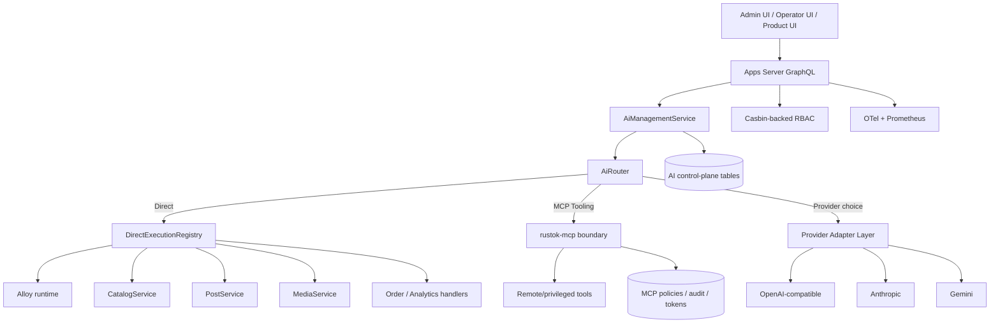
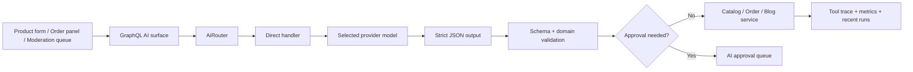
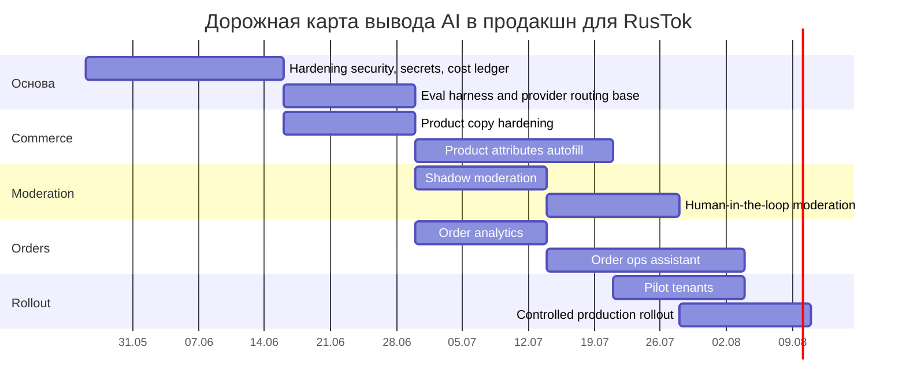

# Интеграция и вывод в продакшн AI-модуля для экосистемы RusTok

## Executive summary

Исследование, начатое с GitHub-коннектора и ограниченное репозиторием `RusTokRs/RusTok`, показывает, что в RusTok уже есть не «заготовка», а полноценный AI-MVP: отдельный capability-crate `rustok-ai`, мульти-провайдерный runtime, task profiles, hybrid direct/MCP execution, RBAC-first модель доступа, persisted control plane, потоковая выдача, diagnostics и две админские поверхности — Leptos и Next.js. Иначе говоря, основная задача сейчас не в создании AI-модуля с нуля, а в его промышленном ужесточении и доменном расширении для новых сценариев: модерации, автозаполнения атрибутов товаров, аналитики заказов и полуавтоматической обработки заказов. fileciteturn35file0L1-L3

Наиболее рациональная целевая архитектура для RusTok — **гибридная**: `Direct` по умолчанию для first-party вертикалей экосистемы и `McpTooling` для удалённых инструментов, высокорисковых операций и межсистемных сценариев. Такой выбор уже поддержан текущей моделью `ExecutionMode::{Auto, Direct, McpTooling}`, существующим роутером `AiRouter`, прямыми обработчиками `alloy_code`, `image_asset`, `product_copy`, `blog_draft`, а также тем фактом, что в backlog отдельно помечены «richer provider routing / fallback / multi-model policy» и «более глубокие domain-direct verticals». fileciteturn31file0L1-L3 fileciteturn33file0L1-L3 fileciteturn44file0L1-L3 fileciteturn47file0L1-L3 fileciteturn48file0L1-L3 fileciteturn35file0L1-L3

По провайдерам лучшая практическая стратегия для RusTok выглядит так: **OpenAI-compatible** как основной «универсальный» интерфейс и базовый продакшн-шлюз, **Anthropic** как премиальный fallback для сложных текстовых и tool-heavy сценариев, **Gemini** как сильный кандидат для мультимодальности, извлечения атрибутов и cost-aware batch-задач. Это хорошо ложится на уже реализованные в RusTok `ProviderKind::{OpenAiCompatible, Anthropic, Gemini}` и capability-модель, а снаружи подтверждается официальными возможностями: у OpenAI есть function calling c JSON Schema и strict mode, у Anthropic — tool use, prompt caching и batch processing, у Gemini — parallel/compositional function calling, context caching и batch pricing. fileciteturn32file0L1-L3 fileciteturn30file0L1-L3 citeturn12view0turn12view2turn17view1turn17view2turn13view0turn13view4

Ключевые продакшн-риски в текущем состоянии — не отсутствие AI-фундамента, а недостаточная глубина нескольких слоёв: fallback и routing-политик, secret management для provider keys, cost analytics на уровне tenant/provider/task, защита чувствительных payload’ов в persisted traces/messages, и расширение direct-вертикалей за пределы Alloy/Media/Commerce/Blog. Именно эти пункты должны стать первой очередью внедрения. fileciteturn42file0L1-L3 fileciteturn43file0L1-L3 fileciteturn35file0L1-L3

## Исходное состояние RusTok и что это означает для AI

RusTok — это модульный Rust-монорепозиторий, в котором AI уже встроен как capability рядом с `alloy`, `rustok-mcp`, `rustok-rbac`, `rustok-product`, `rustok-order`, `rustok-search`, сервером на Loco и отдельными admin-host’ами. GraphQL-схема сервера уже мержит AI, MCP, Search и RBAC в единый API-контур, а сам AI выведен в отдельный namespace `apps/server/src/graphql/ai/*`. Это важно: новая AI-функциональность в RusTok должна жить не «сбоку», а как продолжение существующего capability-паттерна. fileciteturn22file0L1-L3 fileciteturn74file0L1-L3 fileciteturn75file0L1-L3

Текущее ядро `rustok-ai` уже покрывает важнейшие элементы control plane: профили провайдеров, tool profiles, task profiles, chat sessions/runs/messages, approval requests, tool traces, recent stream events и runtime metrics snapshot. На уровне persisted-модели это вынесено в отдельные миграции и таблицы; на уровне API — в GraphQL queries, mutations и subscription `aiSessionEvents`; на уровне UI — в capability-owned пакеты для Leptos и Next.js. Из этого следует прямой вывод: **операторская поверхность, аудит и управляемость уже существуют**, поэтому новые бизнес-сценарии надо подключать к этому контуру, а не строить параллельный. fileciteturn42file0L1-L3 fileciteturn43file0L1-L3 fileciteturn49file0L1-L3 fileciteturn50file0L1-L3 fileciteturn51file0L1-L3 fileciteturn52file0L1-L3 fileciteturn57file0L1-L3

Особенно показательно, что реестр прямых обработчиков уже зарегистрирован в коде: `AlloyScriptAssistHandler`, `MediaImageAssetHandler`, `ProductCopyHandler`, `BlogDraftHandler`. Для `product_copy` AI уже генерирует локализованные title/description/meta-поля и пишет их напрямую через `CatalogService`; для `blog_draft` — создаёт или обновляет локализованные черновики через `PostService`; для `alloy_code` — умеет list/get/validate/run Alloy scripts; для `image_asset` — генерирует изображение и сразу сохраняет его в media library. Это снижает стоимость дальнейшего развития: moderation, product attributes и order workflows можно добавлять как новые direct handlers того же класса. fileciteturn44file0L1-L3 fileciteturn47file0L1-L3 fileciteturn48file0L1-L3

Важный ограничитель тоже виден уже сейчас: в `implementation-plan.md` прямо отмечено, что более глубокие domain-direct verticals, richer routing/fallback и полноценная remote MCP bootstrap-цепочка — это post-MVP backlog, а не уже закрытая часть системы. Поэтому смешивать «есть в коде сегодня» и «целевой дизайн» не стоит: для товарных атрибутов, модерации и order automation потребуется отдельная реализация, пусть и на хорошо подготовленной базе. fileciteturn35file0L1-L3

Ниже — краткая фиксация текущего состояния и пробелов.

| Область | Что уже есть в RusTok | Что ещё нужно для продакшн-экосистемы |
|---|---|---|
| AI runtime | Multiprovider runtime, task/tool/provider profiles, direct + MCP, streaming, diagnostics. fileciteturn35file0L1-L3 | Политики failover, circuit breaker, cost ledger, health-based routing. fileciteturn35file0L1-L3 |
| Доменные AI-сценарии | Alloy, media image asset, product copy, blog draft. fileciteturn44file0L1-L3 fileciteturn47file0L1-L3 fileciteturn48file0L1-L3 | Moderation, product attributes, order analytics, order ops assistant. |
| Безопасность | Typed permissions, approvals, MCP policies/audit, GraphQL permission guards. fileciteturn37file0L1-L3 fileciteturn39file0L1-L3 fileciteturn41file0L1-L3 fileciteturn49file0L1-L3 | KMS/Vault, payload redaction, PII-aware persistence, SSRF-safe MCP remote mode. |
| Операционка | GitHub Actions: fmt, clippy, check, audit, deny, coverage, SBOM, nextest, Next builds. fileciteturn70file0L1-L3 | Performance/regression suites specifically for AI flows and provider outages. |
| Observability | AI metrics snapshot + GraphQL diagnostics; OTel guide в репозитории. fileciteturn34file0L1-L3 fileciteturn51file0L1-L3 fileciteturn68file0L1-L3 | Per-tenant spend dashboards, fallback analytics, task-quality eval dashboards. |

## Архитектурные варианты интеграции с Alloy и MCP

Внутренняя модель RusTok уже задаёт правильную рамку: у AI есть `ExecutionMode::Auto`, `Direct` и `McpTooling`, а `AiRouter` принимает `task_profile`, список доступных provider profiles, explicit override, attached tool profile и actor roles, после чего выбирает execution mode, provider и model. Иными словами, архитектурный слой выбора стратегии в RusTok уже не надо придумывать — его нужно лишь довести до production-grade политики. fileciteturn31file0L1-L3 fileciteturn32file0L1-L3

С инженерной точки зрения здесь есть три жизнеспособных варианта. **Direct-first** означает, что AI вызывает first-party сервисы RusTok напрямую из `rustok-ai` через service layer; это даёт лучшую управляемость, ниже latency, меньше токенов на tool loop и естественный аудит. **MCP-first** означает, что AI почти всё делает через MCP tools; это повышает изоляцию и делает контракты инструментов явными, но добавляет hop, сложность авторизации и риск инструментального «разрастания». **Hybrid** сочетает оба мира: direct для внутренних вертикалей и MCP для удалённых интеграций, операторских инструментов и операций, где лучше явный tool boundary. По совокупности факторов именно hybrid лучше всего соответствует текущему коду RusTok и официальной модели MCP, где hosts/clients/servers разделены, а user consent, authorization и access controls считаются обязательными элементами безопасной реализации. fileciteturn35file0L1-L3 fileciteturn44file0L1-L3 fileciteturn31file0L1-L3 citeturn6view0turn6view1turn14view0

| Вариант | Где силён | Где слаб | Вывод |
|---|---|---|---|
| Direct-first | Товарные карточки, локализация, генерация контента, media, Alloy; минимальный hop и прямой доступ к `CatalogService`/`PostService`/Alloy runtime. fileciteturn47file0L1-L3 fileciteturn48file0L1-L3 | Слабее подходит для внешних систем и ситуаций, где нужен независимый tool boundary. | Должен быть default для first-party сценариев. |
| MCP-first | Удобен для удалённых инструментов, межсистемных операций, внешних data/tools surfaces. MCP формализует tools/resources/prompts и OAuth-подобную защиту для remote mode. citeturn6view0turn6view1turn14view0 | Выше latency и сложнее security surface. | Использовать там, где нужен явный boundary или сторонние системы. |
| Hybrid | Соответствует текущему RusTok: direct verticals уже есть, `mcp_tooling` уже есть, а router умеет выбирать режим. fileciteturn31file0L1-L3 fileciteturn35file0L1-L3 | Требует более зрелых политик маршрутизации и cost control. | Рекомендуемый целевой вариант. |

Интеграция с Alloy уже на удивление зрелая. `alloy_code` в direct-path умеет перечислять, читать, валидировать и запускать скрипты Alloy, а сам модуль Alloy публикует собственные permissions и runtime. При этом движок Alloy уже имеет защитные лимиты: по умолчанию `max_operations=50_000`, `timeout=100ms`, `max_call_depth=16`, лимиты на размеры строк, массивов и глубину карт. Для AI-assisted scripting это сильный аргумент в пользу **direct Alloy assist как базового пути**, а не обязательной упаковки каждого сценария в MCP-инструмент. fileciteturn44file0L1-L3 fileciteturn63file0L1-L3 fileciteturn66file0L1-L3

Диаграмма ниже — рекомендуемая целевая архитектура на базе того, что уже есть в RusTok.



Практическая рекомендация здесь такая: для RusTok стоит формализовать правило **«Direct by default, MCP by policy exception»**. Это означает, что `product_copy`, `product_attributes`, `content_moderation`, `order_analytics`, `order_ops_assistant`, `alloy_code` должны жить как direct handlers, а `McpTooling` должен включаться, когда задача требует удалённого инструмента, сквозного audit boundary, third-party authorization или операторского подтверждения. Такой режим лучше всего согласуется с текущим реестром обработчиков, task profiles и approval-моделью. fileciteturn44file0L1-L3 fileciteturn42file0L1-L3 fileciteturn43file0L1-L3

## Продакшн-требования и дизайн мульти-провайдерной абстракции

Текущая абстракция провайдера в RusTok уже хорошо выбрана. В коде есть `ModelProvider` с методами `test_connection`, `complete`, `complete_stream`, `generate_image`, а также три семейства: `OpenAiCompatible`, `Anthropic`, `Gemini`. На уровне capability-matrix AI уже различает `TextGeneration`, `StructuredGeneration`, `ImageGeneration`, `MultimodalUnderstanding`, `CodeGeneration`, `AlloyAssist`. Это очень сильная опора: добавлять нужно не новый abstraction layer, а политику поверх уже существующего. fileciteturn30file0L1-L3 fileciteturn32file0L1-L3

На уровне control plane текущая модель тоже достаточно зрелая: `AiProviderConfig` уже хранит `provider_kind`, `base_url`, `api_key`, `model`, `temperature`, `max_tokens`, `capabilities` и `usage_policy`; `TaskProfile` хранит `allowed_provider_profile_ids`, `preferred_provider_profile_ids`, `fallback_strategy`, `tool_profile_id`, `approval_policy`, `default_execution_mode`; а роутер уже учитывает `restricted_role_slugs`. Недостающее звено — это **боевые policy-механизмы**, а именно: health-scored routing, ordered fallback по типам ошибок, circuit breaker, tenant budgets, capture реальных token/cost/cache counters и более глубокая аналитика отказов. Сам репозиторий прямо фиксирует richer fallback/routing как post-MVP backlog. fileciteturn32file0L1-L3 fileciteturn31file0L1-L3 fileciteturn43file0L1-L3 fileciteturn35file0L1-L3

Важное проектное правило для RusTok: **маршрутизация должна быть task-centric, а не provider-centric**. То есть решение принимает не «провайдер по умолчанию для всего tenant’а», а связка `task_profile × tenant policy × role × locale × budget × latency class`. Это естественно продолжает текущую структуру `task_profile -> target_capability -> preferred/allowed providers -> execution_mode`. Для production это лучше, чем глобальный default model, поскольку генерация товарных атрибутов, chat operator flows, Alloy assist и order analytics слишком различаются по допустимой цене, задержке и риску ошибки. fileciteturn31file0L1-L3 fileciteturn32file0L1-L3

Рекомендуемая приоритизация провайдеров выглядит так.

| Приоритет в RusTok | Провайдер | Почему имеет смысл | Что учесть в дизайне |
|---|---|---|---|
| Основной интерфейс | OpenAI-compatible | Уже реализован в RusTok; function calling определяется JSON Schema; strict mode делает вызовы функций надёжнее; OpenAI имеет org/project-level rate limits и поддерживает Batch API и cached input pricing. fileciteturn30file0L1-L3 citeturn12view0turn12view2turn16view0turn16view2turn7view0 | Хорош как базовый adapter/gateway; нужен отдельный compatibility-profile для cloud/self-hosted endpoints. |
| Премиальный fallback | Anthropic | Tool use поддерживает client/server tools и strict tool use; prompt caching снижает latency/cost на повторяющихся префиксах; официально есть usage-based tiers, batch -50% и постепенный ramp-up из-за acceleration limits. citeturn17view1turn17view2turn17view3turn17view0turn12view4 | Сильный выбор для длинных инструкций, complex reasoning и operator workflows. |
| Мультимодальность и cost-aware batch | Gemini | Поддерживает parallel и compositional function calling; pricing показывает context caching, batch/flex режимы и enterprise security/compliance; rate limits завязаны на project tier. citeturn13view0turn13view2turn11view0turn13view3turn13view4 | Хорош для product attributes по изображению и batch-аналитики, но лимиты tier-dependent. |

Из этого вытекает следующая production-политика выбора. Для **синхронных текстовых черновиков и строгих JSON-контрактов** — OpenAI-compatible. Для **длинных системных префиксов и tool-heavy reasoning** — Anthropic, особенно если есть повторяемые prompts и long multi-turn conversations, потому что prompt caching переиспользует общий prefix и может снижать и стоимость, и задержку. Для **мультимодальных и batch-ориентированных сценариев** — Gemini, где context caching и batch economics дают хороший компромисс. citeturn12view2turn17view2turn13view0turn13view3

Ниже — рекомендуемый каркас продакшн-требований для RusTok. Там, где пользовательские требования не указаны, я так и помечаю.

| Область | Рекомендация | Статус в репозитории |
|---|---|---|
| Хранилище control plane | PostgreSQL для profiles/sessions/runs/messages/traces/approvals; отдельные индексы по tenant/run/session. fileciteturn42file0L1-L3 | Уже есть. |
| Очереди и async jobs | Для batch, offline analytics и order automation нужен отдельный worker lane; точная технология — **не указано**. | Частично не видно в AI-срезе. |
| CI/CD | Сохранить текущий GitHub Actions pipeline и добавить AI-specific eval/load/failover джобы. fileciteturn70file0L1-L3 | Основа уже есть. |
| Мониторинг | OTel для traces/metrics/logs и Prometheus для time-series/alerting; связать с `ai_runtime_metrics` и recent runs. fileciteturn34file0L1-L3 fileciteturn51file0L1-L3 citeturn15view0turn15view2 | Частично есть. |
| GraphQL safety | Оставить schema controls: `limit_depth(12)` и `limit_complexity(600)`, security + observability extensions. fileciteturn75file0L1-L3 | Уже есть. |
| Latency SLO | Interactive p95, background SLA и budget caps — **не указано**; их нужно зафиксировать до rollout. | Не указано. |
| Cost control | Tenant/project budgets, cached-prefix accounting, batch lanes, model tiering, rate-limit backoff. citeturn12view3turn16view0turn17view2turn13view2turn7view0 | Нужна реализация поверх MVP. |
| Secrets | Provider secrets должны уйти в KMS/Vault или быть зашифрованы envelope-схемой; plaintext/text-column для продакшна плох как конечное состояние. fileciteturn42file0L1-L3 | Требует hardening. |

В отдельности нужно подчеркнуть rate-limit engineering. OpenAI работает с RPM/TPM/RPD/TPD и рекомендует random exponential backoff; к тому же Batch API помогает повышать throughput, когда request-per-minute становится bottleneck. Anthropic использует token-bucket, usage tiers/spend limits и отдельно предупреждает про acceleration limits при резком росте трафика. Gemini применяет лимиты на уровне проекта и usage tier, а для preview/experimental моделей лимиты строже. Поэтому в RusTok необходим **единый internal rate-limit facade**, который знает о tenant-level, provider-level и task-level очередях и умеет переводить провайдерские 429/over-quota/capacity сигналы в унифицированную retry/fallback-политику. citeturn16view0turn16view2turn12view3turn17view0turn12view4turn13view2

## RBAC и безопасность данных

RBAC в RusTok уже продуман как typed permission vocabulary. В `rustok-core` заданы отдельные ресурсы и действия для `ai:providers`, `ai:task_profiles`, `ai:sessions`, `ai:runs`, `ai:approvals`, `ai:router`, а также группы задач `ai:tasks:text`, `ai:tasks:image`, `ai:tasks:code`, `ai:tasks:alloy`, `ai:tasks:multimodal`. Есть и доменные разрешения для `products`, `orders`, `analytics`, `scripts`, `mcp`, а также moderation-related permissions для форумных тем и ответов. Слой `rustok-rbac` при этом объявлен как Casbin-backed live authorization runtime, а GraphQL AI-резолверы реально проверяют permissions на read/manage/run/cancel/resolve. Это отличный фундамент для AI-governance «по ролям», а не по ad-hoc флагам. fileciteturn37file0L1-L3 fileciteturn39file0L1-L3 fileciteturn40file0L1-L3 fileciteturn49file0L1-L3

При этом текущая persisted-модель показывает, где лежат реальные data-risks. В AI control plane хранятся `api_key_secret`, chat messages, tool traces с `input_payload`/`output_payload`, approval requests с `tool_input`, metadata и т.д. В MCP-модели хранятся token hashes/previews, granted permissions/scopes, allowed/denied tools и audit logs. Для production этого достаточно, чтобы обеспечить управляемость; но этого же достаточно, чтобы непреднамеренно сохранить PII, коммерческие секреты или чувствительные tool payload’ы, если не ввести redaction и encryption discipline. fileciteturn41file0L1-L3 fileciteturn42file0L1-L3 fileciteturn43file0L1-L3

Официальная документация MCP здесь даёт очень чёткие ориентиры. Для remote MCP authorization настоятельно рекомендуется, когда сервер даёт доступ к user-specific data, административным действиям, аудиту и per-user usage tracking. Спецификация и security best practices требуют явного user consent перед доступом к данным и перед вызовом tools; рекомендуют OAuth 2.1-style authorization; требуют per-client consent, exact redirect URI validation, cryptographically secure `state`, запрет token passthrough и защиту от SSRF при OAuth metadata discovery. Для RusTok это означает, что вывод remote MCP в продакшн без полноценной authn/authz-цепочки, SSRF-hardened fetcher и consent UI — плохая идея. citeturn6view0turn6view1turn14view0

С точки зрения security-patterns для LLM-приложений RusTok должен проектироваться как система под угрозами OWASP GenAI Top 10, в первую очередь: **Prompt Injection**, **Sensitive Information Disclosure**, **Improper Output Handling**, **Excessive Agency** и **Unbounded Consumption**. Эти риски очень хорошо совпадают с реальными сценариями RusTok: модерация пользовательского контента, генерация JSON для карточек, выполнение Alloy-операций, order suggestions и MCP tools. Следовательно, обязательными становятся три практики: строгие schema contracts на structured outputs, обязательный human approval для чувствительных или state-changing действий и жёсткая санитизация/валидация model outputs перед записью в product/order/blog domains. citeturn15view3turn15view4turn15view5

Практический security-дизайн для RusTok я рекомендую такой.

| Контроль | Как лучше сделать в RusTok |
|---|---|
| Secrets | Перевести `api_key_secret` в `secret_ref` + KMS/Vault или хотя бы encrypt-at-rest с envelope keys; UI должен видеть только `hasSecret`. Текущее хранение как text-column допустимо лишь как промежуточный этап. fileciteturn42file0L1-L3 |
| PII minimization | Перед внешним provider-call формировать redacted prompt envelope: customer email/phone/address/notes по умолчанию не отправлять; отправлять только поля, которые реально нужны для задачи. |
| Persisted traces | В `AiToolTraces`, `AiChatMessages`, `AiApprovalRequests` хранить redacted payload и отдельно debug-only sealed payload с коротким TTL — либо не хранить вовсе. fileciteturn42file0L1-L3 |
| Approval gates | Всё, что меняет состояние заказа, публикует контент, выполняет Alloy script или обращается к удалённым MCP tools, должно идти через approval policy и correlation ID. fileciteturn42file0L1-L3 fileciteturn41file0L1-L3 |
| Output handling | Любой model JSON проходит schema validation + domain validation + permission check перед `CatalogService`/`OrderService`/`PostService`. citeturn12view2turn15view3 |
| MCP security | No token passthrough, exact redirect URI, SSRF-safe metadata discovery, HTTPS-only for production OAuth URLs. citeturn14view0turn6view1 |

Если упростить до одного принципа, он будет таким: **RBAC отвечает на вопрос “кто вообще может инициировать сценарий”, approval policy — “что можно выполнить автоматически”, а data policy — “какие поля реально можно передать модели и сохранить обратно”**. В RusTok эти три слоя уже можно связать без архитектурного рефакторинга, потому что permission vocabulary, approvals и persisted traces уже существуют. fileciteturn39file0L1-L3 fileciteturn42file0L1-L3

## Сценарии применения и интеграция в код RusTok

### Генерация описаний и локализация

Этот сценарий уже частично реализован в `product_copy`: direct handler читает product через `CatalogService`, выбирает source translation, вызывает модель, формирует локализованный target translation и записывает его обратно через `update_product`. Для RusTok это означает, что генерация описаний товаров — не гипотетический use case, а уже существующий production path, который нужно расширить, а не изобретать. Наиболее полезные дополнения здесь — draft/publish split, auto-SEO variants, category-aware tone policies и confidence-driven approval. fileciteturn47file0L1-L3 fileciteturn48file0L1-L3 fileciteturn55file0L1-L3

### Модерация контента

Отдельного moderation handler в текущем AI-регистре нет, но для него уже есть все основные опоры: permission vocabulary знает `Moderate`-действия, форумные moderation permissions уже определены, а AI-approval и tool-trace контур уже существует. Поэтому `content_moderation` стоит делать как новый direct vertical с **строго структурированным** JSON-выходом: `decision`, `labels`, `severity`, `explanation`, `requires_human`, `recommended_action`. Авто-блокировка допустима только для narrow high-confidence policy classes; все спорные кейсы — через `AiApprovalRequests`. fileciteturn37file0L1-L3 fileciteturn39file0L1-L3 fileciteturn42file0L1-L3

### Автозаполнение атрибутов товаров

Этот сценарий, на мой взгляд, — следующий по приоритету после уже существующего `product_copy`. Модуль `rustok-product` отвечает за translations, options, variants и locale-aware custom-field flows через shared `flex` attached localized storage. В Next admin product form при этом сейчас есть только image/name/category/price/description, без AI-assisted autofill surface. Следовательно, самый короткий путь — добавить новый direct handler `product_attributes` и кнопку/панель `AI Fill` в product form, которая после загрузки изображения и выбора категории вызывает мультимодальный или text+tool pipeline и возвращает строго валидируемый JSON по схеме: `brand`, `material`, `color`, `size`, `dimensions`, `compatibility`, `care_instructions`, `hazmat`, `flex_attributes[]`. Именно этот сценарий лучше всего подходит под Gemini или другой multimodal-capable профиль. fileciteturn55file0L1-L3 fileciteturn53file0L1-L3 fileciteturn32file0L1-L3 citeturn13view0turn13view3

### Аналитика заказов

`rustok-order` уже владеет order snapshots, line items, status transitions и admin UI, а order admin package уже использует GraphQL queries для списков/деталей заказов. Это создаёт хороший фундамент для AI-аналитики второго порядка: выявление причин отмен, summarization возвратов, поиск повторяющихся инцидентов доставки, weekly executive summaries, risk flags по carrier/tracking/payment patterns. Критично, чтобы AI здесь не становился источником истины; он должен работать поверх уже существующих order snapshots и выдавать summaries/insights, а не «новые факты». fileciteturn54file0L1-L3 fileciteturn58file0L1-L3

### Автоматизация обработки заказов

Для order ops в репозитории уже есть явные GraphQL lifecycle operations: `markOrderPaid`, `shipOrder`, `deliverOrder`, `cancelOrder`. Это делает сценарий AI-автоматизации практичным, но с важной оговоркой: на первом этапе AI должен **предлагать и заполнять**, а не молча исполнять. Например, AI может по входящему событию сформировать «следующее рекомендуемое действие», предзаполнить tracking/carrier/reason, собрать сводку аномалий и передать её оператору. Полный auto-execution имеет смысл только для узких whitelisted политик и только после approval или явного разрешения через tool profile/MCP policy. fileciteturn58file0L1-L3 fileciteturn41file0L1-L3 fileciteturn42file0L1-L3

Ниже — рекомендуемая карта изменений по коду RusTok.

| Модуль | Что менять / добавлять | Зачем |
|---|---|---|
| `crates/rustok-ai/src/direct.rs` | Добавить `ContentModerationHandler`, `ProductAttributesHandler`, `OrderAnalyticsHandler`, `OrderOpsAssistantHandler`. fileciteturn44file0L1-L3 | Это самый естественный extension point. |
| `crates/rustok-ai/src/model.rs` | Добавить новые task input structs; возможно, расширить `DirectExecutionTarget`, который сейчас знает только `Alloy`, `Media`, `Commerce`, `Blog`. fileciteturn33file0L1-L3 | Чтобы новые вертикали были типизированы. |
| `apps/server/src/graphql/ai/*` | Расширить query/mutation/types под новые task jobs, quality stats, spend stats и domain-specific approvals. fileciteturn49file0L1-L3 fileciteturn50file0L1-L3 fileciteturn51file0L1-L3 | Для headless и Next/Leptos UI. |
| `apps/next-admin/packages/rustok-ai` | Добавить разделы task health, spend, fallback history и domain job launchers. fileciteturn57file0L1-L3 | Чтобы оператор видел не только sessions/runs, но и бизнес-сценарии. |
| `apps/next-admin/.../product-form.tsx` | Добавить `AI Fill` и `Apply Suggested Attributes` с preview diff. fileciteturn53file0L1-L3 | Это точка входа для attribute autofill. |
| `crates/rustok-order/admin/src/api.rs` и order service surfaces | Добавить helper flows для AI suggestions, но сохранить финальное выполнение через существующие lifecycle mutations. fileciteturn58file0L1-L3 | Не ломает текущий order contract. |
| `crates/rustok-core/src/permissions.rs` | При необходимости добавить более узкие permissions вроде `ai:tasks:moderation` или `ai:tasks:orders`, если текущих text/image/multimodal групп не хватит. fileciteturn39file0L1-L3 | Для более прозрачного governance. |

В качестве совместимого с текущей моделью RusTok контракта я рекомендую такой формат запуска task job. Он не копирует точный публичный API из репозитория, а **следует его текущим сущностям** `TaskProfile`, `ExecutionMode`, `ProviderProfile`, `tool_profile_id` и locale-aware contract. fileciteturn32file0L1-L3 fileciteturn33file0L1-L3

```json
{
  "task_profile_slug": "product_attributes",
  "execution_mode": "direct",
  "provider_profile_slug": "gemini-flash-prod",
  "requested_locale": "ru-RU",
  "tool_profile_slug": null,
  "payload": {
    "product_id": "UUID",
    "category_slug": "electronics",
    "image_urls": ["sandbox-or-cdn-url"],
    "source_title": "Наушники беспроводные",
    "source_description": "не указано",
    "copy_instructions": "Сформируй только подтверждаемые атрибуты"
  }
}
```

Именно такую задачу затем можно пустить по целевому потоку:



## Тестирование, валидация и дорожная карта

Сильная сторона RusTok состоит в том, что базовый CI уже довольно жёсткий: formatting, clippy, cargo check, MSRV, cargo audit, cargo deny, typos, docs, udeps, coverage, SBOM, nextest, builds для server/storefront и для Next apps. Поэтому AI-модуль не надо заводить в отдельную «ручную» дисциплину качества; наоборот, AI-изменения должны встраиваться в существующий pipeline и расширять его. fileciteturn70file0L1-L3

Для AI-функций я рекомендую четыре класса валидации. Первый — **schema correctness**: доля валидных JSON outputs, доля strict-schema passes, число domain-validation ошибок на 1 000 запросов. Второй — **business quality**: accept rate, publish-without-edit rate, average edit distance, attribute accuracy, moderation precision/recall, operator suggestion acceptance. Третий — **safety**: prompt injection regression suite, PII leakage tests, tool misuse tests, approval bypass tests, SSRF tests для remote MCP-флоу. Четвёртый — **операционный класс**: p95/p99 latency, fallback rate, provider error rate, token cost per completed task, queue delay, cancellation rate и approval turnaround time. Эти метрики естественно сочетаются с already existing `ai_runtime_metrics`, recent runs и `aiSessionEvents`. fileciteturn34file0L1-L3 fileciteturn51file0L1-L3 fileciteturn52file0L1-L3

A/B-подход здесь обязателен. Для генерации описаний стоит сравнивать «человек без AI» против «AI draft + human edit» по времени, edit distance и publish rate. Для product attributes — «ручной ввод» против «AI prefill + manual confirmation» по скорости и точности. Для order ops — «AI recommendation visible / hidden» по operator throughput и error rate. Для moderation — offline benchmark и staged shadow-mode перед включением enforce-решений. Поскольку OWASP прямо выделяет prompt injection, sensitive information disclosure, excessive agency и improper output handling как базовые риски GenAI-приложений, safety validation не должна быть факультативной частью rollout. citeturn15view3turn15view4turn15view5

Ниже — реалистичная дорожная карта внедрения, если идти от текущего состояния репозитория.

| Этап | Содержание | Оценка усилий | Основные риски |
|---|---|---|---|
| Foundation hardening | Secret storage, payload redaction, provider cost ledger, health checks, retry/fallback policy, eval harness. | 2–4 недели | Недооценка объёма доработок вокруг persisted traces и budgets. |
| Catalog AI | Довести `product_copy`; добавить `product_attributes`, preview diff и schema validation в product form. | 3–5 недель | Атрибутная точность и image-quality variability. |
| Moderation | Добавить `content_moderation`, policy matrix, appeal queue, shadow mode. | 3–4 недели | False positives / policy drift. |
| Order analytics | Batch summaries, anomaly clusters, operator dashboards, spend/latency dashboards. | 2–4 недели | Смещение «аналитики» в принятие решений без достаточной проверки. |
| Order operations assistant | Suggest-next-action, prefill lifecycle inputs, approval-gated automation. | 4–6 недель | Excessive agency и риск неправильных state transitions. |
| Advanced routing | Cost- and health-aware routing, provider fallback tree, batch segmentation, provider scorecards. | 2–4 недели | Complexity creep и трудность объяснимости выбора модели. |

Диаграмма ниже — рекомендуемый timeline с зависимостями.



Итоговая рекомендация по приоритетам такая. Если цель — получить максимальный бизнес-эффект при минимальном техриске, то порядок должен быть следующим: **сначала hardening control plane и мульти-провайдерной политики**, затем **product copy + product attributes**, потом **moderation**, и только после этого — **order automation**. Order analytics можно запускать раньше automation, потому что у неё ниже риск excessive agency и она опирается на уже существующие order snapshots. fileciteturn35file0L1-L3 fileciteturn54file0L1-L3 citeturn15view3turn15view5

## Открытые вопросы и ограничения

Входные параметры, без которых нельзя окончательно зафиксировать infra- и rollout-профиль, в запросе **не указаны**: целевой cloud/region, обязательная data residency, допустимость self-hosted/open-weight моделей, нагрузка по RPM/TPM, месячный бюджет на inference, целевой SLA/latency budget, перечень ролей и уровень допустимой авто-обработки заказов, а также формальный compliance-режим для персональных данных. Поэтому архитектурные решения выше являются **наиболее практичной и низкорисковой траекторией** из текущего состояния RusTok, но не заменяют финальный solution design с реальными SLO и compliance-constraints.

Ограничение исследования тоже важно зафиксировать: GitHub-анализ был намеренно ограничен **только** репозиторием `RusTokRs/RusTok`, как вы и просили; другие GitHub-репозитории не использовались. Внешний контекст добирался лишь из официальной документации MCP, OpenAI, Anthropic, Gemini, а также OpenTelemetry, Prometheus и OWASP. citeturn6view0turn6view1turn14view0turn12view0turn12view2turn16view0turn17view1turn17view2turn13view0turn13view2turn15view0turn15view2turn15view3

Если свести весь отчёт к одному практическому решению, то оно звучит так: **в RusTok уже есть правильный AI-каркас; лучший путь — не строить новый AI-модуль, а довести существующий `rustok-ai` до production-grade governance и добавить новые direct verticals для moderation, product attributes и order flows, оставив MCP как controlled boundary, а не как обязательный путь для всего подряд**. fileciteturn35file0L1-L3 fileciteturn31file0L1-L3 fileciteturn44file0L1-L3

## План реализации (проверенный по исследованию)

Источник задач: [`docs/research/AI-research.md`](./AI-research.md).

Ниже — последовательный implementation plan на базе пунктов исследования (с приоритизацией «минимальный риск → максимальный эффект»).

### Phase 0 — Alignment и scope freeze (1 неделя)

- Подтвердить целевые ограничения: cloud/region, data residency, SLA (p95/p99), бюджет inference, policy по auto-actions.
- Зафиксировать owner-матрицу по AI verticals: catalog, moderation, order analytics, order ops.
- Согласовать definition of done по safety/quality/latency/cost.

**Deliverables**
- RFC/ADR с финальными ограничениями rollout.
- Список tenant’ов для pilot и deny-list сценариев.

### Phase 1 — Foundation hardening control-plane (2–4 недели)

1. **Secrets & provider governance**
   - Вынести ключи провайдеров в managed secrets.
   - Ввести environment separation (dev/stage/prod) и scoped provider profiles.
2. **Data policy & redaction**
   - Добавить redaction для traces/messages/approvals payload.
   - Закрыть хранение sensitive payload: short TTL или отключаемое sealed-хранилище для debug.
3. **Approval gates**
   - Все state-changing действия (заказы/публикации/удалённые инструменты) перевести на approval policy + correlation id.
4. **Routing reliability**
   - Добавить retry/fallback policy (по health/cost/capability), circuit-breaker и provider scorecard.
5. **Observability**
   - Метрики: valid JSON rate, domain-validation errors, p95/p99, fallback rate, token cost/task, approval turnaround.

**Deliverables**
- Production-ready AI control-plane baseline.
- Dashboard `ai_runtime_metrics` + alerting правила.

### Phase 2 — Catalog AI (product_copy + product_attributes) (3–5 недель)

1. **Hardening существующего `product_copy`**
   - Draft/publish split.
   - Confidence score + human approval для low-confidence output.
2. **Новый vertical `product_attributes`**
   - Strict JSON schema: brand/material/color/size/dimensions/compatibility/care/hazmat/flex_attributes.
   - Domain validation перед записью в catalog.
3. **Admin UX**
   - В product form добавить `AI Fill` + preview diff + `Apply Suggested Attributes`.
   - Отображать source-of-truth и причины отклонения валидации.

**Deliverables**
- End-to-end path: product form → AI task → validated preview → apply.
- A/B baseline: manual vs AI-assisted.

### Phase 3 — Content moderation vertical (3–4 недели)

1. Добавить `content_moderation` direct handler.
2. Выход только в структурированном JSON: `decision`, `labels`, `severity`, `explanation`, `requires_human`, `recommended_action`.
3. Включить shadow-mode, затем human-in-the-loop queue.
4. Авто-блокировку разрешать только для whitelisted high-confidence policy классов.

**Deliverables**
- Moderation policy matrix.
- Offline benchmark + regression suite по false positives/false negatives.

### Phase 4 — Order analytics (2–4 недели)

1. Summaries по отменам/возвратам/доставке/рискам.
2. Incident clustering по carrier/tracking/payment patterns.
3. Operator dashboards (insights-only, без auto execution).

**Deliverables**
- Weekly executive summaries.
- KPI: insight adoption rate, review-time reduction.

### Phase 5 — Order operations assistant (4–6 недель)

1. Suggest-next-action для lifecycle операций (`paid/ship/deliver/cancel`).
2. Prefill inputs (carrier/tracking/reason) с валидацией.
3. Approval-gated automation для узкого whitelist policy.
4. Явный запрет silent execution вне policy.

**Deliverables**
- Operator co-pilot в order admin flow.
- Error budget + rollback playbook для automated transitions.

### Phase 6 — Controlled rollout и масштабирование (2–4 недели)

1. Pilot tenants → controlled production rollout.
2. Cost-aware routing + dynamic provider fallback tree.
3. Регулярный evaluation cycle (качество, безопасность, стоимость, latency).

**Deliverables**
- Go/No-Go checklist для каждого tenant.
- Quarterly recalibration модели/политик/порогов.

## Фактическая сверка по коду перед реализацией

Проверка выполнена по текущему коду репозитория (а не только по исследовательским тезисам).

### Что уже есть в коде (confirmed)

- `rustok-ai` уже имеет direct handlers для `alloy_code`, `image_asset`, `product_copy`, `blog_draft`.
- `DirectExecutionTarget` сейчас ограничен категориями `Alloy`, `Media`, `Commerce`, `Blog`.
- В GraphQL уже есть `ai_runtime_metrics`, recent runs/events и доступ к tool traces.
- В order admin уже есть lifecycle operations `markOrderPaid`, `shipOrder`, `deliverOrder`, `cancelOrder`.
- В persisted control plane уже есть таблицы для `AiApprovalRequests` и `AiToolTraces`.

### Чего ещё нет (gaps to implement)

- Отсутствуют direct vertical handlers: `content_moderation`, `product_attributes`, `order_analytics`, `order_ops_assistant`.
- В Next admin product form нет `AI Fill`/`Apply Suggested Attributes` и preview-diff для атрибутов.
- Нет domain-specific launchers/health panels для новых vertical задач в `apps/next-admin/packages/rustok-ai`.
- Нет formalized rollout-metrics как отдельного acceptance-gate для новых verticals (нужно закрепить как DoD).

### Корректировка приоритета реализации по факту кода

1. **Сначала foundation hardening + observability gates** (переиспользуем существующий control-plane).
2. **Далее `product_attributes` + product form UX**, так как `product_copy` и catalog-path уже в прод-контуре.
3. **Потом moderation (shadow → HITL → selective enforce)**.
4. **Затем order analytics (insights-only)**.
5. **И только после этого order ops assistant с approval-gated automation**.

## Проверочный чек-лист по пунктам исследования

- [ ] Секреты и провайдеры изолированы по окружениям.
- [ ] PII/sensitive payload редактируется до сохранения.
- [ ] State-changing AI действия проходят approval gate.
- [ ] JSON-output проходит schema + domain + permission validation.
- [ ] MCP/remote tools работают без token passthrough и с SSRF-safe политиками.
- [ ] `product_copy` переведён в управляемый draft/publish pipeline.
- [ ] Реализован `product_attributes` + UI preview/apply.
- [ ] Реализован `content_moderation` с shadow rollout.
- [ ] Реализован `order_analytics` (insights-only).
- [ ] Реализован `order_ops_assistant` с whitelist automation.
- [ ] Собираются метрики качества/безопасности/стоимости/latency.
- [ ] Проведены A/B и regression тесты перед полным rollout.

## Быстрые ссылки для исполнения

- Основной документ требований и контекста: [`docs/research/AI-research.md`](./AI-research.md)
- Рекомендуемый старт реализации: разделы про `rustok-ai` direct handlers, approvals, validations, observability в этом же документе.
