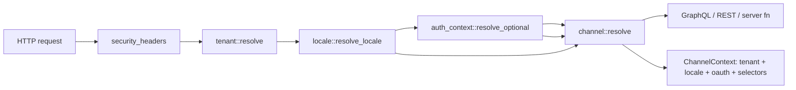

# План устранения недостатков backend/runtime RusTok

## Статус перепроверки

Документ `docs/research/error fix.md` переведён из аудиторского черновика в рабочий план устранения недостатков. Все исходные тезисы были перепроверены по текущему состоянию репозитория на 2026-06-01.

Вопросов, блокирующих составление плана, нет. Перед стартом реализации нужно только подтвердить приоритеты и бюджеты из раздела «Открытые решения», потому что они влияют на объём первой волны, но не меняют список найденных дефектов.

## Executive summary

В репозитории подтверждены шесть проблемных зон:

1. **Дрейф/устаревание contract evidence по dependency graph модулей**: `modules.toml` и центральный реестр считают `pages` зависимым от `content` и `page_builder`, а runtime contract test в `apps/server/src/modules/mod.rs` всё ещё ожидает только `content`. При этом `cargo xtask validate-manifest` сейчас проходит, значит первоочередной риск — не доказанный runtime failure, а рассинхронизация тестового/документального evidence с canonical manifest validation.
2. **Неполный request-context для channel resolution**: `channel` middleware исполняется до `auth_context`, а `RequestFacts` явно заполняет `oauth_app_id` и `locale` значениями `None`.
3. **DB amplification на locale hot path**: `locale` middleware читает `tenant_locales` из БД на каждый запрос tenant-bound маршрута и не использует cache/versioned invalidation.
4. **Протечка inventory через commerce GraphQL read-side**: inventory admin README прямо фиксирует временную зависимость UI read-side от `rustok-commerce` GraphQL contract.
5. **Хрупкая агрегация миграций**: серверный migrator вручную собирает миграции множества crate-ов, но dependency descriptors агрегируются только из `rustok_product`.
6. **CI не закрывает migration-safety и runtime-context invariants отдельными gates**: есть сильные базовые проверки, но нет явного обязательного smoke job на миграции с нуля / incremental apply / dependency graph runtime invariants.

### Обновление реализации на 2026-06-05

- Wave 1 evidence по `pages -> [content, page_builder]`, Wave 2 channel request context и Wave 3 TTL-cache tenant locale policy уже отражены в коде текущей ветки.
- В рамках продолжения Wave 4 добавлен первый migration-safety baseline: module-owned `migration_dependencies()` для известных cross-module FK/order boundaries (`channel -> auth`, `pricing/inventory -> product variants`, `commerce collections/categories -> product`, `blog/forum -> taxonomy`) и агрегация этих descriptors в server migrator.
- Добавлен локальный PostgreSQL smoke `scripts/verify/verify-migration-smoke.sh`: он запускает ignored integration test, который сам создаёт временную БД без локального `psql`, применяет мигратор from-zero и проверяет representative module tables.
- Wave 5 продвинут малым write-transport slice: inventory admin read-side остаётся на inventory-owned `core` + facade `api` + `transport` + explicit `ui/leptos.rs` adapter, а dedicated native endpoints `inventory/variant/set-quantity` и `inventory/variant/adjust-quantity` теперь идут через inventory-owned API/native facade без GraphQL fallback, вызывают inventory-owned service methods после tenant/permission checks, а inventory detail UI получил targeted set-quantity и +/-1 adjustment controls с локальной integer-валидацией и optimistic detail refresh.
- Открытым остатком Wave 4 остаётся наблюдать первый CI `migration-smoke` прогон на реальном GitHub Actions окружении и исправить возможные environment-specific failures; для Wave 5 остаётся расширить parity coverage и закрыть оставшиеся inventory mutations вместо transitional adapter-а.
- Следующий малый Wave 4 slice закрепил dependency descriptors в общем module contract: `MigrationSource` получил default `migration_dependencies()`, известные module crates с cross-module ordering metadata возвращают локальные descriptors через этот trait, а server migrator агрегирует их через module instances вместо прямого доступа к package-local migration modules. Последующий уточняющий slice расширил aggregation list до всех module crates, чьи migrations включены в server migrator, чтобы новые descriptors не требовали отдельного server-side allowlist.
- Следующий малый Wave 4 smoke slice добавил opt-in incremental mode для PostgreSQL migration smoke (`RUSTOK_MIGRATION_SMOKE_INCREMENTAL=1`): тот же fresh DB теперь может проверять не только apply-from-zero целиком, но и последовательный `Migrator::up(..., Some(1))` path без отдельного `psql`; direct Rust test runs теперь валидируют binary smoke flags так же строго, как shell wrapper.
- Следующий малый Wave 3 observability slice выровнял Prometheus naming для tenant locale cache counters с планом: hit/miss метрики теперь экспортируются как `rustok_tenant_locale_cache_hits_total` и `rustok_tenant_locale_cache_misses_total`, рядом с уже существующими `rustok_tenant_locale_db_queries_total` и `rustok_tenant_locale_cache_invalidations_total`; `rustok_tenant_locale_cache_entries` остаётся gauge.
- Следующий малый Wave 6 guardrail slice добавил быстрый локальный `node scripts/verify/verify-runtime-context-invariants.mjs` и подключил его к `./scripts/verify/verify-all.sh runtime-context-invariants`: проверка закрепляет OAuth/locale dimensions для channel, source-order contract для фактического порядка middleware, имена locale-cache metrics и evidence `pages -> [content, page_builder]` без полной Rust-компиляции.
- Следующий малый Wave 4/Wave 6 CI slice добавил отдельный GitHub Actions job `migration-smoke` с PostgreSQL service: CI запускает локальный smoke wrapper сначала в apply-from-zero режиме, затем с `RUSTOK_MIGRATION_SMOKE_INCREMENTAL=1`, а aggregate `ci-success` теперь ждёт этот migration-safety gate.
- Следующий малый Wave 6 docs-hardening slice расширил существующий `docs/verification/README.md` кратким runtime/backend regression runbook для module graph drift, channel locale/OAuth context, locale DB amplification и migration dependency failures без создания нового документа.
- Следующий малый Wave 5 guardrail slice закрепил transitional commerce GraphQL adapter как read-only compatibility fallback: inventory admin boundary test теперь проверяет отсутствие GraphQL mutation/write markers в adapter-е и наличие README removal criteria для adapter-а, пока оставшийся dedicated write transport добирается.
- Следующий малый Wave 5 docs-sync slice синхронизировал центральный FFA/FBA readiness board в `docs/modules/registry.md` с локальным inventory plan: registry evidence теперь явно включает read-only transitional adapter/removal criteria boundary coverage.
- Следующий малый Wave 5 ops-sync slice обновил `docs/modules/implementation-plans-registry.md` для `rustok-inventory`: статус больше не `not_started`, checkpoint отражает native read/write split, read-only transitional adapter guardrail, следующий write-mutation slice и verification gates.

## Проверенные факты

| ID | Тезис из аудита | Статус | Подтверждение в коде/документации | Вывод |
|---|---|---:|---|---|
| VF-01 | `modules.toml`, центральный registry docs и runtime contract test расходятся по `pages` dependencies | ✅ подтверждено, уточнено | `modules.toml` задаёт `pages -> [content, page_builder]`; `docs/modules/registry.md` повторяет эту связь; source-level runtime contract test ожидает `pages.dependencies() == ["content"]`; `cargo xtask validate-manifest` при перепроверке прошёл. | Сначала исправить stale contract evidence/test, затем закрепить общую проверку manifest ↔ registry, чтобы будущий drift не зависел от ручных assertions. |
| VF-02 | В коде уже есть validator manifest ↔ runtime registry | ✅ подтверждено | `ManifestManager::validate_with_registry` сравнивает `depends_on` из resolved manifest со списком `module.dependencies()`. | Не писать дублирующий валидатор с нуля; использовать существующий механизм в `xtask`/tests и добавить regression coverage на обнаруженный drift. |
| VF-03 | `channel` не видит auth-derived dimensions | ✅ подтверждено | В router `auth_context` добавлен перед `channel`, но из-за порядка `Router::layer` фактически `channel` исполняется раньше `auth_context`; `build_request_facts` не принимает extensions и ставит `oauth_app_id: None`. | Переставить layer order так, чтобы execution order был `tenant -> locale -> auth_context -> channel`, и расширить `build_request_facts`. |
| VF-04 | `channel` не учитывает locale | ✅ подтверждено | `locale` middleware вставляет `ResolvedRequestLocale`, но `channel::build_request_facts` не читает extensions и ставит `locale: None`; cache key тоже не содержит locale/oauth dimensions. | Добавить locale/oauth в `RequestFacts` и `ChannelCacheKey`; покрыть тестами разные locale/oauth combinations. |
| VF-05 | `locale` делает БД-запрос к `tenant_locales` на request hot path | ✅ подтверждено | `resolve_locale` вызывает `load_tenant_locales(&ctx, tenant.id).await` для каждого tenant context без cache. | Ввести tenant locale cache с TTL как минимальный шаг и versioned invalidation как целевой вариант. |
| VF-06 | Inventory admin сейчас читает commerce GraphQL read-side | ✅ подтверждено | `crates/rustok-inventory/admin/README.md` описывает использование текущего `rustok-commerce` GraphQL product contract до выделения dedicated inventory transport. | Создать inventory-owned facade/transport seam, commerce GraphQL оставить только как временный adapter внутри inventory. |
| VF-07 | Migration aggregation централизована в server migrator | ✅ подтверждено | `apps/server/migration/src/lib.rs` вручную `extend`-ит миграции domain crate-ов. | Сократить ручной hotspot через module-owned descriptors/exporters и smoke-проверку порядка. |
| VF-08 | Dependency descriptors миграций собираются не для всех модулей | ✅ подтверждено | `collect_migration_descriptors()` агрегирует `rustok_product::migrations::migration_dependencies()`, тогда как migrator подключает много модулей. | Ввести обязательный descriptor contract для модулей с cross-module FK/order assumptions. |
| VF-09 | CI сильный, но отдельного migration smoke gate не видно | ✅ подтверждено | Workflow содержит fmt, clippy, check, platform-contract, audit/deny, coverage, nextest, SBOM, reference artifacts и др.; отдельный job с явной командой migration smoke отсутствует. | Добавить отдельный migration-safety job после локального smoke-скрипта, не ломая текущие jobs. |

## Целевое состояние

### Runtime/module contracts

- `modules.toml` остаётся source of intent для install/runtime composition.
- Runtime `ModuleRegistry` и generated registry code не расходятся с `modules.toml` по slug, required/core flags и dependency edges.
- `docs/modules/registry.md` отражает тот же dependency graph, но не является единственным техническим gate.
- Любой drift manifest ↔ runtime registry падает в `cargo xtask validate-manifest` и/или dedicated regression test.

### Request context and channel resolution

Целевой execution order для full application router:



`RequestFacts` для channel resolution должен включать:

- tenant id;
- target surface;
- explicit channel selectors: header id, header slug, query slug;
- effective host;
- auth-derived OAuth/client dimension;
- effective locale.

`ChannelCacheKey` должен варьироваться как минимум по tenant, resolver version, explicit selectors, host, OAuth/client dimension и locale. Иначе один request может прогреть cache для другого locale/client контекста.

### Locale hot path

- Базовый шаг: TTL cache для `tenant_locales` на tenant id.
- Целевой шаг: versioned invalidation при изменении tenant locale policy.
- Наблюдаемость: отдельные counters для DB hits, cache hits, cache misses и invalidations.

### Inventory transport boundary

- Inventory admin package не должен напрямую зависеть от commerce GraphQL как от canonical read-side.
- Временная совместимость с commerce GraphQL допускается только внутри inventory-owned adapter/facade.
- Новый facade должен возвращать UI read model, необходимый inventory admin, не раскрывая commerce schema как inventory contract.

### Migration safety

- Module-owned migration descriptors находятся рядом с migration exporters соответствующих crate-ов.
- Server migrator агрегирует descriptors для всех модулей, которым нужен cross-module порядок.
- CI имеет отдельный smoke gate для пустой PostgreSQL DB и, по возможности, incremental apply.
- Diagnostic ignored tests остаются допустимыми, но не считаются единственной защитой migration path.

## План работ

### Wave 0 — Подготовка и фиксация baseline

**Цель:** превратить подтверждённые проблемы в измеримые задачи до функциональных изменений.

1. Завести tracking issue/эпик по этому плану.
2. Зафиксировать текущие failures/ожидаемые failures:
   - source-level contract-test mismatch для `pages` и результат `cargo xtask validate-manifest`;
   - отсутствие locale/oauth в `RequestFacts`;
   - отсутствие locale/oauth в `ChannelCacheKey`;
   - отсутствие locale cache;
   - текущий список migration descriptors.
3. Добавить ссылку на этот план в `docs/index.md`, чтобы документ был виден из канонической карты.

**Готовность:** план доступен из `docs/index.md`, baseline воспроизводим локальными командами.

### Wave 1 — Module graph drift

**Цель:** устранить подтверждённое рассинхронизированное evidence по `pages -> page_builder` и закрыть класс ошибок общей проверкой.

1. Подтвердить canonical runtime graph для `pages`:
   - предпочтительный вариант: runtime registry должен включать `page_builder`, потому что `modules.toml` и `docs/modules/registry.md` уже это фиксируют;
   - альтернативный вариант: удалить `page_builder` из `modules.toml` и registry docs, если эта связь была ошибочной.
2. Исправить stale runtime contract test и, если перепроверка конкретного runtime registry выявит отличие от manifest, исправить generated registry source так, чтобы `pages.dependencies()` совпадал с выбранным graph.
3. Добавить или усилить regression test, который сравнивает resolved `modules.toml` dependencies с `ModuleRegistry::dependencies()` для всех registry modules.
4. Убедиться, что `cargo xtask validate-manifest` продолжает проходить на исправленном состоянии и падает на искусственно внесённый drift в локальной проверке.
5. Обновить `docs/modules/registry.md`, если выбранный graph отличается от текущего docs state.

**Acceptance criteria:**

- `cargo xtask validate-manifest` проходит и его результат зафиксирован в verification evidence.
- Dedicated test manifest ↔ registry dependencies проходит.
- Stale assertion `pages.dependencies() == ["content"]` удалён или заменён canonical expectation.
- Нет ручного special-case для `pages` без общей проверки.

### Wave 2 — Channel request-context contract

**Цель:** сделать channel resolution зависящим от полного request context.

1. Переставить middleware layers так, чтобы execution order был:
   1. `security_headers`;
   2. `tenant::resolve`;
   3. `locale::resolve_locale`;
   4. `auth_context::resolve_optional`;
   5. `channel::resolve`;
   6. handlers.
2. Расширить `channel::build_request_facts`:
   - передавать `req.extensions()`;
   - читать `AuthContextExtension` / текущий auth context type;
   - читать `ResolvedRequestLocale`;
   - заполнять `oauth_app_id` и `locale`.
3. Расширить `ChannelCacheKey`:
   - добавить OAuth/client dimension;
   - добавить locale;
   - убедиться, что negative cache entries тоже различаются по этим dimensions.
4. Добавить regression tests:
   - middleware/order smoke;
   - `build_request_facts` переносит locale/auth в `RequestFacts`;
   - cache key отличается при смене locale;
   - cache key отличается при смене OAuth/client id.
5. Обновить архитектурные docs по API/runtime context, если текущий контракт там описан иначе.

**Acceptance criteria:**

- Channel resolver получает non-empty locale/auth dimensions там, где они есть в request extensions.
- Cache не шарится между разными locale/oauth contexts.
- Тесты не завязаны на порядок `.layer(...)` как текст, а проверяют фактическое поведение.

### Wave 3 — Locale cache and observability

**Цель:** убрать лишний DB round-trip на каждый tenant-bound request.

1. Ввести shared cache для tenant locale policy:
   - key: tenant id;
   - value: locales snapshot;
   - initial TTL: 60 секунд, если нет утверждённого SLA на freshness;
   - bounded capacity.
2. Подключить cache в `resolve_locale` перед `load_tenant_locales`.
3. Добавить invalidation hook для операций изменения tenant locale policy, если такая command surface уже есть.
4. Добавить counters/log events:
   - `tenant_locale_db_queries_total`;
   - `tenant_locale_cache_hits_total`;
   - `tenant_locale_cache_misses_total`;
   - `tenant_locale_cache_invalidations_total`.
5. Добавить tests:
   - repeated request не вызывает повторный DB load внутри TTL;
   - disabled locale still constrained correctly;
   - invalidation/TTL обновляет snapshot.

**Acceptance criteria:**

- Locale behavior не меняется функционально.
- Hot path получает cache hit для повторных requests одного tenant.
- Наблюдаемость позволяет увидеть DB amplification regression.

### Wave 4 — Migration safety

**Цель:** сделать порядок модульных миграций явным и проверяемым.

1. Инвентаризировать migrations с cross-module references/FK/order assumptions.
2. Для каждого такого module crate добавить `migration_dependencies()` рядом с `migrations()`.
3. Расширить `collect_migration_descriptors()` так, чтобы он агрегировал descriptors не только из `rustok_product`, но и из остальных модулей с declared dependencies.
4. Добавить тест на полноту descriptors для known cross-module dependencies.
5. Добавить локальный smoke script для пустой PostgreSQL DB:
   - create empty database/schema;
   - apply server migrator from zero;
   - optionally run lightweight schema sanity checks.
6. ✅ Добавить отдельный CI job `migration-smoke`; следующий шаг — отследить первый GitHub Actions прогон и исправить только environment-specific failures, если они появятся.

**Acceptance criteria:**

- Descriptors ссылаются только на существующие migrations.
- Duplicate/cycle/missing dependency tests остаются зелёными.
- Migration smoke проходит на пустой PostgreSQL DB.

### Wave 5 — Inventory-owned read-side facade

**Цель:** убрать прямую зависимость inventory admin package от commerce GraphQL как от фактического backend contract.

**Статус на 2026-06-06:** admin package уже имеет inventory-owned core/api/transport/ui boundary и transitional commerce GraphQL read adapter; backend crate экспортирует `AdminInventoryReadService`/DTO для tenant-scoped product/variant/price/translations read-side, admin package подключает primary native/server-function read path к этому service, а первые dedicated native write endpoints `inventory/variant/set-quantity` и `inventory/variant/adjust-quantity` вызывают inventory-owned service methods без GraphQL fallback, а targeted set-quantity и +/-1 adjustment controls используются в inventory detail UI. Добавлен следующий малый parity slice: model-level serde compatibility snapshots для текущего inventory admin read model (product list/detail, localized copy, variants, inventory fields, prices) и source-level parity check между backend DTO, native mapper и transitional GraphQL adapter. Set/adjust quantity write path дополнительно переведён с bare `i32` на typed `InventoryQuantityWriteResult { quantity, in_stock }`, а endpoint wire shape закреплён serde snapshot-ом, чтобы UI не восстанавливал stock state локальной догадкой. Остаётся вынести оставшиеся dedicated inventory mutations/write transport, сохранив GraphQL только как native-unavailable read compatibility fallback до удаления adapter-а.

1. Описать minimal inventory admin read model:
   - product id/slug/title needed for inventory views;
   - variant identifiers;
   - stock/visibility/health fields;
   - localized copy requirements.
2. Создать inventory-owned backend read service/read DTO.
3. Создать inventory-owned facade/transport boundary.
4. Перенести текущий commerce GraphQL access внутрь временного adapter.
5. Обновить inventory admin package так, чтобы UI зависел от inventory facade, а не от commerce GraphQL schema напрямую.
6. Добавить compatibility tests/snapshots для текущего UI read model.
7. Подключить native `#[server]`/dedicated read transport к backend `AdminInventoryReadService`.
8. Обновить `crates/rustok-inventory/admin/README.md` и module docs.

**Acceptance criteria:**

- Inventory backend crate экспортирует tenant-scoped inventory-owned admin read service/DTO.
- Inventory UI импортирует/использует inventory-owned contract.
- Commerce GraphQL больше не является публично описанным read-side contract для inventory admin.
- Временный adapter явно помечен как transitional и имеет removal criteria.
- Native/server-function read transport имеет parity tests против transitional adapter перед удалением adapter-а.

### Wave 6 — CI gates and docs hardening

**Цель:** закрепить исправления как постоянно проверяемые platform invariants.

1. Добавить/усилить CI checks:
   - manifest ↔ runtime registry graph;
   - migration smoke;
   - channel context/cache key invariants;
   - locale cache tests.
2. Обновить central docs:
   - `docs/architecture/api.md` для request context/channel contract;
   - `docs/architecture/modules.md` или `docs/modules/module-authoring.md` для module graph/descriptors;
   - `docs/modules/registry.md` при изменении graph/status.
3. Добавить краткий runbook для диагностики:
   - module graph drift;
   - channel resolution without locale/oauth;
   - locale DB amplification;
   - migration dependency failure.

**Acceptance criteria:**

- Все новые invariants имеют tests или CI commands.
- Docs описывают фактическое состояние после code changes.
- Нет новых документов там, где можно расширить существующие.

## Приоритеты

| Приоритет | Wave | Почему |
|---:|---|---|
| P0 | Wave 1 — Module graph drift/evidence | Уже есть конкретное расхождение source-level contract evidence; без общей проверки оно может скрыть будущий runtime drift. |
| P0 | Wave 2 — Channel request-context contract | Неполный context может приводить к неверному channel resolution/cache reuse. |
| P1 | Wave 4 — Migration safety | Риск проявляется при schema evolution и production rollout; требует отдельной стабилизации. |
| P1 | Wave 3 — Locale cache | Улучшает hot path и снижает DB amplification без смены внешнего API. |
| P2 | Wave 5 — Inventory facade | Архитектурный долг важен, но может идти после P0 runtime fixes. |
| P2 | Wave 6 — Docs/CI hardening | Должен завершать каждую волну, но общий runbook можно оформить после P0/P1. |

## Открытые решения перед реализацией

Эти вопросы не блокируют план, но должны быть явно решены владельцами перед соответствующей волной:

1. **Canonical graph для `pages`:** подтверждаем ли `pages -> page_builder` как runtime dependency? Рекомендация: да, потому что это уже зафиксировано в `modules.toml` и `docs/modules/registry.md`.
2. **Locale cache freshness:** достаточно ли TTL 60 секунд как стартового baseline? Рекомендация: да, затем перейти к versioned invalidation.
3. **Migration smoke scope:** нужен ли только `up from zero` или ещё incremental apply по одной migration? Рекомендация: начать с `up from zero`, затем добавить incremental smoke для критичных migrations.
4. **Inventory adapter deprecation date:** когда временный commerce GraphQL adapter должен быть удалён? Рекомендация: назначить removal criteria после появления inventory-owned facade tests.
5. **CI runtime budget:** сколько минут допустимо добавить к CI? Рекомендация: держать P0 checks быстрыми, migration smoke вынести в отдельный job с PostgreSQL service.

## Рекомендуемые команды проверки

Минимальный локальный контур после каждой волны:

```bash
cargo fmt --all -- --check
cargo xtask validate-manifest
cargo test -p rustok-server modules::contract_tests::registry_dependencies_match_runtime_contract
cargo test -p rustok-server middleware::channel
cargo test -p rustok-server middleware::locale
cargo test -p server-migration
```

Полный контур перед merge:

```bash
cargo clippy --workspace --all-targets --no-deps -- -D warnings
cargo test --workspace --all-targets --all-features
cargo xtask module validate
```

## Метрики и события для контроля результата

- `module_graph_drift_detected_total`
- `channel_resolution_without_oauth_dimension_total`
- `channel_resolution_without_locale_total`
- `channel_cache_key_locale_dimension_total`
- `channel_cache_key_oauth_dimension_total`
- `tenant_locale_db_queries_total`
- `tenant_locale_cache_hits_total`
- `tenant_locale_cache_misses_total`
- `tenant_locale_cache_invalidations_total`
- `migration_dependency_validation_failures_total`
- `graphql_inventory_read_via_commerce_total`

## Definition of done для всего плана

План можно считать выполненным, когда:

- manifest/runtime/docs/test evidence graph не расходятся и drift ловится автоматикой;
- `ChannelContext` строится из tenant + locale + auth-derived dimensions + request selectors;
- channel cache key безопасно различает locale/oauth contexts;
- locale middleware не делает обязательный DB query на каждый повторный request;
- migration descriptors покрывают modules с cross-module order assumptions;
- CI содержит явный migration-safety gate;
- inventory admin использует inventory-owned facade/transport boundary;
- документация отражает фактические контракты после изменений.
