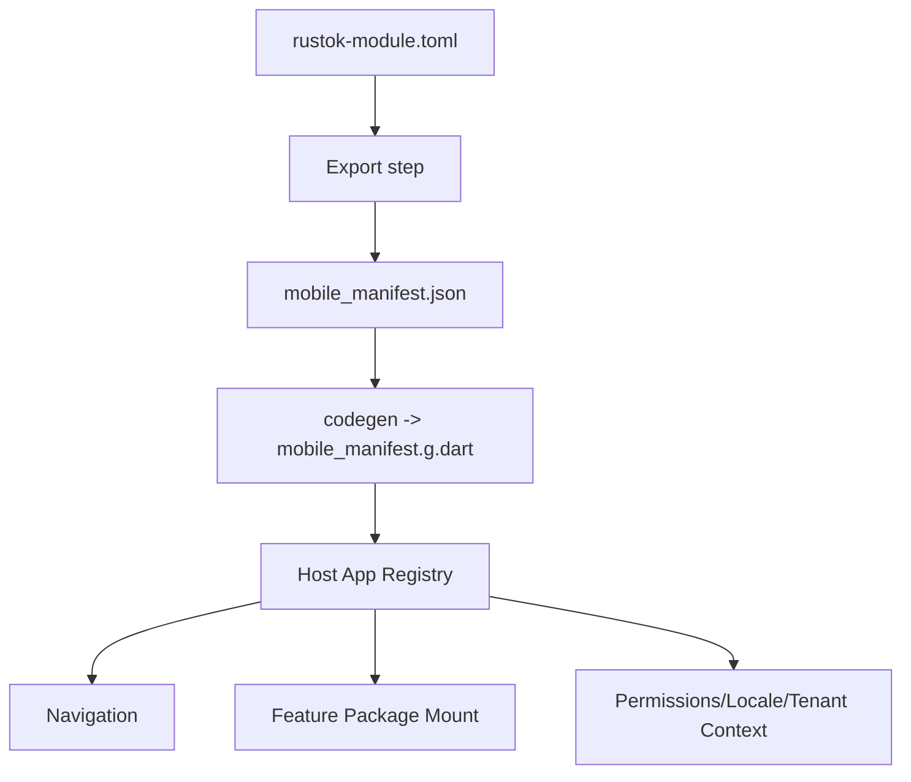
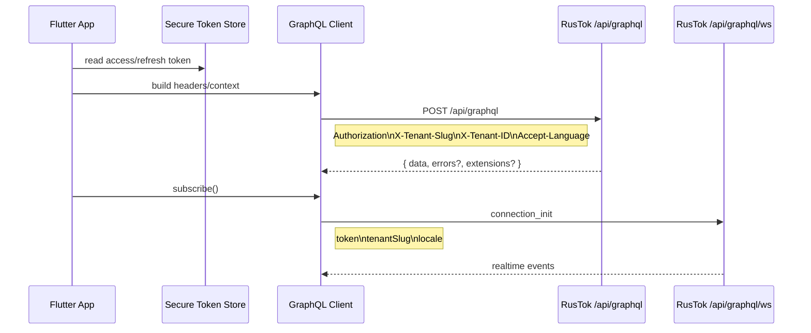

# Архитектура Flutter-приложения для RusTok

## Executive summary

Доступный включённый коннектор в этой сессии — **GitHub**; анализ через него выполнен **только** по репозиторию `RusTokRs/RusTok`, как и требовалось. По результатам анализа видно, что RusTok уже мыслит платформу как **modular monolith** с явным `apps/server` как composition root, с host-приложениями, которые **монтируют** поверхности модулей, но не забирают у модулей ownership доменной логики и UI. Для UI-клиентов **каноническим transport-контрактом** объявлен GraphQL, а внешние/headless/mobile клиенты должны использовать GraphQL и/или REST, не полагаясь на внутренние Leptos `#[server]` функции. Это делает Flutter-клиент не «ещё одной папкой с экранами», а **новым host-клиентом платформы**, который должен уметь подключать module-owned mobile surfaces по manifest-driven правилам платформы. fileciteturn30file0L3-L3 fileciteturn14file0L3-L3 fileciteturn33file0L3-L3

Рекомендуемая стратегия — **feature-first modular Flutter app** с **Clean Architecture-lite**, где:
- **Riverpod** отвечает за state management и DI на уровне приложения и фич,
- **go_router** отвечает за shell-routing, deep links и typed query/path-параметры,
- **graphql_flutter** + **graphql_codegen** дают стандартное подключение к RusTok GraphQL, кэш, subscriptions и типизированные операции,
- module-owned мобильный UI живёт в отдельных пакетах вида `packages/modules/<slug>_mobile`, а общий каркас, токены, роут-контракты, locale/tenant/auth-контекст и GraphQL wiring выносятся в shared-пакеты. Такой подход лучше всего совпадает с текущей платформенной логикой RusTok: shared UI должен оставаться presentational, locale и routing-контракт должны быть host-owned, а модульные поверхности должны подключаться декларативно, а не жёстким копированием в host. fileciteturn17file0L3-L3 fileciteturn31file0L3-L3 fileciteturn32file0L3-L3 fileciteturn36file0L3-L3

С точки зрения Flutter-экосистемы выбор в пользу Riverpod/go_router выглядит наиболее прагматичным: Flutter прямо подчёркивает важность intentional architecture, MVVM/state management и dependency injection для масштабируемых приложений; Riverpod позиционируется как reactive caching/data-binding framework с compile-safety, автоматической обработкой loading/error и тестопригодностью; go_router остаётся официально публикуемым Flutter-пакетом для declarative routing, deep linking, ShellRoute и typed routes; а `graphql_flutter` поддерживает `GraphQLClient`, `AuthLink`, `GraphQLCache`, `HiveStore`, optimistic updates и subscriptions через split между HTTP и WebSocket link. citeturn11view4turn14view0turn14view2turn15view0turn15view2turn18view2turn9view1turn9view3turn9view4turn18view4

Ключевой вывод: **не стоит** строить Flutter-приложение как один большой `lib/features/...` без package boundaries. Для RusTok лучше подходит схема **host app + shared scaffold packages + module-owned mobile packages + generated contracts**. Это снижает UI drift, позволяет повторять параллельную структуру модулей платформы, упрощает поэтапную миграцию и делает mobile-клиент совместимым с manifest-driven будущим платформы. fileciteturn12file0L3-L3 fileciteturn15file0L3-L3

## Что показал анализ RusTok

В репозитории RusTok уже сформулированы почти все архитектурные правила, которые нужны для мобильного клиента. Платформа разделена на host-приложения (`apps/server`, `apps/admin`, `apps/storefront`, `apps/next-admin`, `apps/next-frontend`), платформенные модули и shared/capability crates; UI ownership остаётся у модуля, а host отвечает за routing, shell, locale propagation, auth/session UX и wiring модульных поверхностей. Иными словами, Flutter-клиент логичнее всего вводить как **ещё один host**, а не как набор хаотично скопированных экранов. fileciteturn30file0L3-L3 fileciteturn33file0L3-L3

У платформы уже есть сильный контрактный слой для UI. Manifest модуля (`rustok-module.toml`) может объявлять `provides.admin_ui` и `provides.storefront_ui`, route segment, i18n-пути, child pages и UI-classification; пример `rustok-blog` показывает `ui_classification = "dual_surface"`, admin/storefront route segments, child pages и отдельные locale bundles. Для Flutter это прямой сигнал: mobile-клиенту стоит ввести **аналогичную contract-модель**, например через `provides.mobile_ui`, либо через внешний generated JSON-реестр, который экспортируется из существующих manifest-файлов RusTok. fileciteturn11file0L3-L3 fileciteturn36file0L3-L3

Отдельно важен транспортный контракт. RusTok фиксирует GraphQL как **единый UI-facing surface** для admin/storefront/Next/module-owned UI, а REST — для интеграций, webhooks и ops. Канонические endpoints платформы: `/api/graphql` и `/api/graphql/ws`; серверный GraphQL host реально поднимает POST handler на `/api/graphql` и WebSocket handler на `/api/graphql/ws`. В schema builder уже заданы depth/complexity limits (`12` и `600`), а в UI-модуле `apps/admin/src/features/modules/api.rs` видны реальные query/mutation/subscription contracts, включая `BuildProgress` subscription. Для мобильного клиента это означает, что “стандартное подключение” должно сразу учитывать не только запросы/мутации, но и subscriptions, лимиты сложности и внятные fetch policies. fileciteturn14file0L3-L3 fileciteturn25file0L3-L3 fileciteturn27file0L3-L3 fileciteturn18file0L3-L3

Header-и auth-контракт тоже уже хорошо читаются из репозитория. В Next.js helper для GraphQL RusTok прокидывает `Authorization: Bearer ...`, `X-Tenant-Slug`, при возможности `X-Tenant-ID`, а также `Accept-Language`; GraphQL auth API использует GraphQL-мутции `signIn`, `signUp`, `refreshToken`, а также query `me` и `currentTenant`. Для WebSocket subscriptions сервер требует в `connection_init` как минимум `token` и `tenantSlug`, и опционально `locale`. Это прямой шаблон для mobile-клиента: **весь transport context должен собираться централизованно**, а не в каждой фиче отдельно. fileciteturn24file0L3-L3 fileciteturn37file0L3-L3 fileciteturn25file0L3-L3

RusTok также очень чётко разделяет shared UI и app-local UI. В каталоге UI сказано, что shared tokens и primitives живут отдельно, должны держать parity по назначению и базовому API, но не обязаны иметь зеркальную реализацию один-в-один; shared UI packages должны оставаться **presentational** и не владеть transport/auth/routing/domain behavior. Это критично для Flutter: дублировать нужно не исходный React/Leptos component tree, а **design contract, semantic roles и UX invariants**. То есть `Button`, `Badge`, `Input`, `Select`, `Card`, `Spinner` и layout primitives — в shared `ui_kit`; а сложные domain components вроде product editor, module registry dashboard, SEO panels, users list — в module-owned mobile packages. fileciteturn17file0L3-L3

Наконец, в RusTok уже зафиксированы два очень полезных host-level контракта, которые обязательно стоит перенести в mobile:
- **i18n**: effective locale выбирается host/runtime layer; module-owned UI не должен придумывать свой fallback-chain. fileciteturn31file0L3-L3
- **routing/query contract**: selection state — URL-owned source of truth; используются typed `snake_case` keys вроде `product_id`, `order_id`, `media_id`, `tab`, а generic `id` и camelCase-алиасы не считаются canonical. Для Flutter это значит: route params, deep links и screen selection state нужно проектировать по этим же правилам, чтобы later parity с web/admin оставалась естественной. fileciteturn32file0L3-L3

### Ключевые артефакты репозитория и их вывод для Flutter

| Наблюдение в RusTok | Вывод для Flutter | Источник |
|---|---|---|
| `apps/server` — composition root; hosts монтируют surfaces | Flutter должен быть новым host-клиентом | fileciteturn30file0L3-L3 |
| Module-owned UI остаётся у модуля | Экраны модулей выносить в отдельные mobile packages | fileciteturn12file0L3-L3 fileciteturn33file0L3-L3 |
| GraphQL — канонический UI-facing contract | Основа mobile transport — GraphQL, не REST-first | fileciteturn14file0L3-L3 |
| Сервер поднимает `/api/graphql` и `/api/graphql/ws` | Клиент нужен с HTTP + subscriptions | fileciteturn25file0L3-L3 |
| Shared UI должен быть presentational only | В shared-пакеты не класть auth/routing/domain behavior | fileciteturn17file0L3-L3 |
| Effective locale определяется host-слоем | Locale-provider — в app shell; не в модульных пакетах | fileciteturn31file0L3-L3 |
| Query keys typed и `snake_case` | Deep links и selection state делать по тем же правилам | fileciteturn32file0L3-L3 |
| Manifest объявляет `admin_ui`/`storefront_ui`, i18n и child pages | Для mobile нужен аналогичный registry/export layer | fileciteturn11file0L3-L3 fileciteturn36file0L3-L3 |

## Рекомендуемая архитектура

### Рекомендованный вариант

Для RusTok я рекомендую следующий стек архитектурных решений:

**Feature-first modular structure + Clean Architecture-lite + Riverpod + go_router + module-owned packages**.

Почему именно так:
- Flutter сам акцентирует важность intentional architecture, dependency injection, state management и testability в масштабируемых приложениях. citeturn11view4turn11view2
- Riverpod даёт compile-safety, native async/network patterns, loading/error handling, test readiness и хорошо работает в plain Dart и пакетной архитектуре. citeturn14view0turn14view2turn14view3
- go_router уже решает deep linking, ShellRoute, query/path parameters и redirect flows, что хорошо ложится на RusTok routing contract. citeturn15view0turn15view2
- RusTok сам уже мыслит UI как **host shell + module-owned surfaces**, поэтому modular package boundaries на клиенте естественны. fileciteturn12file0L3-L3 fileciteturn33file0L3-L3

Под **Clean Architecture-lite** я здесь имею в виду не академический “три десятка папок на каждую фичу”, а практический минимум:
- `presentation`
- `application`
- `data`
- `domain` только там, где действительно есть сложные правила и use cases

Для CRUD-heavy экранов доменный слой можно держать тонким. Для auth, permissions, module registry, workflows, SEO/publishing, pricing, offline drafts — наоборот, domain/application слой нужен обязательно.

### Сравнение вариантов

| Вариант | Плюсы | Минусы | Вывод |
|---|---|---|---|---|---|
| **Provider** | Очень простой, официальный экосистемный базис, мало порога входа | Отлично подходит для небольших приложений, но для крупного package-driven клиента быстро упирается в ручную дисциплину и слабее по ergonomics для async/state contracts | Подходит для MVP, не оптимален как основной фундамент |
| **BLoC** | Сильное разделение presentation и business logic, хорошие DI/repository widgets | Больше boilerplate, особенно если модулей и экранов много | Хорош для команд, уже живущих в event-driven стиле |
| **Riverpod** | Compile-safety, async-first ergonomics, test-ready, plain Dart, удобно раскладывается по пакетам | Нужна дисциплина в naming/provider design; команде без опыта понадобится onboarding | **Лучший базовый выбор** |
| **flutter_modular** | Встроенные modular routes + DI, удобен для package/module мышления | Смешивает routing и DI в отдельную мета-архитектуру; в RusTok это может дублировать Riverpod + go_router и делать систему тяжелее | Использовать только если команда уже стандартизировала всё на Modular |
| **Clean Architecture full** | Сильная изоляция и тестируемость | Риск переусложнения, лишняя многослойность для простых фич | Брать как принцип, но в стиле **lite** |

Основания для сравнения: `provider` — wrapper around `InheritedWidget`; `flutter_bloc` подчёркивает separation of presentation/business logic и DI widgets (`BlocProvider`, `RepositoryProvider`); Riverpod декларирует compile safety, async/error handling, test-ready и поддержку WebSocket/network scenarios; `flutter_modular` позиционируется как smart structure для modularized routes и DI. citeturn17view0turn16view0turn14view0turn14view2turn17view1

### Архитектурная схема

```mermaid
flowchart LR
    A[Flutter Host App] --> B[App Shell]
    B --> C[Routing Layer]
    B --> D[App Context]
    D --> D1[Tenant]
    D --> D2[Auth Session]
    D --> D3[Locale]
    D --> D4[Permissions]

    C --> E[Module Registry]
    E --> F1[blog_mobile]
    E --> F2[product_mobile]
    E --> F3[users_mobile]
    E --> F4[workflow_mobile]

    F1 --> G[Application Layer]
    F2 --> G
    F3 --> G
    F4 --> G

    G --> H[Repositories]
    H --> I[GraphQL Client]
    H --> J[Local Storage]
    I --> K[/api/graphql]
    I --> L[/api/graphql/ws]
```

### Практические trade-offs

Если команда RusTok уже сильно привыкла к BLoC, технической ошибки в выборе BLoC не будет. Но с учётом текущего устройства RusTok — manifest-driven, module-owned UI, host-level locale/routing contracts, много async GraphQL reads/writes/subscriptions — Riverpod даёт более дешёвую по когнитивной нагрузке архитектуру. BLoC здесь особенно хорош для очень сложных workflow/state machines, но как **универсальный** фундамент для десятков модульных surfaces Riverpod обычно быстрее и легче в сопровождении. Это мой архитектурный вывод на основании сочетания требований RusTok и свойств библиотек. fileciteturn12file0L3-L3 fileciteturn32file0L3-L3 citeturn14view0turn16view0

## Файловая структура и размещение UI-компонентов

### Базовый принцип размещения

Для RusTok я бы **не стал** делать один пакет `lib/features` с полным содержимым всех модулей платформы. Правильнее сделать monorepo из Flutter-пакетов:

- один **host app**,
- несколько **shared packages**,
- набор **module-owned mobile packages**.

Это буквально повторяет текущую философию RusTok, где host монтирует surfaces, а ownership UI остаётся у модуля. Shared UI должен содержать только presentational primitives и tokens; app shell должен держать routing, auth, locale, nav shell и module registry; module-owned mobile packages — собственные экраны и их data/application layers. fileciteturn17file0L3-L3 fileciteturn33file0L3-L3

### Рекомендуемое дерево репозитория

```text
rustok_mobile/
├── apps/
│   └── rustok_admin_mobile/
│       ├── lib/
│       │   ├── main.dart
│       │   ├── bootstrap.dart
│       │   ├── app.dart
│       │   ├── app_router.dart
│       │   ├── app_shell/
│       │   │   ├── presentation/
│       │   │   │   ├── app_shell.dart
│       │   │   │   ├── app_scaffold.dart
│       │   │   │   ├── app_navigation_bar.dart
│       │   │   │   ├── app_drawer.dart
│       │   │   │   └── app_error_view.dart
│       │   │   ├── application/
│       │   │   │   ├── current_tenant_controller.dart
│       │   │   │   ├── locale_controller.dart
│       │   │   │   └── auth_gate_controller.dart
│       │   │   └── domain/
│       │   │       ├── tenant_context.dart
│       │   │       └── user_session.dart
│       │   ├── routes/
│       │   │   ├── route_names.dart
│       │   │   ├── route_guards.dart
│       │   │   ├── route_codec.dart
│       │   │   └── deep_link_parser.dart
│       │   ├── registry/
│       │   │   ├── mobile_module_registry.dart
│       │   │   ├── generated/
│       │   │   │   └── mobile_manifest.g.dart
│       │   │   └── module_entry_adapter.dart
│       │   └── l10n/
│       │       ├── app_ru.arb
│       │       └── app_en.arb
│       ├── integration_test/
│       └── pubspec.yaml
├── packages/
│   ├── app_core/
│   │   └── lib/
│   │       ├── env/
│   │       ├── errors/
│   │       ├── logging/
│   │       ├── utils/
│   │       └── result/
│   ├── app_ui_kit/
│   │   └── lib/
│   │       ├── tokens/
│   │       ├── theme/
│   │       ├── atoms/
│   │       ├── molecules/
│   │       ├── organisms/
│   │       └── scaffolds/
│   ├── app_graphql/
│   │   └── lib/
│   │       ├── client/
│   │       │   ├── graphql_client_factory.dart
│   │       │   ├── graphql_headers_provider.dart
│   │       │   ├── graphql_error_mapper.dart
│   │       │   ├── graphql_retry_policy.dart
│   │       │   └── graphql_cache_policies.dart
│   │       ├── auth/
│   │       │   ├── auth_session_store.dart
│   │       │   ├── refresh_token_service.dart
│   │       │   └── secure_token_store.dart
│   │       └── generated/
│   │           └── schema.graphql
│   ├── app_route_contracts/
│   │   └── lib/
│   │       ├── query_keys.dart
│   │       ├── route_selection.dart
│   │       ├── route_sanitizer.dart
│   │       └── route_context.dart
│   ├── app_module_contracts/
│   │   └── lib/
│   │       ├── mobile_module_entry.dart
│   │       ├── mobile_nav_meta.dart
│   │       ├── mobile_surface_kind.dart
│   │       └── module_permissions.dart
│   ├── rustok_auth_mobile/
│   │   └── lib/
│   │       ├── presentation/
│   │       ├── application/
│   │       ├── data/
│   │       ├── graphql/
│   │       └── auth_mobile_module.dart
│   ├── rustok_modules_mobile/
│   │   └── lib/
│   │       ├── presentation/
│   │       ├── application/
│   │       ├── data/
│   │       ├── graphql/
│   │       └── modules_mobile_module.dart
│   ├── rustok_blog_mobile/
│   ├── rustok_product_mobile/
│   ├── rustok_users_mobile/
│   └── rustok_workflow_mobile/
├── tooling/
│   ├── build.yaml
│   ├── melos.yaml
│   └── scripts/
├── .github/
│   └── workflows/
└── pubspec.yaml
```

### Что лежит где и зачем

| Путь | Назначение |
|---|---|
| `apps/rustok_admin_mobile` | Host-приложение: запуск, shell, маршрутизация, registry wiring, глобальный контекст |
| `packages/app_core` | Базовые error/result/env/logging-инструменты без UI и domain-specific кода |
| `packages/app_ui_kit` | Общие design tokens, темы, базовые widgets и scaffold-компоненты |
| `packages/app_graphql` | Единая точка сборки GraphQL client, auth/tenant/locale headers, refresh token, mapping ошибок |
| `packages/app_route_contracts` | Typed route/query keys и sanitization по правилам RusTok |
| `packages/app_module_contracts` | Интерфейсы для подключения module-owned mobile packages |
| `packages/rustok_<slug>_mobile` | Экраны, application/data слои и GraphQL-документы конкретного модуля |
| `registry/generated/mobile_manifest.g.dart` | Generated-реестр модулей, child pages, nav metadata, permissions, route segments |
| `tooling/build.yaml` | Настройки `graphql_codegen` и других codegen-задач |
| `integration_test/` | E2E тесты host-приложения |

### Где размещать UI-компоненты и как дублировать UI модулей платформы

Правило должно быть таким.

**В `app_ui_kit`** живут только:
- tokens,
- темы,
- базовые кнопки и поля,
- карточки, бейджи, списочные контейнеры,
- layout/scaffold-примитивы,
- loading/empty/error views.

**В `rustok_<slug>_mobile`** живут:
- screen widgets,
- domain-specific forms,
- complex lists/tables/cards,
- route builders,
- feature controllers,
- GraphQL documents и mappers.

Это соответствует тому, как RusTok уже разделяет shared primitives и app-local/modular UI. fileciteturn17file0L3-L3

Для **дублирования UI существующих модулей** я рекомендую не делать визуальный copy-paste с web-host’ов, а придерживаться трёх уровней parity:

| Уровень parity | Что копировать | Что не копировать |
|---|---|---|
| **Contract parity** | Названия сущностей, permission gates, route semantics, empty/loading/error states, locale keys | Внутренние web-specific implementation details |
| **UX parity** | Информационная архитектура, порядок секций, action hierarchy, form semantics | Точное повторение desktop layouts на мобильном экране |
| **Visual parity** | Tokens, typography, colors, radius, iconography, component intent | Пиксель-в-пиксель сетки web-админки |

Иными словами, экран `modules` в Flutter должен воспроизводить **тот же product contract**, что и web `modules`: те же статусы, те же actions, те же constraints, тот же tenant/auth/locale context — но в мобильной layout-модели. RusTok сам уже подчёркивает parity discipline между Leptos и Next admin и фиксирует единые locale files / FSD-like structure для модульного UI; для Flutter нужно продолжить эту линию, а не строить третий, независимый UX. fileciteturn16file0L3-L3 fileciteturn33file0L3-L3

### Предлагаемый registry-driven поток подключения модулей



Практически это означает: либо backend/CI RusTok публикует JSON-реестр модулей для mobile, либо Flutter-репозиторий периодически подтягивает manifest snapshots и генерирует Dart registry code. Второй вариант проще стартовать; первый — архитектурно чище в долгую.

## Каркас проекта и интеграция GraphQL

### Базовый каркас приложения

RusTok уже задаёт правильную host-модель: shell, routing, locale propagation, auth UX, permissions и wiring модульных surfaces должны быть host-owned. Именно это и должно появиться в Flutter-`main.dart`, а не “голый MaterialApp с тремя экранами”. fileciteturn33file0L3-L3

```dart
// apps/rustok_admin_mobile/lib/main.dart
import 'package:flutter/material.dart';
import 'package:flutter_riverpod/flutter_riverpod.dart';

import 'app.dart';
import 'bootstrap.dart';

Future<void> main() async {
  WidgetsFlutterBinding.ensureInitialized();
  final container = await bootstrap();
  runApp(
    UncontrolledProviderScope(
      container: container,
      child: const RustokAdminMobileApp(),
    ),
  );
}
```

```dart
// apps/rustok_admin_mobile/lib/bootstrap.dart
import 'package:flutter_riverpod/flutter_riverpod.dart';

import 'package:app_core/env/env.dart';
import 'package:app_graphql/client/graphql_client_factory.dart';
import 'package:app_graphql/auth/secure_token_store.dart';

Future<ProviderContainer> bootstrap() async {
  final env = await Env.load();
  final tokenStore = SecureTokenStore();
  final container = ProviderContainer(
    overrides: [
      envProvider.overrideWithValue(env),
      secureTokenStoreProvider.overrideWithValue(tokenStore),
    ],
  );

  // Можно здесь прогреть сессию, tenant и locale.
  return container;
}
```

```dart
// apps/rustok_admin_mobile/lib/app.dart
import 'package:flutter/material.dart';
import 'package:flutter_riverpod/flutter_riverpod.dart';

import 'app_router.dart';
import 'package:app_ui_kit/theme/app_theme.dart';

class RustokAdminMobileApp extends ConsumerWidget {
  const RustokAdminMobileApp({super.key});

  @override
  Widget build(BuildContext context, WidgetRef ref) {
    final router = ref.watch(appRouterProvider);
    final locale = ref.watch(appLocaleProvider);

    return MaterialApp.router(
      title: 'RusTok Mobile',
      routerConfig: router,
      locale: locale,
      theme: buildLightTheme(),
      darkTheme: buildDarkTheme(),
      themeMode: ThemeMode.system,
      debugShowCheckedModeBanner: false,
    );
  }
}
```

Для UI-слоя разумно строиться на **Material 3**: Flutter указывает, что начиная с 3.16 `useMaterial3` включён по умолчанию, а переход к Material 3 предполагает новые компоненты, обновлённые визуальные значения и переход на `ColorScheme.fromSeed`. Для RusTok это хороший baseline: современный системный набор компонентов без лишнего кастомного низкоуровневого UI. citeturn13view3turn13view4

```dart
// packages/app_ui_kit/lib/theme/app_theme.dart
import 'package:flutter/material.dart';
import 'package:flex_color_scheme/flex_color_scheme.dart';

ThemeData buildLightTheme() {
  return FlexThemeData.light(
    useMaterial3: true,
    scheme: FlexScheme.indigo,
    visualDensity: VisualDensity.standard,
  );
}

ThemeData buildDarkTheme() {
  return FlexThemeData.dark(
    useMaterial3: true,
    scheme: FlexScheme.indigo,
    visualDensity: VisualDensity.standard,
  );
}
```

### Маршрутизация

Для RusTok особенно важно, чтобы routing был:
- declarative,
- deep-link friendly,
- shell-capable,
- совместим с typed query/path contract платформы.

Именно здесь `go_router` даёт наилучший баланс: URL-based API, deep links, redirects, sub-routes и `ShellRoute` для постоянного shell/navigation bar. citeturn15view0turn15view2

```dart
// apps/rustok_admin_mobile/lib/app_router.dart
import 'package:flutter/material.dart';
import 'package:flutter_riverpod/flutter_riverpod.dart';
import 'package:go_router/go_router.dart';

import 'app_shell/presentation/app_shell.dart';
import 'registry/mobile_module_registry.dart';
import 'routes/route_guards.dart';
import 'features/auth/presentation/sign_in_screen.dart';
import 'features/home/presentation/home_screen.dart';

final appRouterProvider = Provider<GoRouter>((ref) {
  final isSignedIn = ref.watch(isSignedInProvider);
  final registry = ref.watch(mobileModuleRegistryProvider);

  return GoRouter(
    initialLocation: '/home',
    redirect: (context, state) {
      final loggingIn = state.matchedLocation == '/sign-in';
      if (!isSignedIn && !loggingIn) return '/sign-in';
      if (isSignedIn && loggingIn) return '/home';
      return null;
    },
    routes: [
      GoRoute(
        path: '/sign-in',
        builder: (_, __) => const SignInScreen(),
      ),
      ShellRoute(
        builder: (_, __, child) => AppShell(child: child),
        routes: [
          GoRoute(
            path: '/home',
            builder: (_, __) => const HomeScreen(),
          ),
          ...registry.routes,
        ],
      ),
    ],
  );
});
```

### DI и registry-driven подключение модулей

В RusTok host-приложение не должно становиться владельцем модульной логики; оно должно только монтировать surfaces и прокидывать контекст. Ровно это и нужно сделать в Flutter через registry. fileciteturn33file0L3-L3

```dart
// packages/app_module_contracts/lib/mobile_module_entry.dart
import 'package:flutter/widgets.dart';
import 'package:go_router/go_router.dart';

abstract interface class MobileModuleEntry {
  String get slug;
  String get navLabel;
  int get navOrder;
  List<RouteBase> buildRoutes();
  Widget buildNavIcon(BuildContext context);
}
```

```dart
// apps/rustok_admin_mobile/lib/registry/mobile_module_registry.dart
import 'package:flutter_riverpod/flutter_riverpod.dart';
import 'package:go_router/go_router.dart';

import 'package:rustok_blog_mobile/blog_mobile_module.dart';
import 'package:rustok_modules_mobile/modules_mobile_module.dart';

final mobileModuleRegistryProvider = Provider<MobileModuleRegistry>((ref) {
  final entries = [
    BlogMobileModule(),
    ModulesMobileModule(),
    // далее auto-generated wiring
  ]..sort((a, b) => a.navOrder.compareTo(b.navOrder));

  return MobileModuleRegistry(
    entries: entries,
    routes: entries.expand((e) => e.buildRoutes()).toList(),
  );
});

class MobileModuleRegistry {
  MobileModuleRegistry({
    required this.entries,
    required this.routes,
  });

  final List<dynamic> entries;
  final List<RouteBase> routes;
}
```

### Стандартное подключение GraphQL для RusTok

Официальные рекомендации GraphQL over HTTP задают очень понятную основу: GraphQL обычно работает через **один endpoint**, запросы идут по `POST` c `application/json`, а тело содержит `query`, `operationName`, `variables`, `extensions`; ответ использует top-level keys `data`, `errors`, `extensions`, причём partial success допустим как `data + errors`. RusTok со своей стороны фиксирует UI-facing endpoint `/api/graphql`, WebSocket endpoint `/api/graphql/ws` и использует дополнительные контекстные headers (`Authorization`, `X-Tenant-Slug`, `X-Tenant-ID`, `Accept-Language`) и payload для WS-инициализации (`token`, `tenantSlug`, `locale`). citeturn10view7turn10view8turn10view9turn10view0turn10view1 fileciteturn24file0L3-L3 fileciteturn25file0L3-L3



```dart
// packages/app_graphql/lib/client/graphql_client_factory.dart
import 'package:graphql_flutter/graphql_flutter.dart';

class GraphqlClientFactory {
  GraphQLClient create({
    required String apiBaseUrl,
    required String wsBaseUrl,
    required Future<String?> Function() accessToken,
    required Future<String?> Function() tenantSlug,
    required Future<String?> Function() tenantId,
    required Future<String> Function() localeTag,
  }) {
    final httpLink = HttpLink('$apiBaseUrl/api/graphql');

    final authLink = AuthLink(
      getToken: () async {
        final token = await accessToken();
        return token == null ? '' : 'Bearer $token';
      },
    );

    final contextLink = Link.function((request, [forward]) async* {
      final headers = <String, String>{
        'Accept-Language': await localeTag(),
      };

      final slug = await tenantSlug();
      final id = await tenantId();

      if (slug != null && slug.isNotEmpty) {
        headers['X-Tenant-Slug'] = slug;
      }
      if (id != null && id.isNotEmpty) {
        headers['X-Tenant-ID'] = id;
      }

      final next = request.updateContextEntry<HttpLinkHeaders>(
        (existing) => HttpLinkHeaders(
          headers: {
            ...?existing?.headers,
            ...headers,
          },
        ),
      );

      yield* forward!(next);
    });

    final wsLink = WebSocketLink(
      '$wsBaseUrl/api/graphql/ws',
      config: SocketClientConfig(
        autoReconnect: true,
        initialPayload: () async => <String, dynamic>{
          'token': await accessToken(),
          'tenantSlug': await tenantSlug(),
          'locale': await localeTag(),
        },
      ),
    );

    final link = Link.split(
      (request) => request.isSubscription,
      wsLink,
      Link.from([authLink, contextLink, httpLink]),
    );

    return GraphQLClient(
      link: link,
      cache: GraphQLCache(store: HiveStore()),
      defaultPolicies: DefaultPolicies(
        query: Policies(
          fetch: FetchPolicy.cacheAndNetwork,
        ),
        mutate: Policies(
          fetch: FetchPolicy.noCache,
        ),
        watchQuery: Policies(
          fetch: FetchPolicy.cacheAndNetwork,
        ),
      ),
    );
  }
}
```

`graphql_flutter` требует `GraphQLClient` с `link` и `cache`, поддерживает `AuthLink`, `GraphQLCache`, `HiveStore`, optimistic mutations и subscriptions через split на subscription link и обычный terminating link. Это хорошо совпадает с RusTok transport-контрактом. citeturn18view2turn9view3turn9view4turn18view4turn9view1

### Авторизация и refresh

RusTok уже показывает GraphQL-мутции `signIn`, `signUp`, `refreshToken`, а также query `me` и `currentTenant`. На мобильном клиенте я рекомендую такую политику:

- `accessToken` и `refreshToken` — только в `flutter_secure_storage`,
- `tenantSlug` и non-sensitive UI prefs — в `shared_preferences`,
- refresh — централизованный сервис в `app_graphql/auth`,
- повтор запроса — **один раз** после успешного refresh,
- при провале refresh — hard logout и очистка кэша/сессии. fileciteturn37file0L3-L3 citeturn6view4turn6view5

```dart
abstract interface class SessionStore {
  Future<AuthSession?> read();
  Future<void> write(AuthSession session);
  Future<void> clear();
}

class AuthSession {
  const AuthSession({
    required this.accessToken,
    required this.refreshToken,
    required this.tenantSlug,
  });

  final String accessToken;
  final String refreshToken;
  final String tenantSlug;
}
```

### Кэширование, обработка ошибок и subscriptions

Для RusTok я бы рекомендовал **не обещать офлайн-first**, если это отдельно не подтверждено требованиями. Сейчас разумный baseline такой:

- persisted GraphQL cache для чтений;
- secure session store;
- local drafts только для реально нужных фич;
- subscriptions там, где есть live surfaces: build progress, возможно notifications, audit/event streams;
- сложную offline-синхронизацию отложить до explicit product requirement.

Это соответствует и природе platform admin-клиента, и общим механизмам GraphQL demand control/security. GraphQL Foundation отдельно рекомендует demand control через pagination, depth limiting, breadth/batch limiting и rate limiting; RusTok уже ограничивает depth/complexity на сервере, значит мобильному клиенту не стоит плодить «fat queries» ради удобства UI. citeturn10view3turn10view4turn10view5 fileciteturn27file0L3-L3

### Пример GraphQL-документов и маппинга

```graphql
# packages/rustok_modules_mobile/lib/graphql/list_modules.graphql
query ListModules {
  moduleRegistry {
    moduleSlug
    name
    description
    version
    kind
    dependencies
    enabled
    ownership
    trustLevel
    recommendedAdminSurfaces
    showcaseAdminSurfaces
  }
}
```

```graphql
# packages/rustok_auth_mobile/lib/graphql/sign_in.graphql
mutation SignIn($input: SignInInput!) {
  signIn(input: $input) {
    accessToken
    refreshToken
    user {
      id
      email
      name
      role
      status
    }
  }
}
```

```graphql
# packages/rustok_modules_mobile/lib/graphql/build_progress.graphql
subscription BuildProgress {
  buildProgress {
    buildId
    status
    stage
    progress
    releaseId
    errorMessage
  }
}
```

```yaml
# tooling/build.yaml
targets:
  $default:
    builders:
      graphql_codegen:
        options:
          clients:
            - graphql
          scalars:
            DateTime:
              type: DateTime
              fromJsonFunctionName: dateTimeFromJson
              toJsonFunctionName: dateTimeToJson
              import: package:app_core/utils/scalars.dart
```

```dart
// packages/rustok_modules_mobile/lib/data/modules_repository.dart
import 'package:graphql/client.dart';
import '../graphql/list_modules.graphql.dart';

class ModulesRepository {
  ModulesRepository(this._client);

  final GraphQLClient _client;

  Future<List<ModuleSummary>> listModules() async {
    final result = await _client.query$ListModules(
      Options$Query$ListModules(
        fetchPolicy: FetchPolicy.cacheAndNetwork,
      ),
    );

    if (result.hasException) {
      throw mapGraphqlException(result.exception);
    }

    final items = result.parsedData?.moduleRegistry ?? const [];
    return items.map(ModuleSummary.fromGql).toList();
  }
}

class ModuleSummary {
  const ModuleSummary({
    required this.slug,
    required this.name,
    required this.description,
    required this.enabled,
  });

  final String slug;
  final String name;
  final String description;
  final bool enabled;

  factory ModuleSummary.fromGql(Query$ListModules$moduleRegistry gql) {
    return ModuleSummary(
      slug: gql.moduleSlug,
      name: gql.name,
      description: gql.description,
      enabled: gql.enabled,
    );
  }
}
```

### Шаблоны экранов и виджетов

```dart
// packages/app_ui_kit/lib/scaffolds/app_screen.dart
import 'package:flutter/material.dart';

class AppScreen extends StatelessWidget {
  const AppScreen({
    super.key,
    required this.title,
    required this.body,
    this.fab,
  });

  final String title;
  final Widget body;
  final Widget? fab;

  @override
  Widget build(BuildContext context) {
    return Scaffold(
      appBar: AppBar(title: Text(title)),
      body: SafeArea(child: body),
      floatingActionButton: fab,
    );
  }
}
```

```dart
// packages/app_ui_kit/lib/scaffolds/async_screen.dart
import 'package:flutter/material.dart';
import 'package:flutter_riverpod/flutter_riverpod.dart';

class AsyncScreen<T> extends StatelessWidget {
  const AsyncScreen({
    super.key,
    required this.value,
    required this.data,
  });

  final AsyncValue<T> value;
  final Widget Function(T data) data;

  @override
  Widget build(BuildContext context) {
    return value.when(
      data: data,
      loading: () => const Center(child: CircularProgressIndicator()),
      error: (error, stack) => Center(
        child: Text('Ошибка: $error'),
      ),
    );
  }
}
```

```dart
// packages/rustok_modules_mobile/lib/presentation/modules_screen.dart
class ModulesScreen extends ConsumerWidget {
  const ModulesScreen({super.key});

  @override
  Widget build(BuildContext context, WidgetRef ref) {
    final modules = ref.watch(modulesControllerProvider);

    return AppScreen(
      title: 'Modules',
      body: AsyncScreen(
        value: modules,
        data: (items) => ListView.builder(
          itemCount: items.length,
          itemBuilder: (_, index) {
            final item = items[index];
            return ListTile(
              title: Text(item.name),
              subtitle: Text(item.description),
              trailing: Switch(
                value: item.enabled,
                onChanged: (_) {},
              ),
            );
          },
        ),
      ),
    );
  }
}
```

## Библиотеки и самописные модули

### Рекомендуемые готовые библиотеки

Ниже — рекомендуемый набор библиотек для стартового production-scaffold. Версии ниже взяты с официальных страниц библиотек по состоянию на **22 мая 2026 года**. Для state/routing/DI это `flutter_riverpod 3.3.1`, `go_router 17.2.3`, `get_it 9.2.1`, `flutter_bloc 9.1.1`, `provider 6.1.5+1`, `flutter_modular 6.4.1`, `auto_route 11.1.0`; для data/GraphQL — `graphql_flutter 5.3.0`, `graphql_codegen 3.0.1`, `build_runner 2.15.0`, `dio 5.9.2`, `flutter_secure_storage 10.2.0`, `shared_preferences 2.5.5`, `drift 2.33.0`, `isar 3.1.0+1`, `json_serializable 6.14.0`; для UI/testing — `flutter_svg 2.3.0`, `flex_color_scheme 8.4.0`, `skeletonizer 2.1.3`, `mocktail 1.0.5`, `patrol 4.6.0`. Отдельно важно, что `golden_toolkit 0.15.0` на pub.dev помечен как **discontinued**, поэтому для нового проекта я бы его не брал. citeturn6view1turn6view0turn6view6turn16view0turn17view0turn17view1turn17view2turn6view2turn8view5turn8view4turn6view3turn6view4turn6view5turn8view1turn8view0turn8view2turn8view7turn8view8turn8view9turn7view0turn8view10turn6view7

| Категория | Рекомендовано | Почему | Альтернатива | Когда выбрать альтернативу |
|---|---|---|---|---|---|
| State management | **flutter_riverpod** | Лучший баланс async ergonomics, modularity, testability | `flutter_bloc`, `provider` | BLoC — если команда уже на event-driven модели; Provider — для маленького MVP |
| Routing | **go_router** | Deep links, ShellRoute, query/path params, стабильность | `auto_route`, `flutter_modular` | `auto_route` — если нужна сильная codegen-типизация маршрутов |
| DI | **Riverpod providers** как primary DI; `get_it` только точечно | Меньше дублирования DI-механизмов | `get_it` | Только для низкоуровневых сервисов без UI-context |
| GraphQL client | **graphql_flutter** | Прямо покрывает link/cache/auth/subscriptions | `ferry_flutter` | Если нужна более жёсткая typed-архитектура и команда готова к steeper setup |
| GraphQL codegen | **graphql_codegen** + `build_runner` | Типизированные операции и маппинг schema/documents | ручной gql client | Только на очень маленьком проекте |
| HTTP fallback/REST | **dio** | Interceptors, cancelation, adapters | `http` | Если нужен совсем простой клиент |
| Secure storage | **flutter_secure_storage** | Правильное место для токенов и секретов | — | Без альтернативы в baseline |
| Preferences | **shared_preferences** | Простые non-critical настройки | — | Только для prefs, не для критичных данных |
| Local DB | **drift** | Более свежая stable-линейка и хороший контроль SQL/queries | `isar` | `isar` — если нужен object-store стиль и команда уже его знает |
| JSON models | **json_serializable** | Стабильный официальный путь к сериализации | ручной код | Если моделей мало |
| SVG assets | **flutter_svg** | Практический стандарт для иконографии | PNG-only | Если SVG вообще не используются |
| Theming | **flex_color_scheme** | Быстрый production-grade старт поверх Material 3 | только ThemeData вручную | Если нужен предельно минималистичный theming |
| Skeleton loading | **skeletonizer** | Быстро даёт consistent loading states | самописные placeholders | Если дизайн-система совсем уникальна |
| Unit/widget mocks | **mocktail** | Не требует code generation | `mockito` | Если команде нужен именно Mockito flow |
| Integration/E2E | **integration_test** baseline + `patrol` optional | Patrol закрывает native interactions, где `integration_test` неудобен | только `integration_test` | Если native prompts/permissions не тестируются |

### Почему выбранные лучше именно для RusTok

Для RusTok главный критерий — не “самая модная библиотека”, а **совместимость с архитектурой модульной платформы**. Поэтому:
- `go_router` лучше `flutter_modular` как базовый роутинг, потому что он решает routing-плоскость без навязывания отдельной DI/meta-архитектуры поверх RusTok host-shell.
- Riverpod лучше Provider как основной state/DI фундамент, потому что RusTok явно тяготеет к package boundaries, async GraphQL flows, strict contracts и тестопригодности.
- `graphql_flutter + graphql_codegen` лучше ручного GraphQL, потому что платформа уже богата schema-driven поверхностями, subscriptions и сложными query/mutation contracts; ручной string-based клиент быстро станет источником drift и ошибок.
- `drift` как optional offline/data-db выглядит надёжнее для long-lived production mobile, чем брать object-store только потому, что он “быстрее стартует”. При этом если офлайн-режим ограничен лишь persisted GraphQL cache + drafts, отдельная БД может вообще не понадобиться на первом этапе. Это уже продуктовый выбор, а не обязательный обязательный слой.

### Предлагаемые самописные библиотеки и модули

Вот набор **самописных** пакетов, которые я бы считал не “лишней абстракцией”, а архитектурным минимумом.

| Пакет/модуль | Ответственность | Почему нужен именно как отдельный пакет |
|---|---|---|
| `app_core` | env, Result/Failure, logging, retry utils, typed errors | Чтобы не дублировать инфраструктуру по фичам |
| `app_ui_kit` | tokens, themes, base widgets, scaffolds | Чтобы держать parity с RusTok shared UI contract |
| `app_graphql` | client factory, headers/ws payload, refresh policy, error mapping | Чтобы auth/tenant/locale transport context не расползся по всем фичам |
| `app_route_contracts` | query keys, route sanitization, deep-link parsing | Чтобы mirror-ить RusTok route-selection contract |
| `app_module_contracts` | интерфейсы module entry, nav metadata, permissions wiring | Чтобы модульные mobile packages были truly pluggable |
| `generated_module_registry` | generated wiring из manifest/export | Чтобы host не редактировался вручную при каждом новом модуле |

### Примеры публичных интерфейсов

```dart
abstract interface class GraphqlHeadersProvider {
  Future<Map<String, String>> buildHttpHeaders();
  Future<Map<String, Object?>> buildWsPayload();
}
```

```dart
abstract interface class RouteSelectionSanitizer {
  Map<String, String> sanitize(String routeName, Map<String, String> raw);
}
```

```dart
abstract interface class MobileModuleRegistryEntry {
  String get slug;
  bool get adminSurface;
  List<RouteBase> routes();
  List<MobileNavItem> navItems();
}
```

```dart
abstract interface class FailureMapper {
  AppFailure map(Object error, StackTrace stackTrace);
}
```

```dart
sealed class AppFailure {
  const AppFailure();
}

final class UnauthorizedFailure extends AppFailure {
  const UnauthorizedFailure();
}

final class NetworkFailure extends AppFailure {
  const NetworkFailure(this.message);
  final String message;
}

final class GraphqlFailure extends AppFailure {
  const GraphqlFailure(this.message, {this.code});
  final String message;
  final String? code;
}
```

## CI/CD, риски и рекомендации по миграции

### Что стоит перенять из текущего CI RusTok

Текущий CI RusTok уже очень строгий: formatting, clippy/check, platform contract validation, audit/deny, documentation, unused dependencies, coverage, SBOM, сборка серверных и UI-артефактов, а также отдельные jobs для Next-приложений. Для Flutter-репозитория имеет смысл взять **тот же уровень дисциплины**, а не ограничиться `flutter test`. fileciteturn29file0L3-L3

### Рекомендуемый pipeline для Flutter

Минимальный production pipeline:
1. `dart format --set-exit-if-changed .`
2. `flutter analyze`
3. codegen-check: `dart run build_runner build --delete-conflicting-outputs` + `git diff --exit-code`
4. unit/widget tests + coverage
5. integration tests
6. Android build
7. iOS build
8. артефакты + релизная публикация для internal channels
9. contract checks: GraphQL schema snapshot, generated registry snapshot, route/query contract tests

### Шаблон GitHub Actions

```yaml
name: Flutter CI

on:
  push:
    branches: ["**"]
  pull_request:
    branches: ["**"]
  workflow_dispatch:

jobs:
  static:
    runs-on: ubuntu-latest
    steps:
      - uses: actions/checkout@v5

      - uses: subosito/flutter-action@v2
        with:
          channel: stable

      - name: Install dependencies
        run: flutter pub get

      - name: Format
        run: dart format --set-exit-if-changed .

      - name: Codegen
        run: dart run build_runner build --delete-conflicting-outputs

      - name: Verify generated files committed
        run: git diff --exit-code

      - name: Analyze
        run: flutter analyze

  tests:
    runs-on: ubuntu-latest
    needs: static
    steps:
      - uses: actions/checkout@v5
      - uses: subosito/flutter-action@v2
        with:
          channel: stable

      - name: Install dependencies
        run: flutter pub get

      - name: Unit and widget tests
        run: flutter test --coverage

      - name: Upload coverage
        uses: actions/upload-artifact@v4
        with:
          name: coverage
          path: coverage/lcov.info

  integration-android:
    runs-on: macos-latest
    needs: tests
    steps:
      - uses: actions/checkout@v5
      - uses: subosito/flutter-action@v2
        with:
          channel: stable

      - name: Install dependencies
        run: flutter pub get

      - name: Run integration tests
        run: flutter test integration_test

  build-android:
    runs-on: ubuntu-latest
    needs: tests
    steps:
      - uses: actions/checkout@v5
      - uses: subosito/flutter-action@v2
        with:
          channel: stable

      - name: Install dependencies
        run: flutter pub get

      - name: Build Android App Bundle
        run: flutter build appbundle --release --dart-define=FLAVOR=prod

      - name: Upload Android bundle
        uses: actions/upload-artifact@v4
        with:
          name: android-aab
          path: build/app/outputs/bundle/release/*.aab

  build-ios:
    runs-on: macos-latest
    needs: tests
    steps:
      - uses: actions/checkout@v5
      - uses: subosito/flutter-action@v2
        with:
          channel: stable

      - name: Install dependencies
        run: flutter pub get

      - name: Build iOS without codesign
        run: flutter build ipa --release --no-codesign --dart-define=FLAVOR=prod

      - name: Upload iOS artifact
        uses: actions/upload-artifact@v4
        with:
          name: ios-ipa
          path: build/ios/ipa/*.ipa
```

### Риски и митигации

| Риск | Почему реален для RusTok | Митигация |
|---|---|---|
| **UI drift** между Flutter и web-host’ами | RusTok уже поддерживает несколько UI-стеков | Единые tokens, locale keys, route/query contracts, review checklist на parity |
| **Разъезд transport-контрактов** | Платформа уже богата GraphQL/REST/WS surfaces | Весь transport context только через `app_graphql`, никаких feature-local клиентов |
| **Over-modularization** | Легко превратить всё в слишком большое число пакетов | Пакет выделять только если есть ownership boundary или повторное использование |
| **Schema drift / codegen drift** | GraphQL surface живой и растущий | Schema snapshot + codegen CI + generated files checked in |
| **Сложность офлайна** | Не указано, нужен ли offline-first | Начать с persisted cache + secure session; Drift/outbox только после подтверждения требований |
| **Сложный routing state** | В RusTok route/query contract уже строгий | Единый sanitizer и typed route keys package |
| **Auth/tenant bugs** | У RusTok контекст tenant/auth/locale обязателен | HTTP/WS заголовки и payload собирать централизованно и контрактно тестировать |

### Фазный план реализации (без дубляжа)

Ниже — единый implementation plan, который **ссылается на уже описанные разделы** документа вместо повторения одних и тех же решений.


_Легенда статусов: `⬜ Planned` — не начато, `🟡 In progress` — в работе, `✅ Done` — выполнено._

| Статус | Фаза | Объём работ | На что опираемся в этом документе | Definition of Done |
|---|---|---|---|---|
| 🟡 In progress | **Phase 0 — Foundation** | Создать `host app`, app shell, тему, auth session store, GraphQL client factory, route contracts и сразу зафиксировать FFA-baseline для Flutter (единый product/capability contract без Flutter-specific API). | [Базовый каркас приложения](#базовый-каркас-приложения), [Маршрутизация](#маршрутизация), [Стандартное подключение GraphQL для RusTok](#стандартное-подключение-graphql-для-rustok), [Авторизация и refresh](#авторизация-и-refresh) | Работают login + `me` + `currentTenant`, есть базовый shell и deep-link вход в защищённый экран; FFA-baseline зафиксирован с начала разработки. |
| ⬜ Planned | **Phase 1 — Pilot module** | Внедрить один module-owned пакет (рекомендовано: `modules` или `blog`) с реальным E2E флоу. | [Файловая структура и размещение UI-компонентов](#файловая-структура-и-размещение-ui-компонентов), [DI и registry-driven подключение модулей](#di-и-registry-driven-подключение-модулей), [Шаблоны экранов и виджетов](#шаблоны-экранов-и-виджетов) | Один бизнес-сценарий модуля проходит end-to-end в мобильном host без feature-local transport-клиентов. |
| 🟡 In progress | **Phase 2 — Registry/codegen** | Подключить generated mobile registry из manifest/export и убрать ручное wiring в host. Заранее заложить расширяемость registry под сложные модульные поверхности (в т.ч. page builder: child pages/typed surface metadata), без отдельного «плана-повтора». | [Предлагаемый registry-driven поток подключения модулей](#предлагаемый-registry-driven-поток-подключения-модулей), [Предлагаемые самописные библиотеки и модули](#предлагаемые-самописные-библиотеки-и-модули) | Новый модуль подключается через manifest/codegen без правок в навигационном каркасе host; контракты registry готовы к page-builder сценариям (nested routes и surface metadata). |
| ⬜ Planned | **Phase 3 — Parity expansion** | Перенести остальные high-value модули, закрепить route/i18n/permission parity и единые error/loading/empty паттерны. | [Где размещать UI-компоненты и как дублировать UI модулей платформы](#где-размещать-ui-компоненты-и-как-дублировать-ui-модулей-платформы), [Кэширование, обработка ошибок и subscriptions](#кэширование-обработка-ошибок-и-subscriptions) | Покрыты основные operator flows; контракты query keys/locale/permissions не расходятся с web-host правилами. |
| ⬜ Planned | **Phase 4 — Hardening & release** | E2E, performance, observability, crash reporting, release pipeline (Android/iOS), rollout gates. | [Рекомендуемый pipeline для Flutter](#рекомендуемый-pipeline-для-flutter), [Шаблон GitHub Actions](#шаблон-github-actions), [Риски и митигации](#риски-и-митигации) | Готовы alpha/beta релизы, pipeline стабилен, критичные риски закрыты митигациями. |
| ⬜ Planned | **Phase 5 — Offline/advanced sync (optional)** | Добавить офлайн-сценарии только после продуктового подтверждения требований. | [Open questions и ограничения](#open-questions-и-ограничения), [Риски и митигации](#риски-и-митигации) | Есть утверждённые offline requirements и реализована целевая стратегия sync/outbox. |

#### Чек-лист anti-duplication для PR

- Не дублировать архитектурные решения в новых docs: ссылаться на разделы этого файла.
- Новые детали добавлять только там, где им логически место (routing — в routing разделе, GraphQL — в transport разделе).
- При изменении фаз обновлять только эту таблицу и связанные разделы, а не создавать параллельные «планы-повторы».

### Open questions и ограничения


### Scope clarification: клиенты, а не третий web frontend

Для текущего трека Flutter scope фиксируется так:
- не создавать «третий web frontend» параллельно `apps/admin` / `apps/next-admin`;
- развивать **headless-клиенты** (mobile и desktop) как host-приложения поверх существующего backend-контракта;
- переиспользовать общий client-core (auth/session, tenant/locale context, GraphQL transport, route/query contracts) между mobile и desktop поверхностями.

Это сохраняет platform parity и снижает стоимость сопровождения по сравнению с отдельным web-host fork.

### Зависимости между планами (anti-drift guardrail)

- Flutter-план для registry/codegen и module surfaces **зависит** от выполнения backend/page-builder этапов в:
  - `docs/modules/tiptap-page-builder-implementation-plan.md`;
  - `crates/rustok-pages/docs/implementation-plan.md` (Dedicated page-builder track).
- Flutter host, базовый app shell и module-owned mobile UI пакеты нужно развивать в логике FFA (один product contract при разных runtime/topology), но **без** Flutter-специфичных API-контрактов поверх платформы.
- Для практики это означает:
  - Flutter держит минимальные contract-safe каркасы (`preview/tree/properties/publish`) и registry wiring;
  - canonical правила builder/state/validation/RBAC остаются на backend и в общем page-builder плане;
  - parity проверяется по capability и data-contract, а не по буквальному UI-клону Leptos/Next.
- Если в мобильном host добавить routing/registry под page-builder раньше, чем зафиксированы backend contract + parity для admin-стеков, появится drift:
  - расхождение surface metadata;
  - нестабильные GraphQL payload/contracts;
  - повторные переделки route/query wiring в клиентах.
- Поэтому при каждом PR по Flutter registry/module contracts агент должен явно отмечать:
  1) что уже закрыто в backend/page-builder плане;
  2) какой следующий шаг **заблокирован** до закрытия пунктов в `tiptap-page-builder-implementation-plan.md` и `rustok-pages` плане.


Ниже — то, что в постановке **не указано**, поэтому в отчёте я дал только разумные варианты, а не жёсткие требования:

| Параметр | Статус | Разумный вариант по умолчанию |
|---|---|---|
| Целевые платформы | **Уточнено** | Mobile-first (iOS + Android), затем desktop (macOS/Windows/Linux) на общем client-core; без запуска нового web-host |
| Минимальные OS/SDK требования | **Не указано** | Брать актуальную stable-ветку Flutter и согласовать minima после freeze набора пакетов |
| Offline support | **Не указано** | Стартовать без offline-first; только persisted cache + secure auth + drafts |
| Тип мобильного приложения | **Не указано** | Судя по репозиторию, первичен **admin/operator mobile host**; storefront имеет смысл выносить отдельным приложением/пакетом позже |
| Способ получения manifest/export для mobile registry | **Не указано** | На первом этапе — snapshot/codegen из RusTok repo; в долгую — backend/export endpoint |
| Distribution model | **Не указано** | Internal/TestFlight/Play Internal на первых этапах |

Итоговая рекомендация остаётся высокой уверенности: **строить Flutter-клиент как новый host платформы RusTok, а не как набор экранов без ownership-границ**. Именно это лучше всего соответствует текущей архитектуре репозитория и лучше всего масштабируется в сопровождении. fileciteturn30file0L3-L3 fileciteturn33file0L3-L3
